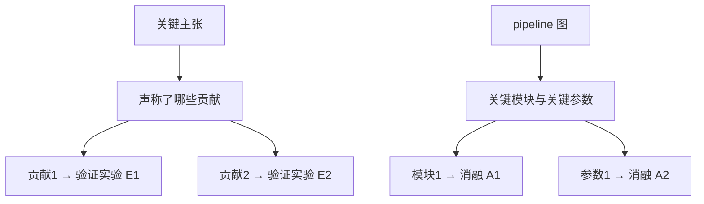

# 实验设计

三个使用者：speculator（设计段设计主笔，落笔前跑本表）、runner（唯一输入=设计段+断言清单，缺格按①点名退回，不自补设计）、qa（放门前的覆盖检查=②双射 + ⑥⑦的核验颗粒）。定位是上游设计检查：设计段没留的格子，断言清单和判词就无从核验。

## ① 设计段必填矩阵（一实验一行，缺格不交 runner）

| 字段 | 必填内容 | 缺格后果 |
|---|---|---|
| `exp_id` | `E1`…稳定编号，主张表与结果节双向引用 | 读数无法对账 |
| 撑的主张 | 该实验通过才成立的 claim 编号，指回头四段「最终验证依据」或假设段某条假设 | 孤儿实验，跑完也不进结论 |
| 因子与水平 | 自变量取值全集（含 `full` 参照行），关键参数给区间与步长 | 覆盖不明，②数不清 |
| 基线 | 名字+出处+配置路径+种子+数据切分；缺任一项按仓根口径判无效基线 | 增益无可对照 |
| 切分 | 训练面/评测面/held-out 比例与切分方式；分组或时序数据点名用哪种切分 | 泄漏核验无从下手 |
| 协议命令 | `evaluation/` 评测器路径 + 运行命令原文（qa 照此重跑对账） | 读数不可复核 |
| pass 判据 | 按仓根 objectives 五字段填成字面结论行：`{metric, evaluator, direction, epsilon, baseline}` | 字段缺项不交 runner |
| 预算 | 单次 wall-time 估计 × 次数，须落进 45 min 切片粒度与项目 `budget` | runner 直接退回 |
| 失败口径 | 什么算无效读数（NaN、掉点、超时、断言 fail），点名后进结果节 | 无效读数率无人担 |

断言行字段（设计段随实验行一并落盘，qa 照 `command` 重跑对账；`ml-runbook` 的①是它的证据载体）：

| 字段 | 填法 | 服务 |
|---|---|---|
| `aid` | `A1`… 稳定编号，被结果节引用 | 对账 |
| `constraint` | `leak` / `determinism` / `budget` / `objective`；填 `leak` 时指向 `ml-runbook`②③ 的机械检查项（split 先于学出的变换、per-fold refit、group/time-aware、同 fold 选参又报性能、held-out 只跑一次），其评测冻结布尔与探针结论落 `measured/self_checks.json`，本表不重复定义；填 `determinism` 只指回 `seed` 与 `tested_against` 两键（复现评测的 checkpoint hash 在 `environment.json`，不在 `pins`） | 三约束 + objectives |
| `statement` | 一句可判真伪的声明，含切分与阈值字面量 | 断言清单本体 |
| `command` | 核验重跑的原文命令（评测器住 `evaluation/`） | qa 复跑 |
| `output_expect` | 期望退出码 / 文件存在 / 关键字段在场 / 数值区间 | 有效读数判据 |
| `tested_against` | 整串照抄 `measured/environment.json` 的 `pins`（python + 包@版本 + `uv.lock` hash + 核对日期）；缺日期等于没标 | 确定性 |
| `seed` | 值 + 作用域（train 与 eval 分开记） | 确定性 |
| `slice` | 值逐字等于 `environment.json` 的 `slice_id`（多片即 `environment.<slice_id>.json` 那段）；附单次 wall-time 估计 × 次数 | 预算 |

## ② 双射覆盖检查（qa 放门用）

- 硬尺两条：`主 claim 数 ≤ 验证实验数`、`模块+关键参数数 ≤ 消融数`。计数由 qa 从设计段字段自己数，不采信 speculator 自报数。
- 矩阵固定列：`实验 | 撑的主张 | 对照与条件 | 结果 | 支持的结论 | 撑不住的更强说法 | 来源`。最后一列留空 = 检查没做。
- 「撑不住的更强说法」必须写具体一句（例：「E3 撑不住『方法通用有效』，只撑住『在切分 S 上指标 M 达阈值 T』」）。这句出现在任何解释文里 = qa 退单。
- 孤儿实验（不撑任何主张）删掉或补明它撑哪条；孤儿主张（无实验承载）在放门判词里点名「未证」，不许靠文字圆过去。
- 一实验多主张要写明它同时判哪几条；一主张多实验则在结论节合并成一条结论行。

## ③ 基线公平四条（三问之一：是否强于强基线）

1. 强且近年：对照里必须有该任务当前公开最强方法；只跟自造弱基线比不成立。
2. 协议四同：同数据切分、同预处理、同评估设置、同预算口径（训练步数/参数量/搜索预算至少对齐一项并写明是哪一项）。
3. 数字同源：基线数字出自本仓实现或上游官方实现，路径与 commit 进 `measured/`；转引论文数字必须在表注点名「转引」，与自跑数字分栏。
4. 归因封顶：对比表只证明能力，不证明机制。整体涨幅归给哪个模块，只能由④的消融挣得；消融未隔离前，设计段与结果节不许写「增益来自 X」。

## ④ 消融包规格（三问之二：增益来自哪个模块）

- 三件：一张覆盖全部主贡献的核心消融表 + 若干模块级小消融 + 每个重要消融配一张定性可视化（曲线/样例/残差，出图口径见 `paper-figures`）。
- 变体三型：`remove`（删掉）、`replace`（换成平凡实现）、`disable`（留代码关开关），一律对 `full` 报 delta，裸绝对值不算消融。
- 模块耦合时补交互消融（至少成对 2×2），否则「增益归哪个模块」不可判。
- 关键参数与模块同权：设计段点名的超参（α、秩 r、窗口 W 之类）每个必须有扫点或双值对照，缺一项即过不了②的尺。
- 实测效果与预期效果分栏：未跑完的消融只准留在设计段待做清单，不许以「预计」进结果节。
- 移除后不掉点 = 该模块的贡献主张不成立，必须在结论里删掉或改口，不许改叙述保住它。

## ⑤ 压测与失效例（三问之三：更难设定下能走多远）

- 压测四型至少选一：更大/更长规模、更罕见 case、更噪输入、更严约束（延迟、显存、无标注）。设计段点名选了哪一型并说明为何这一型最难。
- OOD/更严设定必须同时报增益与失效例。只报增益 → qa 在判词里点名「边界未测」。
- 主结果给有界重述：一句把结论钉回「在 <数据/切分> 上、用 <指标> 度量、<阈值> 内成立」；越界外推一律进 open questions 草节。
- 最难子集单独一行，写明失败形态，不许用均值盖掉。
- 预定实验的阴性结果照报：未做、做砸、不显著都进结果节并点名原因；从结果节删项即 cherry-picking。

## ⑥ 统计审查表（读数进结论前逐格过）

- 触数据前定死检验与判据。事后换检验、换子集、换剔除方案凑显著 = p-hacking，该读数作废。
- 多重比较：先定义比较族，再指定校正（Holm / BH-FDR / Tukey HSD），报告点名用了哪种；无族定义的批量比较按 P0 处理（P0=可能使中央主张失效，P1=主张或许站得住，报告过不了审，P2=表述）。
- 效应量与不确定度：每个中央结果给效应量 + CI。p 值答有无，效应量答值不值得在乎。
- 精确值：写 `p = .034`，不写 `p < .05`；仅 `.001` 以下用 `p < .001`。阈值式判据只出现在 pass 判据行。
- 独立单元：n 是随机化单元数，不是重复测量数、切片数、seed 变体数；同批数据上的重复测量按嵌套/配对结构处理。
- 种子与重复：默认 ≥3 seed，单次必须写明理由；每格「均值±什么」（sd/std/sem/CI）在表注定义。
- 版本回显：核验命令第一条打印版本矩阵（Python/lightning/关键包），与 `measured/environment.json` 的 `pins` 对拍，断言行 `tested_against` 引同一串，不许两处各写各的。
- 功效：禁用观测效应量反算 post-hoc power；给敏感性分析（现有 n 能检出多大效应）。
- 逐面板审查表（qa 抄进判词，一行一个读数）：

| 分析/面板 | 检验与单双侧 | 精确 n 与重复单元 | 误差/区间 | 精确 p | 统计量与自由度 | 重复次数 | 状态 |
|---|---|---|---|---|---|---|---|

  状态枚举只准四值：`pass` / `AUTHOR_INPUT_NEEDED` / `not applicable`（附一句因）/ `blocked`。
- 缺信息写成短事实问句：`AUTHOR_INPUT_NEEDED: 定义 Fig.2c 的独立单元。` 空泛整改单（「请补充统计信息」）无效。
- 措辞：指问题写「审稿人可能质疑该分析把错误的单元当 n」，不写「这是假显著性」。拿不到原始数据时只准 `not assessable` / `potential risk` / `requires author confirmation`。

## ⑦ 切分纪律（泄漏四型 + 两条静默失效）

- 变换泄漏：任何会学的东西（imputer、scaler、encoder、特征选择、PCA、批次校正、α 与超参选择）必须在切分之后、每个 fold 内重拟合，整体进 pipeline；切分前在全量上 fit 即泄漏。
- 评测面泄漏：调参不得复用评测数据；held-out 只在冻结候选上跑一次出终判（仓根基线切分条款）；同一 fold 里选参又把该 fold 性能当外部结果报 = 无效读数。
- 结构泄漏：分组/重复测量用 group-aware split（同族样本不得跨切分）；时序部署用 time-respecting split（训练时点严格早于评测时点）；图/边数据切边并显式声明负采样口径。
- 时间栅泄漏：按时间索引的指标，评测栅限制在测试集随访范围内且不越过训练支撑上界；删失/缺失分布只在训练侧估计。
- 数据集自带 train/test 分裂时按原分裂加载，重切即改协议，必须与设计段声明的切分一致才可用。
- 影子模块禁令：`experiment/`、`evaluation/` 下脚本不得与已安装包同名（`umap.py`、`sklearn.py`、`evaluation.py` 皆然）。撞名时 import 静默解析到本地文件，读数和断言一起错且不抛异常。

## Sources

- 三问定盘（强且近年基线 / 增益归模块 / 更严与 OOD 压测同报失效例）→ Research-Paper-Writing-Skills `research-paper-writing/references/experiments.md:7-21` → MIT，改写成本文③⑤。
- 主张→贡献→验证实验、pipeline→模块与关键参数→消融两张映射 → 同上 `:23-53` → MIT，压缩为②的一张图 + 双尺计数。
- 消融包三件 → 同上 `:90-94`；变体三型与交互消融 → 同上 `:14-17`；协议公平四同与「不只跟弱基线比」→ 同上 `:12-13` → MIT，改写。
- 实验→claim 矩阵含「撑不住的更强说法」列 → nature-skills `skills/nature-paper-card/references/card-schema.md:82-90`；实测/预期去除效果二分 → 同上 `:69-76`；主结果有界重述 → 同上 `:91-93` → 该仓根 Apache-2.0 且子包多许可并存，只搬表列结构与判据，中文重写，逐目录记出处。
- 统计 P0/P1/P2 与交付前问句、措辞纪律 → nature-skills `skills/nature-statistics/references/reviewer-checklist.md:7-53,56-74`；逐面板表与状态枚举 → 同上目录 `references/nature-article-requirements.md:62-76`；统计红线（禁造 p/n/CI/版本/校正、`significant` 不作「重要」同义、细胞数不当独立重复）→ `skills/nature-statistics/SKILL.md:94-99`；短事实问句 → 同上目录 `references/statistical-reporting.md:70-77` → 同上处理，状态枚举英文串原样保留（qa 对账字面量）。
- 承诺先于看数、效应量随检、精确 p、校正点名、禁事后凑显著 → scientific-agent-skills `skills/statistical-analysis/SKILL.md:56-63,345-348,441-447`；SESOI/pilot 收缩/敏感性分析与禁 post-hoc power → `skills/statistical-power/SKILL.md:53-61`；版本回显 → `skills/shap/SKILL.md:243` → MIT，改写。
- 「结构性错误无法在分析里补救」八条（伪重复、混杂、随机化走样、无同期对照、跑序与时间漂移）与设计文档化使分析成 confirmatory → `skills/experimental-design/SKILL.md:157-199` → MIT，拆进⑥⑦。
- group-aware / time-respecting split → `skills/scikit-survival/SKILL.md:137-138`；切分先于一切学出来的变换（含 α 选择）→ 同上 `:70-75` + `skills/scikit-learn/SKILL.md:142-143`；同 fold 选参又报性能 → `skills/scikit-survival/SKILL.md:219-220`；时间栅限制 → 同上 `:78-80`；官方分裂加载期不重切 → `skills/aeon/SKILL.md:63-64` → MIT，直借机制并改写。
- 影子模块禁令 → `skills/scikit-survival/SKILL.md:284-287`、`skills/umap-learn/SKILL.md:456` → MIT，扩写到本仓 `experiment/`、`evaluation/` 命名。
- 断言行字段表（①下）：字段名与判据口径自定，`constraint` 四值中 `leak`/`determinism`/`budget` 对齐仓根三约束、`objective` 承 objectives 读数行（仓根 `AGENTS.md:147-150` 两组字段都在表内，一行只挂一值）；`tested_against` 一名与「pin 与数值同等」的口径 → 蒸馏笔记 `.intake-notes/_frag/ml-runner.md:353`（上游 `scientific-agent-skills/skills/scikit-survival/scripts/_common.py:16-25` 的 `PINNED_INSTALL`/`DEFAULT_SEED` 常量，MIT）→ 改写；`environment.json` 键名照抄 `ml-runbook` 定义，不另起。
- D0–D5 实验门 → Supervisor-Skills `skills/paper-writer/references/evidence-discipline.md:112-124`（CC BY-NC-SA 4.0）→ 一字不取，本体归 `evidence-discipline`，本文仅在接缝节按门名引用。
- 反向提纲、claim-evidence map、措辞档位、断言对表本体 → 归 `evidence-discipline` 与 `paper-writing`，本文不重复。

## 与自家条款的接缝

- 本体在仓根：objectives / constraints / 基线切分 / pass_rule 四字段的定义与判据在仓根 `AGENTS.md`「评测契约」节，两硬门在 `research_project/README.md`。本文①只是把它的字段拆成可数格子，字段语义冲突一律以仓根为准。
- 三约束（泄漏/确定性/预算）归 qa 核验：⑦为「泄漏」提供设计期颗粒，⑥为「确定性」提供报告颗粒，①预算格只要求把预算写成一行——功耗纪律本体（单进程、串行、≤45 min 切片、`.train-slot` 锁）以仓根为准，本文不引上游任何并行/多进程默认。
- 段权：设计段的实验设计由 speculator 主笔，只增不改，改设计=追加新实验行而非改旧行；runner 只能按①退回缺格，不得自补设计；结果节由 runner 逐次追加。②的双射是 qa 的判词依据，不是 speculator 的自证材料。
- 判词落点：②的覆盖缺口、⑤的未测边界、⑥的 `blocked` / `AUTHOR_INPUT_NEEDED` 以一条具体 finding 形式落 `research_project/<项目短名>/gates/中期判定.md`，放门时进 `packs/结题送审包.md` 的断言对表与 open questions 两节。
- 证据门与措辞档位：D0–D5、主张强度对齐证据、claim↔evidence 对表归 `evidence-discipline` 与 `paper-writing`；本文只保证设计期把格子留全，不裁定措辞。
- 与 `ml-runbook` 的分工：断言行字段、切分与覆盖尺归本文；`measured/environment.json` 键名、读数落盘与资源快照归 `ml-runbook`，两边引同一串 `pins`，不各定一套 schema。
- 出图与路径：消融表、压测曲线的三线表与 conf 化归 `paper-figures`；旧 `runs/<run-id>/` 口径废止，读数一律 `research_project/<项目短名>/measured/`。
- 上游若要求预注册、固定样本量后才许读数，与本飞轮追加式实测台账冲突时以自家为准；本文只要求设计先于结果落盘、事后改动只增不改。
