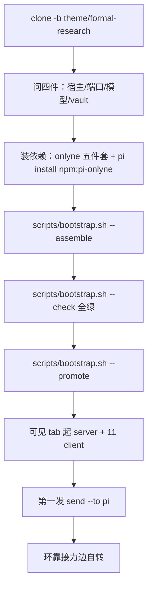

# BOOTSTRAP —— 把模板树装成可通电的集群

读者：拿到 clone 的第一个 agent 会话（pi / omp / claude 皆可），或自己动手装机的人。

`theme/formal-research` 是模板发布分支：拓扑（11 角色）、角色细则、领域技能、评测契约都已定稿。装配不改设计，只补三件本机事实——服务器证书指纹、11 个角色密钥、模型路由与可选 vault 路径。装配期间不启动集群、不跑实验。红线：`.onlyne/spec.toml` 与 `.onlyne/templates/` 的结构保持完整。

## 开场协议（会话读到本文件、或用户说「帮我看看这棵树」时，第一件事）

向用户自我介绍，然后一次问全下面四件，拿到答复再动手：

> 这是一棵 formal-research 模板树：11 个角色（planner 派题 → pi 开题 → examiner 敌意对线 → theorist/speculator 理论 → runner 跑批 → qa 中期判词与放门 → chair+referee×3 结题合议 → planner 归档）组成的自转科研环，任务经 onlyne 集群投递，知识全落文件。我能替你把它装成你这台机器上可通电的实例，四条确认：
>
> 1. **装在哪台机器、用哪个终端宿主**？herdr / orca / zellij 之一——server 与 11 个 client 之后要各占一个你可见的前台 tab。
> 2. **端口**？spec 现值 `127.0.0.1:7820`；一台机器并跑多棵树就要换号。
> 3. **模型供应商与档位路由**？模板现值是 powerful 档（pi/examiner/theorist/speculator/chair/referee/planner）+ supercheap 档（librarian/runner/qa/scribe）。换供应商就报 provider 名与两档模型 id；沿用现值说「不改」。
> 4. **有没有 Obsidian vault**？给根路径就接（仓根 `obsidian/` 四软链），没有就跳过，约定里的 vault 节在这台机器上整段失效。算力功耗要不要调口径（默认：训练单进程、串行、单片 ≤45 min）？

用户只想浏览：给 `README.md` 的全景与设计说明，停在原地，零文件改动。

## 0. 全景



## 1. 上下文面（谁读什么）

| 文件 | 读者 | 作用 |
|---|---|---|
| 仓根 `AGENTS.md`（clone 态） | 第一个会话 | 薄引导：指向本文与脚本 |
| `.agents/AGENTS.md` | `--promote` 复制为仓根 `AGENTS.md` | 11 角色公共约定正本；pi 沿父目录链拼进树内每个 role 会话 |
| `.pi/SYSTEM.md` | supervisor 值班会话 | 装配、通电、账目、残影恢复、对人报告 |
| `.onlyne/templates/formal/<phase>/<role>/AGENTS.md` | 该 role 会话 | 角色细则（generate 渲进 ws） |
| `.agents/skills/` | 全员按需 | 领域方法论十件（吸收制，只进本目录） |
| `README.md` | 人 | 系统说明与三关口 |

## 2. 依赖安装（版本策略＝始终追 latest，闸只设 protocol=1 下限）

```bash
command -v onlyne && onlyne version      # 判据：protocol=1，版本 ≥1.0.0
cargo install onlyne-cli onlyne-server onlyne-client onlyne-gateway onlyne-tui
pi install npm:pi-onlyne                 # 第一次装配亲手跑；命令里没有版本号
```

crate `onlyne-cli` 装出的 bin 叫 `onlyne`，其余同名；各 crate 版本号独立前进。onlyne 发版频繁，每个小版本装进来的都是 bug fix。升级＝同一条 `cargo install` 加 `--force`。

名字陷阱：crates.io 上的 `onlyne` 0.5.x 与 `onlyne-swarm` 0.6.x 是旧形态占名；npm 上的 `pi-onlyne` ≤0.9.1 讲旧协议，≥1.0.0 讲 protocol 1，latest 即最新修复。

备用源码构建（要跟 onlyne main 上未发布的 fix）：`git clone <onlyne 上游仓地址> && cd onlyne && cargo build --release`（地址问集群 owner，或从 `onlyne --help` 指向的项目页取），把 `target/release/{onlyne,onlyne-server,onlyne-client,onlyne-gateway,onlyne-tui}` 放进 PATH；macOS 上 cp 复制的二进制签名失效，需逐个 `codesign --force --sign -` 重签，Linux 免。后续更新 `git pull && cargo build --release` 再重跑拷贝。

会话后端需 herdr / orca / zellij 之一：选择链 `ONLYNE_BACKEND`（非空）> 工作区 `config.toml` 的 `backend` > auto（探测序 herdr→orca→zellij）；`exec`/`fake` 只认点名，全无匹配时 `onlyne client run` 退 5。`onlyne-client doctor` 只读打印宿主判定。socket 解析次序 `--socket` > `ONLYNE_SOCKET` > `--server-root` > cwd 上行查找；规范路径越过 103 字节时绑系统临时目录下的短派生路径，实际路径写进 `.onlyne/run/socket`。

## 3. 一条命令装配

```bash
scripts/bootstrap.sh --assemble --dry-run      # 先看要做啥，零写入
scripts/bootstrap.sh --assemble \
  --provider <名> --model-powerful <id> --model-supercheap <id> \
  --vault <vault 根路径>
```

不报模型 flag 就保留模板现值；不给 `--vault` 就不建软链。脚本按幂等六步走，已达状态打 `SKIP`：

| 步 | 动作 | 判据 |
|---|---|---|
| 1 | 证书：暂移 `spec.toml` → `onlyne-server init --root . --listen <addr>` → 还原并把打印的 `cert_pin` 写回 `[server]` 行 | `cert_pin` 非 `REPLACE_ME` 且 `.onlyne/keys/server.key` 在盘 |
| 2 | 密钥：逐 role `onlyne-client init --workspace .onlyne/ws/formal/<phase>/<role> --role <role> --server-root .`，把打印行的 `key` 回填进对应 `[[client]]` | 11 个 key 非全 `AQEB` 占位 |
| 3 | 模型档位：按 flag 重写 11 份模板 `.pi/settings.json` 的 `defaultProvider`/`defaultModel`，effort 档不动，`packages` 钉回 `["npm:pi-onlyne"]` | flag 缺省即 SKIP |
| 4 | 渲染：逐 role `onlyne server generate --root . --template formal/<phase>/<role> --role <role> --force` | 11 份 ws 在盘 |
| 5 | vault：`obsidian/{论文,reports,draft,templates}` 四软链（`obsidian/` 已 gitignore） | `--vault` 给了才做 |
| 6 | 收尾自动跑 `--check` | — |

第 1 步为什么要暂移 spec：`onlyne-server init` 见 `spec.toml` 存在即拒（源码 `init_command`，无 `--force` 时 refuse）。**别图省事加 `--force`**——那会让 init 用它自带的极简模板覆盖整份 spec，11 行拓扑与 ACL 全丢。

产出的本机状态：`.onlyne/keys/`、`.onlyne/ws/`（gitignored），`spec.toml` 出现 `cert_pin` + 11 行 `key` 的本地 diff（跟踪文件，设计内的装机改动）。

## 4. 门禁与提升

```bash
scripts/bootstrap.sh --check     # 只读十二项，全绿才准通电
scripts/bootstrap.sh --promote   # cp .agents/AGENTS.md → 仓根 AGENTS.md
```

`--check` 覆盖：五件套与 protocol、pi 插件在册、spec 可 parse 且 11 role 与模板目录双向一致、relay 边双向闭合、`_supervisor` 零上行、cert_pin 与 server.key 同机、11 key 非占位、11 ws 已渲染且 packages 为 `npm:pi-onlyne`、终端宿主可探测、listen 端口空闲、文档卫生（跟踪件里零本机绝对路径与已废栈字样）、vault 软链一致性。

`--promote` 只替换仓根 `AGENTS.md`：此后树内每个 role 会话沿父目录链读到的就是公共约定正本，薄引导退场。仓根文件首行已是约定标题时脚本报 already-promoted，零写入。

## 5. 通电（人在可见 tab 执行）

daemon 一律起在你可见的前台终端 tab，关 tab 即停环；禁入任何 agent 后台，禁 nohup。起 client 的宿主目录决定会话 spawn 定向，起错检出=会话一起就死。

```bash
onlyne server start --root .                                   # 一个 tab；detached+pid，判活 socket_present
onlyne client run --workspace .onlyne/ws/formal/initiation/pi  # 11 个 role 各一个 tab
# initiation/examiner、common/librarian、common/scribe、theory/speculator、theory/theorist、
# experiment/runner、review/qa、review/referee、review/chair、archive/planner 同式
onlyne tui --server-root .                                     # 可选观测位
onlyne status --server-root .                                  # connected 11/11 = 环点亮
```

## 6. 第一发

研究方向写进 `payload/first.md`（目标 / 输入 / 期望产物三段，见约定正本「任务书三段」），投给角色表 ★ entry role（pi）：

```bash
onlyne send --server-root . --from planner --to pi --file payload/first.md
```

`--from` 须是在册持边角色（supervisor 不注册 `[[client]]`，走 admin 面代发，落账 `admin=true`）。用户自己在 CLI 投也行，supervisor 事后从 ledger 与项目目录接上下文。第一发落地后环自转：pi 出头四段申报 examiner，后续推进全靠接力任务。

## 7. 验收自检

最小闭环用例先行：向 pi 投一条自包含小任务（内容如「读 AGENTS.md 后回一句本环入口确认」）→ session 起 → pi 内 `onlyne_complete` outcome=done → `onlyne ledger --server-root .` 出现 task acked 与 completion 回 origin 两行 → `onlyne faults --open-only` 空。绿了再投研究方向的第一发。

## 8. 换机速查

要动的本机项三件：`cert_pin`（步 1）、11 个 `[[client]].key`（步 2）、模型三元组（步 3）；vault 路径（步 5）可选。全部由 `--assemble` 幂等代做。其余文件跨机通用。`.onlyne/run|store|keys|logs|ws/`、`obsidian/`、`.train-slot/` 全是运行态，不入 git，装机过程自然再生。

装机 diff 的归属：promote 后的仓根 `AGENTS.md` 与带真实 key 的 `spec.toml` 是本机实例状态。往模板分支提交前先问用户，缺省不入库。

## 9. 常见坑

- 装具报 command not found 或行为像旧版：核 `which onlyne` 与 PATH 序（cargo install 与手拷二进制并存时，先入 PATH 者生效），`onlyne version` 不过闸就 `cargo install --force` 重跑五条。
- 非法 key 会让 spec 全量 parse 连 `client init` 都跑不动：回填前 key 位必须保持合法 32 字节 base64（模板占位 `ed25519/AQEB…` 即合法），改成 `REPLACE_ME` 之类字面串会全链拒跑。
- `onlyne client run` 退 5 报 NO_SUPPORTED_HOST：终端宿主缺失或 `ONLYNE_BACKEND` 点错，跑 `onlyne-client doctor` 看判定。
- 深路径工作区 socket 绑不上：看 `.onlyne/run/socket` 里的短派生路径，属 1.1.1 起的正常行为。
- client 重挂后有 working 残影（faults 只覆盖投递层）：逐条 `onlyne repair inspect --task <id>`，死 pane 的用 `onlyne repair close --task <id>` 收口（close 记 cancelled、fail 记 failed，两者都向属主 client 发 Cancel 并回收宿主资源）。
- 停某个 client：`onlyne-client` 不写 pid 文件，用 `ps` 按 args+cwd 精确匹配再定点发信号，禁按名杀。
