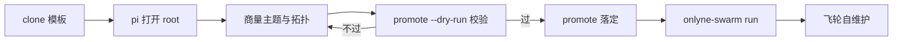

# 模板装配（bootstrap）设计

一个主题一套 flywheel。clone 出来的模板要有一个确定的开箱入口：



装配材料在落定后全部退场，工作区只剩主题产物。本文档是实现规格，材料本体（指南 skill、
`promote.sh`）按本文写。

## 1. 决定设计的运行时事实

- pi 每个目录只取一个上下文文件，候选序
  `AGENTS.override.md → AGENTS.md → AGENTS.MD → CLAUDE.md → CLAUDE.MD`，
  且只读 cwd 与祖先目录（`pi-coding-agent/dist/core/resource-loader.js:32`）。
- worker session 的 cwd 在 `.ws/<role>/`，它的公共约定来自 root `AGENTS.md` 的祖先拼接。
  落定动作是**替换** root `AGENTS.md` 的内容：删掉它等于把五个 worker 的约定一起删掉。
- `.agents/` 子目录下的 markdown 运行期不加载，是天然的材料区。
- `.agents/skills/` 是 pi 的 skill 根，会被发现（现在装着 `onlyne-swarm`）。装配指南 skill 与
  常驻 skill 同目录，靠"落定时删除装配指南目录"划界。
- scheduler 的 role 名取自 `.agents/.schedule/<目录名>`，`swarm_send` 与 `--to` 都吃这个名字。
  角色可增删，因此任何写死 `scout/model/bench/writer/critic` 五个名字的文件都是装配对象。

## 2. 状态机

| stage | 含义 | root `AGENTS.md` 内容 | `.ws/` | 飞轮在动 |
|---|---|---|---|---|
| configuring | 刚 clone，正在商量 | 薄入口（§5.1） | 未生成 | 否 |
| checking | 用户说配好了 | 薄入口 | 可已生成 | 否 |
| live | 主题已落定 | 主题约定版 | 由 scheduler 维护 | 要注入第一发才动（§6.5） |

标记文件 `.onlyne/flywheel.json`（运行态，gitignore 内）：

```json
{ "stage": "live", "theme": "qwen-sft-schema", "slug": "qwen-sft-schema",
  "template_commit": "258f154", "promoted_at": "2026-09-08T14:02:00Z",
  "entry_role": "scout", "roles": ["scout", "model", "bench", "writer", "critic"] }
```

幂等判定读它：已 `live` 时 `promote.sh` 拒绝再跑。`template_commit` 记模板演进锚点，
将来 `git merge origin/main` 升级骨架靠它对照。

## 3. 装配面（主题会改到的东西）

| # | 路径 | 装配动作 | 谁读它 |
|---|---|---|---|
| 1 | `AGENTS.md` | 落定时由 `.agents/AGENTS.md` 提升，主题段填进骨架槽 | supervisor + 每个 worker |
| 2 | `.pi/SYSTEM.md` | 主题职责；派工目标名来自角色表 | supervisor 会话 |
| 3 | `.agents/.schedule/<role>/template.workspace.jsonc` | role 增删、`role` 文案、`model.{provider,model,effort}`、`back_edges` | scheduler 生成的 worker |
| 4 | `pool/ideas.jsonl` | 建文件并放主题种子 idea（schema 见 root 约定） | supervisor 队列、scout 追加 |
| 5 | `research/` | 领域锚点文件与 `frontier-notes.md` 表头约定 | scout / model |
| 6 | `experiment/`、`evaluation/` | 领域代码与评测器骨架 | model / bench |
| 7 | `papers/`、`runs/` | 空骨架 + `.gitkeep` | writer / critic / supervisor |
| 8 | `.pi/settings.json` | `npm:pi-onlyne@^0.8.1` 版本下限 | 所有 worker 与 supervisor |
| 9 | `README.md` | 用户面：这套主题跑什么、怎么起 | 人 |

第 3 项的角色清单是拓扑的唯一事实源。第 1、2 项里出现的角色名都要由装配过程按第 3 项生成。

另一处同类缺口：root `AGENTS.md` 与本文都引用 `payload/`，模板目录里它不存在（`pool/`、`runs/`、
`research/`、`papers/`、`experiment/`、`evaluation/` 都只带 `.gitkeep`，`payload/` 连目录都没有）。
装配时补 `payload/.gitkeep` 进 git，第一发写 `payload/first.md` 前先 `mkdir -p payload`。

## 4. 角色表（落定进 root `AGENTS.md` 的产物）

宏观流从固定五角色改成装配时生成的表。`entry` 列标出第一发的注入对象，全表恰好一个 `★`：

```markdown
| role | 职责 | 上游 | 下游 | entry | model |
|---|---|---|---|---|---|
| scout | 前沿检索与 idea 入池 | root | root | ★ | axonhub/supercheap |
| model | 推导 + Lean + 实现 | root | bench, writer, root | | … |
| bench | 跑批与测量 | model | writer, root | | … |
| writer | 成稿 | model, bench | critic | | … |
| critic | 审稿 | writer | root（accept/reject）/ writer（revise） | | … |
```

supervisor 派工、`onlyne-swarm submit --to <role>`、`swarm_send <role>` 的目标名都查这张表。
角色增删时表与 `.schedule/` 目录必须同步，这是校验项（§6.3）。`entry` 那一行同时写进
`.onlyne/flywheel.json` 的 `entry_role`，供脚本与 supervisor 直接读。

## 5. 材料布局

### 5.1 root `AGENTS.md`（装配前版本）

```markdown
# 本工作区尚未装配

你是这个 clone 的第一个 pi 会话。先读
`.agents/skills/flywheel-setup/SKILL.md`，按它的阶段一步步配。
配完跑 `./scripts/promote.sh --dry-run`，逐项过校验后向用户复述将删除
哪些文件，用户确认再执行 `./scripts/promote.sh`。

红线：落定前不起 scheduler，不跑领域实验，不动 `.agents/AGENTS.md` 与
`.agents/skills/onlyne-swarm/`。
```

薄入口承担两件事：把 pi 引到 skill，以及立住红线。步骤与清单全在 skill 里，装配期结束随目录退场。

### 5.2 `.agents/skills/flywheel-setup/SKILL.md`

frontmatter `name` + `description` 要能触发（关键词：装配、bootstrap、新主题、clone）。
正文按 §7 的七个阶段写，每阶段给"问用户什么 / 写哪个文件 / 怎么自查"。阶段 G 的开头先把
§6.5 的现场清单转述给用户，再问要不要投第一发。

### 5.3 `.agents/AGENTS.md`（约定骨架）

现 root `AGENTS.md` 全文迁入，四处改造：

- 宏观流一节改成"角色表 + 从表推导的接力规则"（§4，含 `entry` 列）。
- 新增一节「冷启动与第一发」（§6.5 的现场描述与动作条款原文搬进骨架）。`BOOTSTRAP.md` 与
  装配 skill 落定即退场，提醒只有写在这两份长期文件里才能被运行期的 supervisor 读到。
- `.pi/SYSTEM.md` 同步加一条 idle 判定条款（§6.5）。
- 主题槽用可见标记：`<!-- THEME:research-question -->`、`<!-- THEME:runs-layout -->`、
  `<!-- THEME:evaluation-contract -->`、`<!-- THEME:role-table -->`、`<!-- THEME:entry-role -->`。
  装配填槽，`promote.sh` 检查残留标记。

## 6. `scripts/promote.sh` 契约

### 6.1 用法

```text
./scripts/promote.sh [--dry-run] [--theme <slug>] [--force-stage]
```

### 6.2 前置

- 当前 stage 为 `configuring` 或 `checking`（读 `.onlyne/flywheel.json`，无文件按 `configuring` 处理）。
- `--dry-run` 只跑校验并打印将执行的动作，零写入。

### 6.3 校验项（任一失败即 exit 1，保持 configuring）

1. `.agents/AGENTS.md` 存在，五个 THEME 槽均已填充，无残留 `<!-- THEME:` 标记。
2. `.agents/.schedule/*/template.workspace.jsonc` 至少 1 个；每个的 `name` 与目录名一致、
   `role` 非空、`model` 三字段按主题需要填写。
3. `entry_role` 恰好一个且对应 `.schedule/` 目录存在；角色表 `entry` 列的 `★` 数恰好 1。
4. `onlyne-swarm workspace sync` 退出码 0 且输出的 `dangling links` 为 0（back_edges 校验在
   `template.rs::validate_edges`，由 `load_tree` 触发，`workspace sync` 是它离线的调用入点）。
5. root `AGENTS.md` 的角色表覆盖 `.schedule/` 全部目录名，无多余条目。
6. `pool/ideas.jsonl` 存在；逐行 JSON 可解析，`id/origin/question/hypothesis/method/evidence/
   evaluation/done_when/status` 齐全，`evidence` 非空数组，`evaluation.objectives` 非空，
   `done_when` 非空。允许 0 条种子，此时给 warning。
7. `payload/` 与 `research/` 就位：`payload/` 存在（缺则脚本建目录 + `.gitkeep` 并列入本次
   commit，§3 记的模板缺口）；`research/` 至少一个非 `.gitkeep` 文件。
8. `.pi/settings.json` 的 `packages` 含 `npm:pi-onlyne@^0.8.1` 或更高下限。
9. 二进制齐备：`onlyne-swarm`、`onlyne`、`orca`、`pi`；`onlyne-swarm --version >= 0.5.0`。

> CLI 实际子命令集（0.5.0）：`init`、`export-skill`、`run`、`attach`、`submit`、`cancel`、`list`、
> `status`、`tui`、`shell-completions`、`workspace {create|sync}`。`validate` 与 `doctor` 不存在，
> 模板校验靠 `workspace sync` 与 IPC `list_workspaces`。

### 6.4 动作序（全部成功才算落定）

1. `git checkout -b theme/<slug>`（已存在则报错，`--force-stage` 才允许切到已有分支）。
2. `cp .agents/AGENTS.md AGENTS.md`。
3. 写 `.onlyne/flywheel.json`（`stage=live`、`roles` 取自 `.schedule/` 目录名、`entry_role` 取自
   `THEME:entry-role` 槽）。
4. 删除装配材料：`.agents/AGENTS.md`、`.agents/skills/flywheel-setup/`、`BOOTSTRAP.md`。
5. `onlyne-swarm workspace create` 生成 `.ws/`（幂等，实例已存在则更新）。
6. `git add -A && git commit -m "feat(bootstrap): promote template to theme <slug>"`。
7. 打印下一步三行，原文包含 idle 提醒：

   ```text
   1) 本目录终端执行: onlyne-swarm run            # 起调度器（人执行，脚本不拉常驻进程）
   2) 另开终端:      pi                           # 这个会话就是 supervisor
   3) 飞轮现在是全 idle：tasks 0 行、runs/ 空、pool 只有种子。
      起 scheduler 等于接上电；它在转还需要再一步：
      给 supervisor 一个研究方向，或直接执行
      onlyne-swarm submit --to <entry_role> --payload payload/first.md
   ```

删除项集中在一个数组常量里，退场清单见 §8。脚本不启动任何常驻进程，scheduler 交给人执行。

### 6.5 落定后的现场与第一发（冷启动语义）

装配完成的瞬间，工作区处于这些事实下：

- `stage=live`，`theme/<slug>` 分支已建，装配材料已消失。
- scheduler 未运行（脚本不起常驻进程）；起 `onlyne-swarm run` 后各 workspace daemon 逐个 ready。
- `tasks` 表 0 行，`.ws/<role>` 下无 session，`runs/` 空，`papers/` 空，`pool/ideas.jsonl` 只有种子
  或空。
- 飞轮是反应式的：没有入站任务就什么都不会发生。`onlyne-swarm run` 属于通电，属于开跑。

启动动作二选一：

1. 用户给方向，supervisor 写 `payload/first.md`（含问题、约束、期望），执行
   `onlyne-swarm submit --to <entry_role> --payload payload/first.md`。
2. 用户自己在 CLI 投第一发，supervisor 事后从 ledger 与 `runs/` 接上下文。

两处要写死的提醒（否则运行期的 supervisor 意识不到自己在空转）：

- root `AGENTS.md`「冷启动与第一发」一节：上面的现场清单 + 两个启动动作 + 起始 role 名。
- `.pi/SYSTEM.md` 一条判定条款：进会话先查 `onlyne-swarm status` 与 `tasks`/`runs/`；
  若 `tasks` 为 0 行且 `runs/` 空，报告首行写「飞轮 idle，等待第一发注入」并给出确切命令；
  scheduler 未起时同批提示先 `onlyne-swarm run`；把"起了 scheduler"当成"在跑"归为错误报告。

第一发落地后环才成形：起始 role 产出入池 → `swarm_send _root` 唤醒 supervisor → supervisor 取
queued 派给下一个 role。后续每轮的推进靠接力任务，启动只需要一发。

## 7. 装配阶段（skill 的步骤骨架）

| 阶段 | 问用户 | 写文件 | 自查 |
|---|---|---|---|
| A 探询 | 研究问题、什么算进步、可跑的评测、算力与时间预算、禁区 | — | 能一句话说清目标与度量 |
| B 拓扑 | 需要哪些 role、谁唤醒谁、模型档位、需要几个评测器 | `.agents/.schedule/`（增删目录） | 每个 role 有上游下游 |
| C 起草 | 术语、runs/ 结构、稿件口径、起始 role 选谁 | 五个 THEME 槽、`.pi/SYSTEM.md`、`README.md` | 角色表与 `.schedule/` 对齐、★ 恰好一个 |
| D 种子 | 首批 idea 方向 | `pool/ideas.jsonl`、`research/` | schema 校验过 |
| E 校验 | — | — | `promote.sh --dry-run` 全绿 |
| F 落定 | 确认删除清单 | 脚本执行 | `stage=live`、分支 `theme/<slug>`、脚本输出的 idle 提醒已转述给用户 |
| G 第一发 | 研究方向给不给、由谁投 | `payload/first.md` | 投完看 `onlyne-swarm status`：`tasks` 出现 ≥1 行且起始 role 有 session；`runs/` 或 `research/` 开始有产物 |

## 8. 落定后退场清单

| 路径 | 处置 |
|---|---|
| `AGENTS.md` | 内容替换为约定骨架（提升） |
| `.agents/AGENTS.md` | 删除 |
| `.agents/skills/flywheel-setup/` | 删除 |
| `BOOTSTRAP.md` | 删除（本文档只服务装配） |
| `.agents/skills/onlyne-swarm/` | 保留，worker 运行期要读 |
| `scripts/promote.sh` | 保留（重装配与排障入口） |
| `examples/marquee/` | 保留（协议示例） |
| `.onlyne/flywheel.json` | 保留并写 `stage=live` |

## 9. 验收

- 新 clone（或 `git worktree add` 出的干净副本）执行 `pi` 后，第一条回复就指向 skill 并开始
  阶段 A 探询。
- `promote.sh --dry-run` 在缺种子 idea、缺主题槽、角色表与 `.schedule/` 不一致、`entry_role` 缺或
  多于一个四种情况下分别以 1 退出并打印可定位的原因。
- 落定后不起 scheduler 时开 `pi`，supervisor 首条报告含「飞轮 idle，等待第一发注入」与确切命令；
  起完 scheduler 仍 0 任务时同样报 idle，把 `run` 当成开跑的报告算不合格。
- 注入第一发后 `tasks` 至少 1 行、起始 role 出现 session；此后 supervisor 靠接力任务推进，
  人工不再推。
- 完整装配一遍后：`stage=live`、`theme/<slug>` 分支存在、退场清单里的文件消失、
  `onlyne-swarm run` 起得来、`onlyne-swarm submit --to <entry_role>` 能点亮一跳。
- 二次执行 `promote.sh` 报"已 live"，零写入。

## 10. 派工边界

- 判断与主题文案：人 + supervisor 会话（skill 的 A–D 阶段）。
- 机械与破坏性动作：`scripts/promote.sh`。删除项与 git 动作全部进脚本，装配指南里只出现
  `promote.sh` 一条命令。
- 实现材料：§5 三份文件 + §6 脚本，代码交 onlyne 侧会话，本文档是唯一输入。
