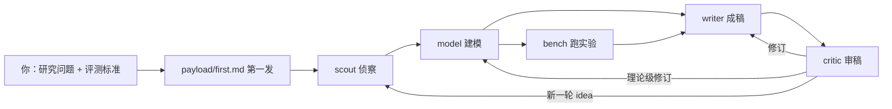

# Research Flywheel v3

一个本地多智能体自动科研模板。你给它一个研究问题和验收标准，五个 AI 角色在本地互相派活、逐轮推进：侦察员找证据、建模员做推导与形式化、实验员跑数据、写手成稿、审稿员定生死。每轮的过程件、实测数据、成稿、判词全部落成磁盘文件，顺着 `runs/` 与 ledger 能回溯整条科研链。

飞轮是反应式的：没有入站任务时环不动。第一发任务落地后，推进全靠角色之间的接力边自转，人在旁边旁观，用一条命令终结任务族。

workspace 表示一个 role 的长期工作区，里面有记忆、设定、历史文件。session 表示这个 role 当前手上的一件工作。任务、session、一跳是一回事。飞轮按"射后不理"工作：恢复上下文 → 工作 → `handoff` 激发下游（可选）→ 写文件 → `onlyne_complete` 交活退出。role 不等下游回执。投递后立即返回一行 receipt JSON。过程与回执都写进 server ledger。结果通过文件返回。下一条接力任务会唤醒下一个 role。

## 最省事的路：让 agent 干完全程

在仓库根目录打开 pi（orca/herdr 里用 omp 打开本仓库即可），把下面整段粘给它，它会把装配、通电全部做完，你只回答三个问题、最后在几个 tab 里粘几行命令。

```text
把这个 Research Flywheel 模板在本工作区装配并通电到"环已起动"的状态。常驻进程按仓库纪律起在可见 tab，你的编辑与前台命令照常跑。

动手前先用一次提问问全三件事：
1. 研究问题一句话；主度量与次度量各自的判定阈值；算力与时间预算；禁区。
2. 模型 provider / model id / thinking level（填 .onlyne/templates/flywheel/<role>/.pi/settings.json 的 defaultProvider / defaultModel / defaultThinkingLevel，五个 role 同一套或分别定）。
3. server 端口，默认 127.0.0.1:7812，被占用就换一个。

然后按顺序执行，每步做完报一行结果：
1. 检查工具链：onlyne、onlyne-server、onlyne-client、pi 都在 PATH；缺谁就给安装命令并停下等我装。
2. 填 .agents/AGENTS.md 的「研究问题与判进标准」「runs/<run-id>/ 目录约定」「评测契约」三节。
3. 填五个 role 的模型三元组；.onlyne/spec.toml 的 [server].listen 换成我选的端口，cert_pin 保持占位串不动。
4. 写 pool/ideas.md 至少一条种子 idea（evidence、evaluation.objectives、done_when 三项非空，格式照 .agents/AGENTS.md 的「idea 格式」一节）；research/frontier-notes.md 补一条真实来源记录。
5. 按我的主题改写 payload/first.md 四段：目标、输入、期望产物、下一跳建议。
6. ./scripts/promote.sh --dry-run 跑到 9/9 PASS，再执行 ./scripts/promote.sh。
7. onlyne server init --root . --listen <我选的端口>，把产出的 cert_pin 回填 .onlyne/spec.toml 的 [server].cert_pin。
8. 对 scout model bench writer critic 逐 role 跑 onlyne client init --workspace .onlyne/ws/flywheel/<role> --role <role> --server-root .。
9. onlyne server generate --root . && onlyne server start --root . && onlyne reload --server-root . && onlyne-client doctor。
10. 把 onlyne server status 的 socket_present 报给我。
11. 把下面五行原样给我，我在五个可见 tab 里各粘一行（daemon 一律起在可见 tab）：

    onlyne client run --workspace .onlyne/ws/flywheel/scout
    onlyne client run --workspace .onlyne/ws/flywheel/model
    onlyne client run --workspace .onlyne/ws/flywheel/bench
    onlyne client run --workspace .onlyne/ws/flywheel/writer
    onlyne client run --workspace .onlyne/ws/flywheel/critic

我跑完五个 client 后告诉你，你再执行第一发并只读报现场：

onlyne --server-root . send --from _supervisor --to scout --file payload/first.md
onlyne ledger
```

验收清单（agent 报完你核对）：`onlyne server status` 的 `socket_present` 为真；`onlyne roles` 五个角色全 connected；第一发后 `onlyne ledger` 出现 scout 的在途行；`runs/` 下新生出 `<run-id>/idea.json`。

## 环长什么样



三种走法：照下面五步自己走；把上面那段话粘给 pi 让 agent 干完全程；在 orca/herdr 里用 omp 打开本仓库口头问它。

## 快速起步（新手照这条走）

### 第 0 步：装工具（一次性）

```bash
cargo install onlyne-cli onlyne-server onlyne-client onlyne-gateway onlyne-tui
pi install npm:pi-onlyne
```

- 五条 onlyne 命令来自 Rust 工具链，先装 cargo。升级＝同一条命令加 `--force` 重跑。
- `pi` 是角色会话的 agent 后端，`npm:pi-onlyne` 是它的 onlyne 插件。role 模板 `.pi/settings.json` 的 packages 已经写着它。
- 会话宿主三者有其一：`herdr`、`orca`、`zellij`。选择链是 `ONLYNE_BACKEND`（非空）> 工作区 `config.toml` 的 `backend` > auto；auto 探测序 herdr→orca→zellij。
- 验收：`onlyne version` 输出 `protocol:1`；`pi list` 里有 `npm:pi-onlyne`。

要跟 onlyne 仓 main 上尚未发布的 fix：`git clone https://github.com/dbydd/onlyne && cargo build --release`，五产物放进 PATH。macOS 上 cp 完必做 `codesign --force --sign -`，复制后的二进制签名失效，直接 exec 收 SIGKILL。

### 第 1 步：把你的研究主题填进骨架

模板出厂是通用骨架。填五处，缺一处 `promote.sh` 会拦住你：

| 位置 | 填什么 |
|---|---|
| `.agents/AGENTS.md` | 「研究问题与判进标准」「runs/<run-id>/ 目录约定」「评测契约」三节 |
| `.onlyne/spec.toml` | `[server].listen` 端口；role 增删改 `[[client]]` |
| `.onlyne/templates/flywheel/<role>/.pi/settings.json` | 每 role 的模型三元组 |
| `pool/ideas.md` | 至少一条种子 idea |
| `research/` | 领域锚点文件 |

研究问题一节写：问题一句话，主度量与次度量各自的判定阈值，算力与时间预算，禁区。每条具体到能判断某一轮实验是否推进了它。

模型三元组示例（`defaultProvider` / `defaultModel` / `defaultThinkingLevel` 三个键都要是非空字符串）：

```json
{
  "packages": ["npm:pi-onlyne"],
  "defaultProvider": "axonhub",
  "defaultModel": "<你的模型 id>",
  "defaultThinkingLevel": "high"
}
```

种子 idea 一个小节，`evidence`、`evaluation.objectives`、`done_when` 三项非空才进池，格式见 `.agents/AGENTS.md` 的「idea 格式」一节。`research/frontier-notes.md` 要有表头加至少一条真实来源记录（URL 加单行结论）。

`payload/first.md` 已带示例任务书，按你的主题改写四段：目标、输入、期望产物、下一跳建议。输入路径必须真实存在，接收方 session 是全新上下文，任务书里没写的路径它找不到。

### 第 2 步：装配

```bash
./scripts/promote.sh --dry-run   # 九检零写入
./scripts/promote.sh             # 复核清单后执行
```

脚本建 `theme/<slug>` 分支、把 `.agents/AGENTS.md` 提升为 root `AGENTS.md`、写 `.onlyne/flywheel.json`、删装配材料、commit。九检覆盖：role 面无装配残留、spec 与模板一致、恰好一个 entry role、ACL 双向闭合、种子 idea schema、payload 与 research 就位、模型三元组与插件包、工具链在 PATH 且版本过闸。

### 第 3 步：通电（一次性，脚本不起任何常驻进程）

```bash
onlyne server init --root . --listen 127.0.0.1:7812   # 产 keys 与 cert_pin；多树并机自选空闲端口
```

回填 `.onlyne/spec.toml` 的 `[server].cert_pin`，然后逐 role 换真 key：

```bash
for r in scout model bench writer critic; do
  onlyne client init --workspace .onlyne/ws/flywheel/$r --role $r --server-root .
done
onlyne server generate --root .                       # 渲染 .onlyne/ws/flywheel/<role>/
onlyne server start --root .                          # detached+pid；判活看 socket_present
onlyne reload --server-root .                         # 改了 spec.toml 之后也要跑一次
onlyne-client doctor                                  # 只读：宿主探测结果
```

判活口径：`onlyne server status` 的 `socket_present` 是 server 死活真相（`run` 不写 pid，`status.running` 只认 pid 文件；深层工作区再看 `.onlyne/run/socket`）；每个启用 role 在 `onlyne roles` 显示 connected 才算连上。

然后每 role 开一个可见 tab，各起一个 client：

```bash
onlyne client run --workspace .onlyne/ws/flywheel/scout
```

五个 role 五条命令五个 tab。`onlyne-client` 从目标 worktree 自己的 tab 起。daemon 类（`onlyne-server`、`onlyne-client`、`onlyne tui`）一律起在可见 tab，不进 agent 后台。

再在仓库根目录开一个 agent 会话（omp 或 pi）当 supervisor 值班面，它的岗位说明在 `.pi/SYSTEM.md`。

### 第 4 步：第一发

```bash
onlyne --server-root . send --from _supervisor --to scout --file payload/first.md
onlyne tui
```

示例按模板默认拓扑写 `--to scout`；实际入口以角色表 `★` 行为准，换主题时同步这一行。第一发落地后环即成形：entry role 产出入池并自取 queued 派给下游，后续每轮靠接力任务推进。supervisor 不进环。

### 第 5 步：旁观与收摊

- 看现场：`onlyne roles`、`onlyne sessions`、`onlyne ledger`、`onlyne faults --open-only`、`onlyne tui`（两页看板：角色网络 + ledger）。
- 看产物：`runs/<run-id>/`（idea.json、derivation.md、lean/、measured/、verdict.md）、`papers/`（成稿与 figs）、`pool/ideas.md`（状态机）。
- 终结一个任务族：`onlyne control cancel --task <id>`，或在 TUI 里按终结键。
- 停 server：`onlyne server stop --root .`。

## 装配与通电（细则）

### 装配

装配把通用骨架填成一个具体研究主题的飞轮，产出一条 `theme/<slug>` 分支与一套可通电的拓扑。装配期间不启动集群，不跑实验。

1. **定题**。填 `.agents/AGENTS.md` 的「研究问题与判进标准」「runs/<run-id>/ 目录约定」「评测契约」三节：研究问题一句话加验收它的度量，主度量与次度量各自的阈值，算力与时间预算，禁区。
2. **拓扑**。role 增删与边改 `.onlyne/spec.toml` 的 `[[client]]`，同步 `.onlyne/templates/flywheel/<role>/` 目录。角色名的唯一事实源是模板目录名。prose 是身份与上报纪律，与角色表两处保持一致。ACL 铁律：A 的 `handoff B` 要求 B 条目 `allowed_senders` 含 A，且 A 条目 `allowed_targets` 含 B。`relay_required` 是完成守卫（session 在 complete 前必须已经 handoff 给列出的角色），本模板未启用。
3. **模型档位**。逐 role 填 `.onlyne/templates/flywheel/<role>/.pi/settings.json` 的三元组。
4. **种子**。写 `pool/ideas.md`：一条 idea 一个小节，`evidence`、`evaluation.objectives`、`done_when` 三项非空才进池。同时写 `research/` 的领域锚点文件，含 `frontier-notes.md` 表头与至少一条真实来源记录。
5. **装具**。跑「第 0 步」的 onlyne 与 pi 插件两条安装命令；缺 `npm:pi-onlyne` 时 `pi list` 会点出来。
6. **落分支**：跑「第 2 步」两条命令。

### 通电

通电一次性，由人执行，脚本不起任何常驻进程。命令序列见「第 3 步」。

key 位在换真身前保持合法 32 字节 base64 占位（`AQEBAQ...AQE=`）。非法 key 会让全量 parse 连 `onlyne client init` 都跑不动。`[server].cert_pin` 在 `onlyne server init` 之前保持字符串形态。

三个断电口径：`onlyne server status` 的 `socket_present` 是 server 死活真相；每个启用 role 在 `onlyne roles` 显示 connected 才算连上；ws 内 `.pi/settings.json` 的 packages 保持 `npm:pi-onlyne`。

### 第一发

写 `payload/first.md`（目标、输入、期望产物、下一跳建议四段，口径见角色面正本的「任务书四段」），跑「第 4 步」两条命令。

## 角色树

```text
.        supervisor（root）：值班、观察、记账，不进环
├─ scout   检索+证据+idea 入池，取单派 model                                    ★ 第一发入口
├─ model   推导+Lean 形式化+方法与评测器 spec → 派 bench / writer（理论缺口回 scout）
├─ bench   跑实验与评测落 measured/ → 派 writer（跑不动回 scout）
├─ writer  成稿（带溯源数字）+ 兼职出图 → 派 critic
└─ critic  对照证据审稿 → verdict.md → 派 writer（修订）/ model（理论级修订）/ scout（新轮）
```

角色链：scout → model → {bench, writer} → writer → critic → {writer、model、scout}。角色表、ACL 与模型位都在 `.agents/AGENTS.md`。每个 session 自动继承它。调度与值班词汇见 `.agents/skills/onlyne-supervisor/SKILL.md`，role 协同纪律见 `.agents/skills/onlyne-role/SKILL.md`。

## 动力源

第一颗 seed 由人给，内容是方向和问题。之后每轮结束，critic 从 open questions 或失败结论提取下一条 idea 入池。idea 需要证据和评测契约，缺任一项就不入池。自激发没有熔断。人用 `onlyne control cancel --task <id>` 终结任务族，也可以在 TUI 里按终结键。

## 词汇表

| 词 | 含义 |
|---|---|
| role | 一个固定职能的长期身份，跑在自己的 workspace 里（scout、model、bench、writer、critic） |
| session | role 当前手上的一件工作，一跳即结 |
| hop / 接力 | 一次任务交付；一律用 handoff，ledger 顺 `parent_task` 链可查整条科研链 |
| ledger | server 侧的二进制账本（`.onlyne/state.db`），用 CLI 读，禁止递归读 `.onlyne/` |
| idea 池 | `pool/ideas.md`，唯一队列，checkbox 状态机：queued → running → keep / failed |
| verdict | critic 的判词，`runs/<run-id>/verdict.md` 首行 accept / revise / reject |
| 射后不理 | role 投递下一跳后立即交活退出，不等下游回执 |

## 排障

| 现象 | 原因与处置 |
|---|---|
| `onlyne client run` 退出码 5 | herdr/orca/zellij 三者都不在 PATH 且 `ONLYNE_BACKEND` 未设；装一个宿主或显式 `ONLYNE_BACKEND=exec` |
| 全量 parse 报非法 key | 占位 key 保持合法 32 字节 base64；`onlyne client init` 会把占位换成真 key |
| `onlyne server start` 起不来 | 看 `.onlyne/run/socket` 与 `onlyne server status` 的 `socket_present`；端口占用就换 `listen` |
| `acl_denied` | spec 缺边：A handoff B 要求 B 的 `allowed_senders` 含 A 且 A 的 `allowed_targets` 含 B |
| `recipient_offline` | note 类消息找不到可唤醒的目标：角色离线，或在线但无 working session 且 `note_queue` 关闭。改用 `onlyne_send kind:"task"` 或 `onlyne handoff` |
| `duplicate` / `conflict` | 同一 `op_id` 重发。原帧重发；换内容会得 `conflict` |
| server 起了、环不动 | 反应式飞轮等第一发。跑「第 4 步」；判断口径见 `.pi/SYSTEM.md` 的空转判定 |
| TUI 显示 `working+stale` | pane 心跳停了。先 `onlyne control probe --task <id>`，pane 已死用 `onlyne repair close --task <id> --reason ...` 或 `repair fail` 销账 |
| 改了 `spec.toml` 没生效 | `onlyne spec_diff --server-root .` 看差异，再 `onlyne reload --server-root .` |

## 目录

```text
AGENTS.md                  角色面正本：角色表、边义、runs 结构、评测契约、纪律
.agents/AGENTS.md          角色面正本源，promote 的复制起点
.agents/skills/            领域技能（paper-figures、paper-writing）与平台技能（onlyne-role、onlyne-supervisor）
.pi/SYSTEM.md              supervisor 值班会话的岗位说明
scripts/promote.sh         装配器：九检 + 落分支
onlyne 侧：.onlyne/spec.toml（拓扑真相）+ templates/flywheel/<role>/（细则与模型位）
知识产物：pool/（idea 池）、runs/（一轮过程件）、papers/（成稿与 figs）、research/（证据）
领域代码：experiment/、evaluation/；第一发任务书：payload/
```
