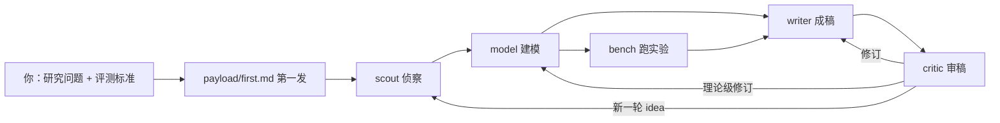

# Research Flywheel v3

本模板按当前 Onlyne 契约运行。role 会话使用 pi 插件工具，supervisor 的 admin 面使用带身份 gate 的 shell 命令。

一个本地多智能体自动科研模板。你给它一个研究问题和验收标准，五个 AI 角色在本地互相派活、逐轮推进：侦察员找证据、建模员做推导与形式化、实验员跑数据、写手成稿、审稿员定生死。每轮的过程件、实测数据、成稿、判词全部落成磁盘文件，顺着 `runs/` 与 ledger 能回溯整条科研链。

飞轮是反应式的：没有入站任务时环不动。第一发任务落地后，推进全靠角色之间的接力边自转，人在旁边旁观，用一条命令终结任务族。

workspace 表示一个 role 的长期工作区，里面有记忆、设定、历史文件。session 表示这个 role 当前手上的一件工作。任务、session、一跳是一回事。飞轮按"射后不理"工作：恢复上下文 → 工作 → `onlyne_handoff` 激发下游（可选）→ 写文件 → `onlyne_complete` 交活退出。role 不等下游回执。投递后立即返回一行 receipt JSON。过程与回执都写进 server ledger。结果通过文件返回。下一条接力任务会唤醒下一个 role。

## 最省事的路：让 agent 干完全程

在仓库根目录打开 pi（orca/herdr 里用 omp 打开本仓库即可），把下面整段粘给它，它会把装配、通电全部做完，你只回答三个问题、最后在几个 tab 里粘几行命令。

```text
把这个 Research Flywheel 模板在本工作区装配并通电到"环已起动"的状态。常驻进程按仓库纪律起在可见 tab，你的编辑与前台命令照常跑。

动手前先用一次提问问全三件事：
1. 研究问题一句话；主度量与次度量各自的判定阈值；算力与时间预算；禁区。
2. 模型 provider / model id / thinking level（填 .onlyne/templates/flywheel/<role>/.pi/settings.json 的 defaultProvider / defaultModel / defaultThinkingLevel，五个 role 同一套或分别定）。
3. server 端口，默认 127.0.0.1:7812，被占用就换一个。

然后按顺序执行，每步做完报一行结果：
1. 检查工具链：当前 Onlyne 工具链（含 onlyne-testkit）与 pi 都在 PATH；缺谁就给安装命令并停下等我装。
2. 填 .agents/AGENTS.md 的「研究问题与判进标准」「runs/<run-id>/ 目录约定」「评测契约」三节。
3. 填五个 role 的模型三元组；.onlyne/spec.toml 的 [server].listen 换成我选的端口，cert_pin 保持占位串不动。
4. 写 pool/ideas.md 至少一条种子 idea（evidence、evaluation.objectives、done_when 三项非空，格式照 .agents/AGENTS.md 的「idea 格式」一节）；research/frontier-notes.md 补一条真实来源记录。
5. 按我的主题改写 payload/first.md 四段：目标、输入、期望产物、下一跳建议。
6. ./scripts/promote.sh --dry-run 跑到 9/9 PASS，再执行 ./scripts/promote.sh。
7. onlyne server init --root . --listen <我选的端口>，把产出的 cert_pin 回填 .onlyne/spec.toml 的 [server].cert_pin。
8. 对 scout model bench writer critic 逐 role 跑 onlyne-client init --workspace .onlyne/ws/flywheel/<role> --role <role> --server-root .。
9. onlyne server generate --root . && onlyne reload --server-root . && onlyne-client doctor。
10. 在一个可见 tab 里起 onlyne-server run --root .（前台常驻，v2 没有 start/stop），把 onlyne status --server-root . 的结果和 onlyne ls 里本树那行报给我。
11. 把下面五行原样给我，我在五个可见 tab 里各粘一行（daemon 一律起在可见 tab）：

    onlyne-client run --workspace .onlyne/ws/flywheel/scout
    onlyne-client run --workspace .onlyne/ws/flywheel/model
    onlyne-client run --workspace .onlyne/ws/flywheel/bench
    onlyne-client run --workspace .onlyne/ws/flywheel/writer
    onlyne-client run --workspace .onlyne/ws/flywheel/critic

我跑完五个 client 后告诉你，你再执行第一发并只读报现场：

onlyne --server-root . send --from _supervisor --to scout --file payload/first.md \
  --force --yes-i-am-supervisor-not-other-role
onlyne ledger
```

验收清单（agent 报完你核对）：`onlyne status --server-root .` 答 ok 且 `onlyne ls` 里本树的 SOCKET/ALIVE 都是 yes；`onlyne roles` 五个角色全 connected；第一发后 `onlyne ledger` 出现 scout 的在途行；`runs/` 下新生出 `<run-id>/idea.json`。

## 环长什么样


```mermaid
flowchart LR
  You["你：研究问题 + 评测标准"] --> First["payload/first.md 第一发"]
  First --> Scout["scout 侦察"]
  Scout --> Model["model 建模"]
  Model --> Bench["bench 跑实验"]
  Model --> Writer["writer 成稿"]
  Bench --> Writer
  Writer --> Critic["critic 审稿"]
  Critic -->|修订| Writer
  Critic -->|理论级修订| Model
  Critic -->|新一轮 idea| Scout
```

三种走法：照下面五步自己走；把上面那段话粘给 pi 让 agent 干完全程；在 orca/herdr 里用 omp 打开本仓库口头问它。

## 快速起步（新手照这条走）

### 第 0 步：装工具（一次性）

```bash
cargo install --locked onlyne-cli onlyne-server onlyne-client onlyne-testkit
pi install npm:pi-onlyne@2.0.0
```

- Onlyne 工具链来自 Rust crates（crates.io 已有 2.0.0），先装 cargo。升级＝同一条命令加 `--force` 重跑。
- `onlyne-gateway`、`onlyne-tui` 两个独立二进制在 2.0.0 已经没有，两个能力都收成 `onlyne` 本体的动词：TUI 是 `onlyne tui`，gateway 是 `onlyne gateway status`（报 server 知道的 gateway mount 与各自能力）。
- `pi` 是角色会话的 agent 后端，`npm:pi-onlyne@2.0.0` 是它的 onlyne 插件。v2 的协议面变了，旧版插件对 v2 client 不兼容，版本号必须钉住；role 模板 `.pi/settings.json` 的 packages 已经写着它。
- 手册按 role 与 supervisor 两种席位导出：

  ```bash
  onlyne skill export --dest .agents/skills --set role
  onlyne skill export --dest .agents/skills --set supervisor
  ```

- 会话宿主：2.0.0 起这件事叫 placement，值域只有 `orca | zellij | headless | external`（`fake` 是测试运行时），v1 的 `herdr` 不在其中。选择链是 `ONLYNE_BACKEND`（非空）> 工作区 `.onlyne/config.toml` 的 `placement` 键 > auto；auto 探测序 orca→zellij，都没有就退回 headless（client 在后台起运行时）。
- 驱动（drive）是另一件事，属于运行时、写进 spec 的 `[client.runtime] drive`（`plugin | acp | exec`）；`acp` 要求 `placement = "headless"`。v1 那个把两者混在一起的 `backend` 键在 2.0.0 被具名硬拒（`BACKEND_IS_GONE`，根层与 `[[client]]` 内都拒）——它属于「v2 按名废止」那一档，不属于「未知键只 warn」那一档。退出码按门走，见「排障」。
- 一个 session 服务几跳，是工作区 `.onlyne/config.toml` 的 `[client.session] scope`：`oneshot`（默认，一跳一 session，该跳结算就关）、`task`（一个任务族共用）、`role`（常驻池，至多 `max_sessions` 个）；`idle_close` 管空闲多久释放。本模板用默认 `oneshot`。
- 验收：`onlyne version` 报 `2.0.0`；`pi list` 里有 `npm:pi-onlyne@2.0.0`。
- 可选的图形前端是 `onlyne-web`（`onlyne-web --server-root <dir>`，自带 token），本模板不用它。

要跟 onlyne 仓 main 上尚未发布的 fix：`git clone https://github.com/dbydd/onlyne && cargo build --release`，工具链产物放进 PATH。macOS 上 cp 完必做 `codesign --force --sign -`，复制后的二进制签名失效，直接 exec 收 SIGKILL。

### 第 1 步：把你的研究主题填进骨架

模板出厂是通用骨架。填五处，缺一处 `promote.sh` 会拦住你：

| 位置 | 填什么 |
|---|---|
| `.agents/AGENTS.md` | 「研究问题与判进标准」「runs/<run-id>/ 目录约定」「评测契约」三节 |
| `.onlyne/spec.toml` | `[server].listen` 端口；role 增删改 `[[client]]` |
| `.onlyne/templates/flywheel/<role>/.pi/settings.json` | 每 role 的模型三元组 |
| `pool/ideas.md` | 至少一条种子 idea |
| `research/` | 领域锚点文件 |

研究问题一节写：问题一句话，主度量与次度量各自的判定阈值，算力与时间预算，禁区。每条具体到能判断某一轮实验是否推进了它。

模型三元组示例（`defaultProvider` / `defaultModel` / `defaultThinkingLevel` 三个键都要是非空字符串）：

```json
{
  "packages": ["npm:pi-onlyne@2.0.0"],
  "defaultProvider": "axonhub",
  "defaultModel": "<你的模型 id>",
  "defaultThinkingLevel": "high"
}
```

种子 idea 一个小节，`evidence`、`evaluation.objectives`、`done_when` 三项非空才进池，格式见 `.agents/AGENTS.md` 的「idea 格式」一节。`research/frontier-notes.md` 要有表头加至少一条真实来源记录（URL 加单行结论）。

`payload/first.md` 已带示例任务书，按你的主题改写四段：目标、输入、期望产物、下一跳建议。输入路径必须真实存在，接收方 session 是全新上下文，任务书里没写的路径它找不到。

### 第 2 步：装配

```bash
./scripts/promote.sh --dry-run   # 九检零写入
./scripts/promote.sh             # 复核清单后执行
```

脚本建 `theme/<slug>` 分支、把 `.agents/AGENTS.md` 提升为 root `AGENTS.md`、写 `.onlyne/flywheel.json`、删装配材料、commit。九检覆盖：role 面无装配残留、spec 与模板一致、恰好一个 entry role、ACL 双向闭合、种子 idea schema、payload 与 research 就位、模型三元组与插件包、工具链在 PATH 且版本过闸。

### 第 3 步：通电（一次性，脚本不起任何常驻进程）

```bash
onlyne server init --root . --listen 127.0.0.1:7812   # 产 keys 与 cert_pin；多树并机自选空闲端口
```

回填 `.onlyne/spec.toml` 的 `[server].cert_pin`，然后逐 role 换真 key：

```bash
for r in scout model bench writer critic; do
  onlyne-client init --workspace .onlyne/ws/flywheel/$r --role $r --server-root .
done
onlyne server generate --root .                       # 渲染 .onlyne/ws/flywheel/<role>/
onlyne reload --server-root .                         # 改了 spec.toml 之后也要跑一次
onlyne-client doctor                                  # 只读：宿主探测结果
```

server 自己在一个可见 tab 里起，前台常驻；2.0.0 没有 `start`/`stop`，也没有 pid 文件：

```bash
onlyne-server run --root .                            # 前台；停它就在这个 tab 里 Ctrl-C
```

判活口径：`onlyne status --server-root .` 答 ok 是 server 活着的真相；机器级清单用 `onlyne ls`（列出本机全部 server/client 注册），SOCKET 与 ALIVE 两列分开报，要一起读——被杀掉的 daemon 会留下 SOCKET=yes/ALIVE=no，被回收的 pid 会让 ALIVE 报 yes 而进程早已不是当初那个。socket 固定在 `/tmp/onlyne-<uid>/<digest>.sock` 加同名 `.json` 注册文件（`$ONLYNE_RUNTIME_DIR` 可改目录），树里的 `.onlyne/run/s` 只是操作员读的拼写，没有任何代码会创建它。每个启用 role 在 `onlyne roles` 显示 connected 才算连上。

然后每 role 开一个可见 tab，各起一个 client：

```bash
onlyne-client run --workspace .onlyne/ws/flywheel/scout
```

五个 role 五条命令五个 tab。`onlyne-client` 从目标 worktree 自己的 tab 起。daemon 类（`onlyne-server`、`onlyne-client`、TUI）一律起在可见 tab，不进 agent 后台。`ONLYNE_BACKEND` 或 `config.toml` 给出一个环境与配置都不认的名字，`run` 就在启动处停下退出 5。

再在仓库根目录开一个 agent 会话（omp 或 pi）当 supervisor 值班面，它的岗位说明在 `.pi/SYSTEM.md`。

### 第 4 步：第一发

```bash
onlyne --server-root . send --from _supervisor --to scout --file payload/first.md \
  --force --yes-i-am-supervisor-not-other-role
onlyne tui
```

示例按模板默认拓扑写 `--to scout`；实际入口以角色表 `★` 行为准，换主题时同步这一行。第一发落地后环即成形：entry role 产出入池并自取 queued 派给下游，后续每轮靠接力任务推进。supervisor 不进环。

第一发可以带任务族元数据：`--hop-budget <n>` 设定可用的跳数，`--label <key=value>` 最多重复八次，`--deadline <RFC3339>` 设定整族截止时间。每次 `onlyne_handoff` 继承 family root、hop budget、origin、deadline 与 labels；计数由 client 机械检查——越过 hop budget 的那一跳 `handoff` 直接被拒，报错点名它要破的那个预算，该跳保留并完成当前工作。v1 的 `relay_required` / `relay_required_count` / `relay_count` 三键在 2.0.0 被具名硬拒（`RELAY_IS_GONE`，根层与 `[[client]]` 内都拒），完成守卫由 `allowed_targets` 一处承担——这是硬拒那一档，别和无关键只 warn 混起来（见「排障」）。

### 第 5 步：旁观与收摊

- 看现场：`onlyne roles`、`onlyne sessions`、`onlyne ledger`、`onlyne faults --open-only`、`onlyne ghosts --limit 20`（ghost sweep 审计）、`onlyne history`、`onlyne watch --follow`（持续事件流，`--since <cursor>` 续）。TUI 是 `onlyne` 本体的动词：`onlyne tui --server-root <root>` 开三页看板（cluster / task / faults，`1`/`2`/`3` 切页、`Enter` 展开、`s` 发任务、`f` focus、`r` 报结项、repair 各键），一次性快照用 `onlyne tui --server-root <root> --once`。
- 看产物：`runs/<run-id>/`（idea.json、derivation.md、lean/、measured/、verdict.md）、`papers/`（成稿与 figs）、`pool/ideas.md`（状态机）。
- 终结一个任务族：`onlyne --server-root . control cancel --task <id> --from _supervisor --reason "operator stop" --force --yes-i-am-supervisor-not-other-role`，或在 TUI 里按终结键。
- 探活一个任务：`onlyne --server-root . control probe --task <id> --from _supervisor --force --yes-i-am-supervisor-not-other-role`；`probe` 不带 `--reason`。
- 停 server：去起它的那个 tab 里 Ctrl-C。2.0.0 没有 stop 动词。停 client 同理（每个 role 一个 tab）。

`[server].requeue_ttl_secs` 默认是 `0`（关闭）。配置后，队列项超过 enqueue age 会自动 requeue，并以 `requeue_ttl` 作为结算原因；`repair retry` 绕过这道 TTL gate。

## 装配与通电（细则）

### 装配

装配把通用骨架填成一个具体研究主题的飞轮，产出一条 `theme/<slug>` 分支与一套可通电的拓扑。装配期间不启动集群，不跑实验。

1. **定题**。填 `.agents/AGENTS.md` 的「研究问题与判进标准」「runs/<run-id>/ 目录约定」「评测契约」三节：研究问题一句话加验收它的度量，主度量与次度量各自的阈值，算力与时间预算，禁区。
2. **拓扑**。role 增删与边改 `.onlyne/spec.toml` 的 `[[client]]`，同步 `.onlyne/templates/flywheel/<role>/` 目录。角色名的唯一事实源是模板目录名。prose 是身份与上报纪律，与角色表两处保持一致。ACL 铁律：A 的 `onlyne_handoff` 到 B 要求 B 条目 `allowed_senders` 含 A，且 A 条目 `allowed_targets` 含 B。同一个 `allowed_targets` 还是完成守卫：session 报终态前必须已经把活交给它列出的每个下游角色，还欠着的 `onlyne_complete` 被拒并点名欠谁。v1 的 `relay_required*` 三键在 2.0.0 正是被具名硬拒（`RELAY_IS_GONE`），这道守卫是被这一条并进来的。
3. **模型档位**。逐 role 填 `.onlyne/templates/flywheel/<role>/.pi/settings.json` 的三元组。
4. **种子**。写 `pool/ideas.md`：一条 idea 一个小节，`evidence`、`evaluation.objectives`、`done_when` 三项非空才进池。同时写 `research/` 的领域锚点文件，含 `frontier-notes.md` 表头与至少一条真实来源记录。
5. **装具**。跑「第 0 步」的 Onlyne、onlyne-testkit 与 pi 插件安装命令；缺 `npm:pi-onlyne@2.0.0` 时 `pi list` 会点出来。手册用 `onlyne skill export --dest .agents/skills --set role` 与 `onlyne skill export --dest .agents/skills --set supervisor` 导出——它们从二进制里读，装好的 onlyne 自带自己版本的手册，不需要源码 checkout。
6. **落分支**：跑「第 2 步」两条命令。

### 通电

通电一次性，由人执行，脚本不起任何常驻进程。命令序列见「第 3 步」。

key 位在换真身前保持合法 32 字节 base64 占位（`AQEBAQ...AQE=`）。非法 key 会让全量 parse 连 `onlyne-client init` 都跑不动。`[server].cert_pin` 在 `onlyne server init` 之前保持字符串形态。

三个断电口径：`onlyne status --server-root .` 答 ok 是 server 死活真相；每个启用 role 在 `onlyne roles` 显示 connected 才算连上；ws 内 `.pi/settings.json` 的 packages 保持 `npm:pi-onlyne@2.0.0`。

**账本没有迁移**。server 的账本是 `.onlyne/state.db`（schema marker 6），client 的是 `.onlyne/client.db`（marker 3）。**v1 与 v2 同路径、不同 marker**（v2 = `onlyne-server/6/1`，v1 = `onlyne-server/4/1`）：`state.db` 这个名字不是 v1 遗留，别按文件名清「残留」，判据只有 marker。marker 对不上时 daemon 停下来报一句它找到的 revision 并退 6；遗留布局（`channels/` 目录，或带 v1 表标记的 `state.db`）让 `onlyne client init` 在写任何东西之前停下，也是 6。**exit 2 是另一扇门**：坏旗标、未知动词、少 supervisor gate 旗标。没有 `migrate` 动词，换版本的动作是排干集群、把旧文件手工移到旁边、再让 v2 全新起账。想看 v2 的键集全貌，跑 `onlyne schema spec`（和 `onlyne schema client` 看工作区那份 `config.toml`）——键、类型、哪些必填都从编译产物里出来。

### 第一发

写 `payload/first.md`（目标、输入、期望产物、下一跳建议四段，口径见角色面正本的「任务书四段」），跑「第 4 步」两条命令。

## 角色树

```text
.        supervisor（root）：值班、观察、记账，不进环
├─ scout   检索+证据+idea 入池，取单派 model                                    ★ 第一发入口
├─ model   推导+Lean 形式化+方法与评测器 spec → 派 bench / writer（理论缺口回 scout）
├─ bench   跑实验与评测落 measured/ → 派 writer（跑不动回 scout）
├─ writer  成稿（带溯源数字）+ 兼职出图 → 派 critic
└─ critic  对照证据审稿 → verdict.md → 派 writer（修订）/ model（理论级修订）/ scout（新轮）
```

角色链：scout → model → {bench, writer} → writer → critic → {writer、model、scout}。角色表、ACL 与模型位都在 `.agents/AGENTS.md`。每个 session 自动继承它。调度与值班词汇见 `.agents/skills/onlyne-supervisor/SKILL.md`，role 协同纪律见 `.agents/skills/onlyne-role/SKILL.md`。

## 动力源

第一颗 seed 由人给，内容是方向和问题。之后每轮结束，critic 从 open questions 或失败结论提取下一条 idea 入池。idea 需要证据和评测契约，缺任一项就不入池。自激发没有熔断。人用带 gate 的 `onlyne --server-root . control cancel --task <id> --from _supervisor --reason "operator stop" --force --yes-i-am-supervisor-not-other-role` 终结任务族，也可以在 TUI 里按终结键。

## 词汇表

| 词 | 含义 |
|---|---|
| role | 一个固定职能的长期身份，跑在自己的 workspace 里（scout、model、bench、writer、critic） |
| session | role 当前手上的一件工作，一跳即结 |
| hop / 接力 | 一次任务交付；role 会话用 `onlyne_handoff`，ledger 顺 `parent_task` 链可查整条科研链 |
| ledger | server 侧的二进制账本（`.onlyne/state.db`，marker 6），用 CLI 读，禁止递归读 `.onlyne/` |
| drive / placement | drive 是运行时属性，写在 spec 的 `[client.runtime] drive`（`plugin｜acp｜exec`）；placement 是机器属性，写在 role workspace 的 `.onlyne/config.toml` 的 `placement`（`orca｜zellij｜headless｜external`）。v1 那个混体的 `backend` 键 2.0.0 不再被读，写了也只是被忽略 |
| hook | `[[hook]]`：事件落盘后跑操作员脚本，at-least-once，按 `seq` 续。`on` 取闭合集合里的类名，`run` 是 argv，`timeout` 必填。改 hook 要重启 server |
| idea 池 | `pool/ideas.md`，唯一队列，checkbox 状态机：queued → running → keep / failed |
| verdict | critic 的判词，`runs/<run-id>/verdict.md` 首行 accept / revise / reject |
| 射后不理 | role 投递下一跳后立即交活退出，不等下游回执 |

## 排障

| 现象 | 原因与处置 |
|---|---|
| `onlyne-client run` 退出码 5 | `ONLYNE_BACKEND` 或工作区 `config.toml` 的 `placement` 给了一个环境与配置都不认的名字。按 `orca｜zellij｜headless｜external` 重写，或干脆删掉让 auto 探测走（探不着就退回 headless） |
| 报 `spec.toml:<行号>: <消息>` | **值错误**与**v2 按名废止的键**两档都在这里，两者都点名行号与句子（例：`spec.toml:7: cert_pin digest must be base64 or lowercase hex`）。占位 key 保持合法 32 字节 base64，`onlyne-client init` 会把占位换成真 key |
| 同一句报错，退的码不一样 | **码按门走**，判据是这扇门**自己干活还是转发**：在 `onlyne` 进程内干活的那扇门退 4（实测 `onlyne server generate`）；转发给守护二进制的那几个跟守护同一个码——`onlyne client init` 把参数原样转给 `onlyne-client`，退 1，`onlyne server run` exec 守护进程也退 1；直接跑 `onlyne-server` / `onlyne-client` 一律 1（这次运行失败）；server 读 spec 之前问的 admin 动词（走 admin socket 的 `status` / `spec_diff` / `ls`）退 3（无 socket）。同一份坏 spec 各门报同一句话与同一行号，**读句子，别读码** |
| server 起不来 | 起它的 tab 里读报错；端口占用就换 `[server].listen`。判活用 `onlyne status --server-root .` 加 `onlyne ls` |
| 报 `exit 6` 或 marker 对不上 | 账本是旧 revision。v1 与 v2 同路径不同 marker（都叫 `state.db`），别按文件名清残留，看 marker。没有 migrate：停机、把旧文件移到旁边、让 v2 全新起账 |
| 未知 spec 键被静默忽略 | 2.0.0 对**一般未知键**只 warn 不拒绝：每键一条 `` `<file>: ignoring unknown key <path>` `` 就跳过，spec 照跑、设置静默走默认值，一个被删掉的键和一个生效的键长得一模一样。察觉途径只有一条：跑完 spec 读 server 启动日志的 `ignoring unknown key` 行。落在这一档的典型是 v1 的 `session_command` 与 `[client.timeout].running_ms`——argv 进 `[client.runtime]` 的 `command`，进度冻结看工作区 `config.toml` 的 `stall_report_secs`。**注意四键例外**：`backend`、`relay_required`、`relay_required_count`、`relay_count` 不在此列，它们被具名硬拒（exit 4），见上一行 |
| `acl_denied` | spec 缺边：A 的 `onlyne_handoff` 到 B 要求 B 的 `allowed_senders` 含 A 且 A 的 `allowed_targets` 含 B |
| `recipient_offline` | note 类消息找不到可唤醒的目标：角色离线，或在线但无 working session 且 `note_queue` 关闭。改用 `onlyne_send kind:"task"` 或 `onlyne_handoff` |
| `duplicate` / `conflict` | 同一 `op_id` 重发。原帧重发；换内容会得 `conflict` |
| server 起了、环不动 | 反应式飞轮等第一发。跑「第 4 步」；判断口径见 `.pi/SYSTEM.md` 的空转判定 |
| TUI 显示 `working+stale` | pane 心跳停了。先 `onlyne --server-root . control probe --task <id> --from _supervisor --force --yes-i-am-supervisor-not-other-role`，pane 已死用 `onlyne repair close --task <id> --reason ...` 或 `repair fail` 销账 |
| 改了 `spec.toml` 没生效 | `onlyne spec_diff --server-root .` 看差异，再 `onlyne reload --server-root .` |

## 目录

```text
AGENTS.md                  角色面正本：角色表、边义、runs 结构、评测契约、纪律
.agents/AGENTS.md          角色面正本源，promote 的复制起点
.agents/skills/            领域技能（paper-figures、paper-writing）与平台技能（onlyne-role、onlyne-supervisor）
.pi/SYSTEM.md              supervisor 值班会话的岗位说明
scripts/promote.sh         装配器：九检 + 落分支
onlyne 侧：.onlyne/spec.toml（拓扑真相，含 [client.runtime]）+ templates/flywheel/<role>/（细则与模型位）
知识产物：pool/（idea 池）、runs/（一轮过程件）、papers/（成稿与 figs）、research/（证据）
领域代码：experiment/、evaluation/；第一发任务书：payload/
```
