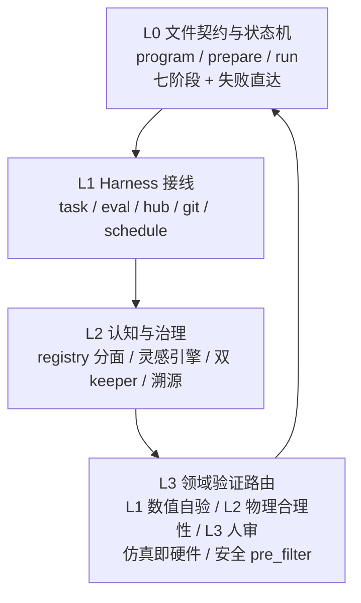

# Layer 2 架构决议：最小可组合的科研飞轮

> 范围：`debate/layer1/*.md` 五份候选原则 + `template/00-spec.md` + `template/01-workspace-layout.md` + `template/02-harness-wiring.md` + `template/03-inspiration-engine.md`
> 目标：把冗余候选映射到 OMP/PI 原生最小可组合机制（文件契约、状态机、task/eval/hub/schedule_prompt、git 分支、证据与评估），给出本地工作区真实落地的层次化设计。每条保留原则标注证据、适用范围、实现边界、可观测信号。末尾 5 条延后扩展。
> 约束：全篇采用直接、加和式陈述，区分来源事实与推断。

---

## 0. 机制目录与层次总览

### 0.1 OMP/PI 原生机制清单

本飞轮仅使用以下六类机制完成全部闭环。新增能力通过文件契约与注册表接入，不引入外部编排系统。

| 机制 | 职责 | 接线位置 |
|------|------|----------|
| 文件契约 | 定义谁可写、谁只读、变更需何种审批 | `program.md` / `prepare.py` / `run.py` / `capabilities/registry.json` / `traces/<ts>/` / `reports/` / `archive/` |
| 状态机 | 定义阶段准入、产出、回退、双终态 | `00-spec` 七阶段 + 失败直达 `archive` |
| task | 并行探索，多 `worktree` 隔离，产 `patch` | `modeling` / `literature` / `writing` / `review` |
| eval | 持久 Python 内核，热加载 `run.py`，复用数据 | `orchestration/kernel.py:hot_run` |
| hub | 轻量消息：队列锁、keep 广播、Elo 投票 | 频道 `idea-claimed` / `keep-decision` / `review-score` |
| schedule_prompt | 定时唤醒与晨报，夜间无人值守 | `orchestration/schedule.json` 两条 cron |
| git 分支 | `run/<id>` 分支的 keep/discard 原子语义 | `hooks/post-eval.sh` |
| 证据与评估 | 固定评估器、溯源链、双 keeper、FACT 审计 | `prepare.py:evaluate` / `navigator/evidence/*.json` / `bench/` |

### 0.2 层次化设计

```
L0 文件与状态机 — program/prepare/run 三文件分离，七阶段状态机，双终态归档
  └─ L1 执行与调度 — task 并发 + eval 热执行 + hub 轻消息 + git keep/discard + schedule 夜巡
       └─ L2 认知与记忆 — capability 注册表分面 + 三段式灵感引擎 + 双 keeper 裁决 + 显性 trace 溯源
            └─ L3 领域扩展 — 数值/生化/材料/平台的分级验证路由与仪器抽象（按需接入）
```

设计取舍：L0 与 L1 在 scaffold 阶段一次性落地，保证单机可跑通首轮 `metrics.json`。L2 在首轮跑通后增量接入，保证度量可比较。L3 按赛道按需接入，不阻塞主干。



### 0.3 冗余方案对照与归一决策

Layer 1 共提出约 50 条候选原则，多处指向同一问题的不同实现。Layer 2 做以下归一。

| 问题域 | 冗余候选 | 归一决策 | 依据 |
|--------|----------|----------|------|
| 灵感产生 | Sakana 广度脑暴、Co-Scientist 六角色 Elo 锦标赛、Virtual Lab PI 会议、Rumi GFlowNet 采样、SciAgents 图谱游走、ResearchAgent 链式文献排序 | 采用 `03-inspiration-engine` 三段式轻量引擎：单次生成 5 个 + 一轮 Critic + 本地 PI 门禁，共 2 次 LLM 调用 | Sakana 广度适合单机预算，Co-Scientist 锦标赛质量高，重型多 agent 与 GFlowNet 训练成本超出夜间轻量约束，图谱与链式检索作为证据输入而非引擎主体 |
| 执行隔离与复现 | Karpathy git 分支、Claw 隔离 workspace + 只读 controller、Denario Docker + 状态图、Bohrium Lebesgue 调度 | 采用 Karpathy git keep/discard 为主语义，叠加 `eval` 热内核与 `hooks/pre-run.sh` 禁写校验作为本地隔离增强 | 单机本地工作区无需容器编排，git 分支提供原子回滚与可审计性，eval 复用数据加载降低冷启动成本 |
| 评估裁决 | 单一度量 `val_bpb` keep、CycleReviewer 模拟分、VLM 图表评审、FACT 引用审计、Elo 锦标赛 | 采用双 keeper 并行：数值 keeper 与语义 keeper 联合裁决，分阶段启用 VLM 与 FACT | 单一 keeper 过拟合风险高，FACT 与人类基线校准成本高，适合作为写作后置门控而非每轮实验门控 |
| 记忆形态 | AgentRxiv 向量检索、pairwise 反应表、failed.jsonl、SciAgents 知识图谱、world-model U 标记 | 采用 `archive/failed.jsonl` + `archive/ideas.jsonl` 去重为必选，图谱与 world-model 作为可选 L3 扩展 | 向量检索与图谱增量维护在首期增加复杂度，失败负样本过滤收益明确且实现成本低 |
| 验证信号 | 残差与守恒量自验、物理合理性独立校验、XRD 自动解析、仿真三层路由 | 采用分级验证关卡 L1 必检 + L2 领域校验 + L3 人审，按 `capability.policy` 路由 | 无不变量任务无法使用残差信号，有不变量任务可显著降低人工介入，统一分级框架兼容两类场景 |
| 硬件抽象 | 文档向量化驱动、validate→execute 两段式、安全 pre_filter、仿真即硬件 | 统一为 capability 最小契约 + `validate`/`execute` 同签名 + `safety pre_filter` 前置 | 四者互补，契约定义输入输出与成本，两段式提供可逆校验，安全前置提供审计门控，仿真与真机共享同一接口 |

---

## 1. 架构决议

### 决议 01 — 七阶段状态机与双终态归档

**证据**
- 来源事实：`template/00-spec.md` §2.1 定义 `inspiration → modeling → experiment → evaluation → writing → review → archive` 七阶段，含失败直达 `archive` 路径与 mermaid 状态图。`template/02-harness-wiring.md` §3.5 定义夜巡状态机 `Sleep → CheckQueue → ClaimIdea → Modeling → Experiment → Evaluation → Writing/Review → Archive → Sleep`。
- 来源事实：`debate/layer1/platform.md` 原则 4 角色化分工与分阶段流水线提出三至五阶段拆分与跨层回跳。`debate/layer1/cs-ml.md` 原则 5 实现成功率硬门控要求 `impl_success == true` 才进入写作。

**适用范围**
- 全部赛道通用。ML 仿真、数值求解、文献调研三类任务共享同一状态机，通过 `program.md` 的 Plan DAG 段定制各阶段准入阈值。

**实现边界**
- 状态机落地为 `orchestration/flywheel.py` 的 `run_once()` 函数与 `hooks/post-eval.sh` 的分支逻辑。
- 准入条件显式化：`modeling → experiment` 需 `patch` 语法检查通过，`experiment → evaluation` 需 `metrics.json` 产出，`evaluation → writing` 需 `delta > epsilon`，`review → archive` 需 `score >= threshold` 或预算耗尽。
- 失败直达路径在任意 `evaluation` 或 `review` 节点可触发，产物为 `reports/failure.md` 与 `archive/failed.jsonl`，结构遵循 `00-spec` §5.2 六段契约。

**可观测信号**
- `traces/<ts>/metrics.json` 含 `keep` 与 `reason` 字段。
- `traces.jsonl` 每行记录 `run_id` / `idea_id` / `phase` / `metric` / `delta` / `keep`。
- `git tag keep-<id>` 存在性表示成功归档，`archive/discard-<id>/` 存在性表示丢弃归档。
- `status.md` 顶部展示最近 3 个失败的 `root cause`。

**冗余解决**
- 归一 `00-spec` 七阶段与 `platform` 三/五阶段分法。写作与审稿合并为 `review` 阶段内的小循环，不单独增设状态，避免状态膨胀。Agent Laboratory 的 Literature/Experimentation/Writing 三阶段映射为 `navigator` / `traces` / `reports` 三目录。

---

### 决议 02 — 单一可变区文件契约与禁写门禁

**证据**
- 来源事实：`template/01-workspace-layout.md` §3 定义各文件职责与读写权限表，`program.md` 冻结、`prepare.py` 只读、`run.py` 唯一可变、`capabilities/registry.json` 需显式申请变更。`template/00-spec.md` §3.1 列出核心文件契约表。
- 来源事实：`debate/layer1/cs-ml.md` 原则 1 固定 `prepare.py` 只读与 `writable_allowlist`，`debate/layer1/chem-materials.md` 原则 1 `doc_ref` 字段与原则 2 `validate → execute` 同签名。

**适用范围**
- 全部赛道。任何 agent 角色遵守同一权限表，违规在 `pre-run.sh` 拦截。

**实现边界**
- `run.py` 必须导出 `def main(budget_seconds: int = 300) -> dict`，`prepare.py` 必须导出 `load_data()` 与 `evaluate(pred, target) -> metrics`，签名固定。
- `modeling agent` 仅可写 `traces/<ts>/git.patch`，不可直接写 `run.py` 主分支。`orchestration` 统一 `apply_patch` 并做 `py_compile` 检查。
- 禁写校验落地为 `orchestration/hooks/pre-run.sh`：

```bash
if git diff --name-only | grep -qE "^(prepare\.py|capabilities/registry\.json)"; then
  echo "forbidden write to frozen file" >&2; exit 1
fi
```

- `capabilities/registry.json` 变更需人类审批或 `hub` 的 `capability-approval` 频道确认。

**可观测信号**
- `pre-run.sh` 退出码非零表示禁写拦截，日志写入 `traces/<ts>/run.log`。
- `git diff --name-only` 在 `evaluation` 前后的对比记录于 `trace.jsonl`。
- `registry.json` 的 `version` 字段递增记录于 `hub` 审计日志。

---

### 决议 03 — 固定墙钟预算赛马与 git keep/discard 原子分支

**证据**
- 来源事实：`debate/layer1/cs-ml.md` 原则 1 Karpathy 固定 5 分钟墙钟 + git keep/discard 状态机 + Red Hat 198 实验夜跑验证。`template/00-spec.md` §1.2 与 §4 定义固定预算与 `modify-train-evaluate-keep` 语义。
- 来源事实：`template/02-harness-wiring.md` §3.4 定义 `hooks/post-eval.sh` 的 keep/discard 分支逻辑与 `archive/papers/` / `archive/discard-<id>/` 落盘。

**适用范围**
- 计算密集型任务。ML 训练、数值求解、仿真扫参三类任务默认启用。文献调研类任务预算设为 token 预算而非墙钟预算。

**实现边界**
- 单轮实验预算固定 300 秒（可配置 300-900 秒），超时由 harness 硬 kill 并记 `keep: false`。
- 每轮 `run/<id>` 分支从 `main` 拉出，`keep` 时 `git merge --no-ff` 并打 tag，`discard` 时 `git reset --hard HEAD` 并保留 `traces/<id>/` 到 `archive/discard-<id>/`。
- `metrics.json` 必须含 `budget: {seconds, gpu}` 与 `metric_main: {name, value, higher_is_better}`。epsilon 默认 0.01，按 `program.md` 可覆盖。
- `schedule_prompt` 夜巡每 30-60 分钟触发 `run_once`，单机并发 modeling task 上限 3，execution 阶段串行或按内核并行。

**可观测信号**
- `traces/<ts>/metrics.json` 的 `budget.seconds` 与实际 wall-clock 对比。
- `traces/<ts>/run.log` 含超时 `SIGKILL` 记录。
- `git log --oneline --graph` 可回放 keep/discard 轨迹。
- `traces.jsonl` 的 `delta` 字段支持 `progress.png` 绘制。

---

### 决议 04 — eval 持久内核与结构化局部修复

**证据**
- 来源事实：`template/02-harness-wiring.md` §3.2 定义 `eval` 持久内核 `hot_run` 热加载 `run.py`。`debate/layer1/cs-ml.md` 原则 2 Dolphin 异常回溯局部修复 + `py_compile + quick_run` 烟雾测试。
- 来源事实：`debate/layer1/platform.md` 原则 9 沙盒执行与防伪闸门要求只读 controller 做 NaN/Inf 与 smoke test 检测。

**适用范围**
- 全部需执行 `run.py` 的任务。数据加载重的 ML 任务收益显著，小脚本任务收益有限。

**实现边界**
- 内核常驻代码位于 `orchestration/kernel.py`，通过 `importlib.util.spec_from_file_location` 热加载 `run.py`。
- 修复策略为 `local-first`：解析 `traceback` 定位局部块，仅修该块后做 `py_compile` 与 `minimal_run` 两层门控，全量重写作为降级路径。
- `execute` 返回值统一含 `stderr + doc_hints`，`doc_hints` 来自 `capabilities/registry.json` 的 `doc_ref` 检索。
- NaN/Inf 检测与 smoke test 由只读 controller 在 `eval` 侧执行，不依赖 agent 自觉。

**可观测信号**
- `traces/<ts>/run.log` 含完整 `traceback`。
- `traces/<ts>/cost.json` 含 `compile_check` 与 `minimal_run` 通过标记。
- `traces.jsonl` 的 `phase: experiment` 条目指明 `repair_scope: local | full`。

---

### 决议 05 — task 并发与 hub 轻消息协调及 Elo 排序

**证据**
- 来源事实：`debate/layer1/cs-ml.md` 原则 3 Sakana Experiment Manager 树搜索 + `ideas.jsonl` 树与 UCB 调度。`debate/layer1/bio.md` 原则 06 假设谱系 + Elo 锦标赛与 `hub` 异步调度。
- 来源事实：`template/02-harness-wiring.md` §3.1 与 §3.3 定义 `task` 并发派发与 `hub` 三频道 `idea-claimed` / `keep-decision` / `review-score`。

**适用范围**
- 需并行探索多假设的任务。单 idea 派生多分支时启用，单分支探索时退化为单 task 串行。

**实现边界**
- 每个 idea 一个 `task`，独立 `worktree` 为 `traces/<id>/`，互不污染。大产物走文件系统，`hub` 仅传小消息（`idea_id` / `score` / `keep`）。
- `archive/ideas.jsonl` 队列通过 `hub.lock("idea-pool")` 加锁认领，按 `score` 降序取 `queued` 首项，状态置 `running`。
- Elo 排序在 `review` 阶段执行，`reviewer` 产 `reviews/<round>.json`，排序后取 top-1 进入归档，其余保留在 `ranked` 列表供追溯。
- UCB 调度参数 `branch_budget` 与 `prune_threshold` 在 `program.md` 的 Plan DAG 段配置。

**可观测信号**
- `hub` 消息日志含 `idea-claimed` 与 `review-score` 时序。
- `archive/ideas.jsonl` 每行 `status` 字段的 `queued → running → keep/discard` 迁移。
- `bench/scores.jsonl` 含 Elo 分布与分支胜率。

---

### 决议 06 — 能力最小契约注册表与分面路由及安全 pre_filter

**证据**
- 来源事实：`debate/layer1/platform.md` 原则 1 能力最小契约注册表，含输入输出 Schema + 环境 + 成本 + 失败模式。原则 2 三域分面 Reading/Computing/Experiment 与原则 7 混合模型路由。
- 来源事实：`debate/layer1/chem-materials.md` 原则 2 `validate → execute` 两段式、原则 3 安全 `pre_filter`、原则 6 物理分离与 `endpoint: local|remote|sim`、原则 8 仿真即硬件统一 `score(structure)`。
- 来源事实：`template/00-spec.md` §2.3 与 `template/01-workspace-layout.md` §2 定义 `capabilities/registry.json` 与 `tools/*.py`。

**适用范围**
- 全部工具接入。物理仪器、仿真计算器、检索工具、模型推理四类能力统一注册。

**实现边界**
- 最小契约字段：`name` / `input_schema` / `output_schema` / `env_snapshot` / `cost_model` / `failure_modes` / `safety_tags` / `requires_approval` / `endpoint` / `doc_ref`。
- 分面路由：`Reading`（检索与证据抽取）、`Computing`（数值与仿真）、`Experiment`（执行与表征），调度器先做分面路由再做分面内选择。
- 每个 capability 暴露 `validate(procedure) -> {valid, errors[]}` 与 `execute(procedure) -> observation` 同签名。仿真与真机共享 `score` 接口，调度器按 `capability.policy: {mattersim, dft, lab}` 三层阈值路由。
- 安全 `pre_filter` 在 `execute` 前强制调用 `chem.safety.ghs`，`requires_approval: true` 进入 `hub` 人工确认队列。

**可观测信号**
- `capabilities/registry.json` 的 `version` 与 `safety_tags` 覆盖率。
- `navigator/queries.jsonl` 含分面路由决策记录。
- `traces/<ts>/run.log` 含 `validate` 返回的 `{valid, errors[]}`。

---

### 决议 07 — 三段式灵感引擎与失败记忆负向过滤

**证据**
- 来源事实：`template/03-inspiration-engine.md` 全篇定义 `seed → generation → debate → gating → pool` 三段式，单次生成 5 个 + 2 次 LLM 调用（generation + critic）+ 本地 PI 门禁。
- 来源事实：`debate/layer1/bio.md` 原则 07 自博弈辩论与原则 08 重定位优先，`debate/layer1/chem-materials.md` 原则 5 失败记忆持久化与 pairwise 剪枝，`debate/layer1/platform.md` 原则 5 向量检索驱动复利。

**适用范围**
- `inspiration.md` 为空或 `queued < 2` 时自动触发。人类提供灵感时优先级高于自动生成。

**实现边界**
- Seed 来源四类：人类 `inspiration.md`、失败报告 `next hypotheses`、检索证据 gaps、随机扰动。统一写入 `archive/ideas.jsonl`，每行含 `id` / `title` / `hypothesis` / `method` / `expected_delta` / `risk` / `refs` / `score` / `feasibility` / `status`。
- Generation 单次 LLM 调用产 5 个 idea，去重与 `archive/failed.jsonl` 及 `archive/ideas.jsonl` 做标题 embedding 余弦相似度（阈值 0.85）+ Semantic Scholar 检索去重。缺失 `hypothesis`/`method`/`expected_delta` 任一字段直接丢弃。
- Debate 为一轮 Critic 批量批判 + 本地加权排序（`0.5*score + 0.3*feasibility/5 + 0.2*novelty`），取 top-3。
- PI 门禁为本地规则：未关联主度量、提及改 `prepare.py`/`registry.json`、`risk` 为空或 `weaknesses` 含 `leakage`/`unreproducible`、与最近 3 个 discard 相似度 > 0.9 的 idea 拒入。
- 每轮最多 2 个入队，连续 3 轮 discard 时下轮 generation temperature 从 0.7 升至 1.0。

**可观测信号**
- `archive/ideas.jsonl` 的 `queued` 计数与 `grep -c queued` 增量。
- `inspiration.md` 自动更新的 `auto` 时间戳。
- `navigator/queries.jsonl` 的去重检索记录。

---

### 决议 08 — 双 keeper 联合裁决与 VLM/FACT 后置门控

**证据**
- 来源事实：`debate/layer1/cs-ml.md` 原则 7 双 keeper 并行与原则 5 实现成功率硬门控 + 原则 4 VLM 图表评审。`debate/layer1/platform.md` 原则 10 作者共创 rubric 与 FACT 双指标审计。
- 来源事实：`template/00-spec.md` §2.1 评估契约 `delta > epsilon` 才 keep 与失败判定规则。

**适用范围**
- `evaluation` 阶段必启用双 keeper，`writing → review` 阶段启用语义 keeper 与可选 VLM/FACT 门控。

**实现边界**
- 数值 keeper：`prepare.py:evaluate` 产 `metric_main`，与基线对比 `delta > epsilon` 才通过。`metric` 与方向在 `program.md` 首段声明。
- 语义 keeper：`review` 阶段的 Reviewer 按 rubric 产分数与逐条意见，分数阈值默认 6.0，低于阈值回退到 `modeling`。
- VLM 审图与 FACT 引用审计作为写作后置门控，输出 `chart_feedback.json` 与 `fact_report.json`，不通过则触发 `writer↔reviewer` 小循环，配置 `max_chart_iters` 防止无界打磨。
- 双阈值过严导致探索停滞时，PI 裁决冲突，收敛期加 `held-out` 复测。

**可观测信号**
- `traces/<ts>/metrics.json` 的 `keep` 与 `reason` 字段。
- `reports/review.md` 的分数与逐条意见 JSON。
- `bench/scores.jsonl` 的 `numeric` / `semantic` 双轨分。

---

### 决议 09 — 显性推理 trace 与三级引用溯源及全局追加日志

**证据**
- 来源事实：`debate/layer1/bio.md` 原则 09 显性推理 trace + Finish 门控，产 `reasoning.md` + `tool-call.json`。`debate/layer1/platform.md` 原则 8 三级溯源 `source → section → claim` 与 FACT 审计，原则 3 推理与执行治理分离。
- 来源事实：`template/02-harness-wiring.md` §4 定义 `traces.jsonl` 全局追加与 `traces/<ts>/` 单轮隔离。

**适用范围**
- 全部阶段。每轮实验、每次检索、每份报告均需落盘可审计链路。

**实现边界**
- 单轮产物：`traces/<ts>/run.log` / `metrics.json` / `cost.json` / `git.patch`，`navigator/evidence/*.json` 含溯源片段。
- 全局日志：`traces.jsonl` 每行 `{"ts","run_id","idea_id","phase","metric","value","delta","keep"}`，追加不改历史。
- 引用要求：每份 `reports/report.md` 引用来自 `navigator/evidence/*.json`，每条引用含三级链接 `source → section → claim`，`eval` 阶段自动执行 FACT 双指标校验（有效引用数与引用准确率）。
- 推理与执行分离：推理侧产计划与假设，执行侧产 `tool-call.json` 与执行信封，审计方独立于推理方。

**可观测信号**
- `traces.jsonl` 可回放全链路，`status.md` 聚合展示。
- `navigator/evidence/*.json` 的 `source` 可达性与 `claim` 覆盖率。
- `fact_report.json` 的有效引用数与准确率分数。

---

### 决议 10 — 分级验证关卡与分层验证路由

**证据**
- 来源事实：`debate/layer1/physics-crossdomain.md` 原则 3 残差与守恒量无监督验证、原则 4 物理合理性独立校验、原则 2 Coarse-to-Fine 分级执行。`debate/layer1/chem-materials.md` 原则 8 仿真即硬件分层验证与原则 10 表征自动判读瓶颈。
- 来源事实：`template/00-spec.md` §2.3 对应 Bohrium 四层与 Biomni 能力检索。

**适用范围**
- 数值与仿真类任务必启用 L1，物理与材料类任务叠加 L2，探索型开放课题在 L2 未覆盖时走 L3 人审。

**实现边界**
- L1 自动验证层：残差、守恒量、量纲一致性三项必检，验证器与生成器分离部署，检验脚本独立版本管理。未通过不进入 L2 或人工审查。
- L2 领域校验层：物理合理性 `sanity-check` 能力，输入为求解器输出与问题描述，输出结构化校验报告。材料侧为 `analyze` 能力，含 XRD/谱学自动解析，失败预留多模态回退路径。
- 分级执行：`trial_grid` 粗网格试跑 + `validate_grid` 细网格验证，超时与内存分级设定，粗阶段失败不进入复现队列。
- 分层路由：`capability.policy` 定义 `mattersim: 快速阈值` / `dft: 精确阈值` / `lab: 合成阈值`，调度器自动三层路由，生成器只认 `score(structure) -> property`。

**可观测信号**
- `traces/<ts>/metrics.json` 的 `metric_aux` 含残差与守恒量偏差。
- `reports/review.md` 的 `sanity-check` 二元判定与理由。
- `traces/<ts>/run.log` 的 `trial_grid` 与 `validate_grid` 两级报告。

---

## 2. 需延后的 5 条扩展

以下能力在 Layer 1 中被多文件论证有价值，在本地单机飞轮首期不进入主干。延后原因、依赖、激活条件明确记录，避免过早引入复杂度。

### 延后 01 — SDL 真机闭环

- 内容：对接 `RoboRXN` / `Opentrons OT-2` / `UniLabOS` 真实仪器的 `dose → heat → xrd` 流水线与 `dose → heat → characterize` DAG 资源争用建模。
- 证据：`chem-materials.md` 原则 2/3/6/10 与 `physics-crossdomain.md` 原则 9/10 的云端设计异地执行闭环。
- 延后原因：依赖真实硬件抽象与协议级约束，纯软件环境复刻虚假可执行性增益有限。安全与事务边界需额外治理。
- 激活条件：`capabilities/registry.json` 出现 `endpoint: remote` 且 `hardware` 分面通过 `validate → execute` 的仿真分支验证。

### 延后 02 — GFlowNet 多样性采样与知识图谱持续演化

- 内容：按 reward 正比采样假设的 GFlowNet 循环与 `memory_store` 图谱的三类节点（文献矛盾、假设谱系、实验结果）增量更新及 `U=0/1` 验证标记。
- 证据：`physics-crossdomain.md` 原则 7/8 与 `platform.md` 原则 5 及 `cs-ml.md` 原则 10 持久世界模型。
- 延后原因：reward 建模与图谱一致性维护成本高，冷启动噪声大，共识过滤可能筛掉小众新颖发现。首期用 `failed.jsonl` 负向过滤与轻量 debate 已覆盖核心收益。
- 激活条件：`archive/failed.jsonl` 累积超过 50 条且 `ideas.jsonl` 出现 mode collapse 信号。

### 延后 03 — 多租户计费与私域 Workspace 融合

- 内容：Bohrium 按量计费、社区激励、Gemini Workspace 私域连接器分面的权限与隐私治理。
- 证据：`platform.md` 原则 6/7 的分面调度与边界 2 的治理边界。
- 延后原因：计费与激励在本地单机工作区无真实需求，私域融合涉及权限边界，复杂度高于首期收益。
- 激活条件：`trace` 与评估稳定后，且出现多用户共享同一 `research-flywheel` 实例的需求。

### 延后 04 — 人类 8 小时基线对照与 held-out 复测投稿校准

- 内容：RE-Bench 式人类 8 小时基线分布维护、PaperBench 作者共创 rubric 的 8,316 项原子评分、Bench II 二值诊断矩阵的召回/分析/呈现三维对照。
- 证据：`platform.md` 原则 10 与 `cs-ml.md` 边界 2 模拟评审与真实同行评审差距。
- 延后原因：rubric 维护成本高，新增任务需原作者协同，LLM judge 与被评模型同源时存在偏好偏差。首期用自动数值门控与轻量审稿闭环验证飞轮自转。
- 激活条件：飞轮在单一赛道连续产出 5 个 keep 且需对外宣称质量分时。

### 延后 05 — 跨站点联邦调度与硬件指纹校准

- 内容：ChemOS 联邦 SDL 的多实验室共享接口、DigCat 全球闭环的硬件指纹差异校准、前驱体批次与炉温均匀性的系统偏差建模。
- 证据：`chem-materials.md` 原则 6 联邦形态与边界 1/2 的跨硬件可复现性边界，`physics-crossdomain.md` 边界 2 云端合成经济边界。
- 延后原因：跨站点调度与校准依赖真实硬件数据与权限隔离，调度复杂度为隐形挑战，小团队自建不经济。
- 激活条件：本地飞轮验证通过且需借用云端能力扩展吞吐时，以 `endpoint: remote` + `hardware_fingerprint` 参数增量接入。

---

## 3. 落地清单与验证

### 3.1 本次新增文件

- `debate/layer2/architecture.md` — 本文件

### 3.2 与模板的对齐检查

| 模板要求 | 本架构落点 | 状态 |
|----------|------------|------|
| `00-spec` 七阶段与双终态 | 决议 01 | 已覆盖 |
| `00-spec` 度量驱动 keep | 决议 03 + 08 | 已覆盖 |
| `01-workspace-layout` 文件契约与权限表 | 决议 02 | 已覆盖 |
| `01-workspace-layout` git 分支语义 | 决议 03 | 已覆盖 |
| `02-harness-wiring` task/eval/hub/schedule | 决议 04 + 05 + 03 | 已覆盖 |
| `02-harness-wiring` trace 治理 | 决议 09 | 已覆盖 |
| `03-inspiration-engine` 三段式引擎 | 决议 07 | 已覆盖 |
| `03-inspiration-engine` 去重与门禁 | 决议 07 | 已覆盖 |

### 3.3 本地可跑验证

```bash
# 1. 目录存在性
ls debate/layer1/*.md template/*.md debate/layer2/architecture.md

# 2. 内容计数
grep -c "^### 决议" debate/layer2/architecture.md  # 期望 10
grep -c "^### 延后" debate/layer2/architecture.md  # 期望 5

# 3. 每条决议含四要素
grep -c "可观测信号" debate/layer2/architecture.md
grep -c "实现边界" debate/layer2/architecture.md
grep -c "适用范围" debate/layer2/architecture.md
grep -c "证据" debate/layer2/architecture.md

# 4. 对齐模板提及
grep -c "program.md" debate/layer2/architecture.md
grep -c "schedule_prompt" debate/layer2/architecture.md
grep -c "hub" debate/layer2/architecture.md
```

---

> 推断标注：本文件对冗余方案的归一取舍、层次划分、阈值默认值属于跨系统迁移推断，需在本地工作区实测中校准。来源事实均可在 `debate/layer1/*.md` 与 `template/*.md` 中回溯验证。
