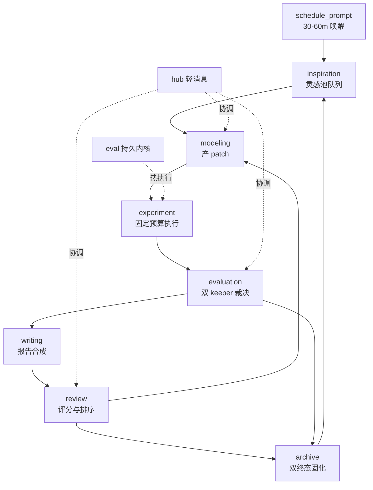

# Layer 3 运行模型决议 — PI 与 Harness 运维双重视角裁判 B

> 定位：第三层运行模型裁判 B，独立于哲学裁判。输入：`debate/layer1/*.md` 五份（约 54 条原则与 15 条边界）、`debate/layer2/adversarial.md` 10 争议 10 共识 5 拒绝、 `debate/layer2/architecture.md` 10 决议与 5 延期、 `debate/layer2/epistemic.md` 11 护栏与 5 不确定性、 `template/00-spec.md` / `01-workspace-layout.md` / `02-harness-wiring.md` / `03-inspiration-engine.md` 四份规格、`channels/README.md` 46 系统索引。输出：10-14 条最小可执行运行决议、5 个失败模式处置法、5 个明确延期项。每条标注证据等级与资源成本，映射到状态、文件、权限、门控、回放、调度六要素。本文件为新增唯一产物，不改动既有文件。
> 独立性说明：哲学裁判聚焦可证伪性、可复现性、溯源完整性、评估有效性。本裁判聚焦单机可运行性、资源隔离性、调度确定性、权限最小性、失败原子性、夜间无人值守自转。两裁判结论可并存，门控字段共享，触发阈值各自记录。
> 证据等级沿用 `epistemic.md` 定义：`direct` 原文度量或代码形态可定位，`supported inference` 跨 2 系统以上归纳且具可检验预测，`speculative` 单案例类比或跨域外推需前瞻验证。
> 资源成本分三档：`低` 单轮 < 500 tokens 或 < 10 秒或 < 10 MB 追加，`中` 单轮 0.5-5k tokens 或 1-15 分钟墙钟或 10-100 MB，`高` 需人类分钟级介入或持续存储或重型依赖。成本标注为增量成本，不含模型基座调用基线。

---

## 0. 裁决方法与覆盖

裁决方法采用双视角校验。PI 视角校验假设到证据到度量的闭环完整度与预算使用效率。Harness 视角校验文件写入边界、进程隔离、消息原子性、定时可达性、回放完备性。两视角在同一门控点汇合，任一视角阻断即阻断晋升。

覆盖检查：七阶段循环 `inspiration → modeling → experiment → evaluation → writing → review → archive` 全覆盖。`template/00-spec.md` §2.1 状态图、`01-workspace-layout.md` §3 权限表、`02-harness-wiring.md` §3 五组件、`03-inspiration-engine.md` §3 三段引擎均为来源事实。



---

## 1. 运行决议 12 条

### 决议 01 — 七阶段状态机与双终态归档为唯一控制平面

**决议陈述**：工作区以 `inspiration → modeling → experiment → evaluation → writing → review → archive` 七阶段为唯一状态机。成功路径经 `review` 归档到 `archive/papers/`，失败路径从 `evaluation` 或 `review` 直达 `archive`，产物为 `reports/failure.md` 与 `archive/failed.jsonl`。

**证据等级**：`direct`。来源事实为 `template/00-spec.md` §2.1 状态图与阶段契约表，`architecture.md` 决议 01 已做归一，`adversarial.md` 共识 1 指纹化预算与 `epistemic.md` Guardrail 04 失败双归档交叉印证。

**资源成本**：`低`。状态机为纯文件与 `git` 分支操作，单轮追加 `traces.jsonl` 一行，约 0.5 KB。

**最小状态**：`archive/ideas.jsonl` 每行 `status: queued | running | keep | discard | failure`，`traces.jsonl` 每行 `run_id/idea_id/phase/metric/delta/keep`，`git` 分支 `run/<id>` 与标签 `keep-<id>`。

**文件**：`orchestration/flywheel.py:run_once()` 为状态机落地，`archive/ideas.jsonl` / `traces.jsonl` / `reports/failure.md` 为状态载体。

**权限**：仅 `orchestration` 可写 `archive/` 与 `traces.jsonl`，`modeling` 与 `experiment` 不可直接改状态。

**门控**：`inspiration → modeling` 需 `idea.score > threshold` 且通过三字段校验，`modeling → experiment` 需 `py_compile` 通过，`experiment → evaluation` 需 `metrics.json` 产出，`evaluation → writing` 需 `delta > epsilon`，`review → archive` 需 `score >= 6.0` 或预算耗尽。

**回放**：`traces.jsonl` 按 `ts` 排序可回放全链路，`git log --graph` 回放 keep/discard 轨迹，`status.md` 聚合最近 5 个 keep/discard。

**调度协议**：`schedule_prompt` 每 30-60 分钟触发 `run_once`，`archive` 固化后立即触发下一轮 `inspiration` 队列检查。空闲时进入 `Sleep`，不持有资源。

**可观测信号**：`traces/<ts>/metrics.json:keep` 布尔值，`archive/discard-<id>/` 目录存在性，`git tag keep-<id>` 存在性。

---

### 决议 02 — 单一可变区文件契约与双层禁写门禁

**决议陈述**：唯一可变执行单元为 `run.py`，固定评估器为 `prepare.py`，冻结定义为 `program.md`，受控注册表为 `capabilities/registry.json`。`modeling` 仅产 `traces/<ts>/git.patch`，由 `orchestration` 统一 `apply_patch`。

**证据等级**：`direct`。来源事实为 `template/01-workspace-layout.md` §3 职责表与 §4 可编辑边界，`cs-ml.md` 原则 1 `prepare.py` 只读与 `writable_allowlist`，`chem-materials.md` 原则 2 `validate → execute` 同签名对写入边界的强化。

**资源成本**：`低`。门禁为 `git diff --name-only` 字符串匹配，单次 < 1 秒，零 token。

**最小状态**：`capabilities/registry.json:version` 递增，`traces/<ts>/git.patch:patch_hash`，`prepare.py:prepare_py_hash`。

**文件**：`run.py` 导出 `main(budget_seconds: int) -> dict`，`prepare.py` 导出 `load_data()` 与 `evaluate(pred,target)`，`orchestration/hooks/pre-run.sh` 为门禁脚本。

**权限**：`prepare.py` 与 `capabilities/registry.json` 仅人类可写，`run.py` 主分支仅 `orchestration` 可合并，`modeling` 写入隔离 `traces/<ts>/`。

**门控**：`hooks/pre-run.sh` 执行：

```bash
if git diff --name-only | grep -qE "^(prepare\.py|capabilities/registry\.json)"; then
  echo "forbidden write to frozen file" >&2; exit 1
fi
```

`capabilities/registry.json` 变更需 `hub:capability-approval` 频道显式确认。

**回放**：`git diff --name-only` 前后对比写入 `traces/<ts>/run.log`，`registry.json:version` 写入 `hub` 审计日志。

**调度协议**：每次 `modeling` 产 patch 后立即触发 `pre-run.sh`，失败直接记 `discard`，不进入 `eval`。

**可观测信号**：`pre-run.sh` 退出码，`traces/<ts>/cost.json:compile_check` 标记。

---

### 决议 03 — 指纹化分层预算执行与硬超时熔断

**决议陈述**：所有执行携带 `device_info + budget_seconds + cost_type` 指纹。计算侧分 `coarse` 短预算海选与 `fine` 长预算复测，湿实验侧另计 `assay_time + material_cost`。超时由 harness 硬 kill，超时轮记 `keep: false` 并采样已产指标。

**证据等级**：`direct` 主干为 `cs-ml.md` 原则 1 Karpathy 固定 5 分钟墙钟与 Red Hat 198 实验夜跑，`physics-crossdomain.md` 原则 2 coarse-to-fine 分级；`supported inference` 为指纹化外推到多硬件可比性。

**资源成本**：`中`。单轮计费墙钟默认 300 秒，可配置 300-900 秒，`coarse` 阶段失败不进入 `fine`，节省约 10 倍重算成本。`speculative` 成本为跨硬件指纹未披露时的指标虚高风险。

**最小状态**：`traces/<ts>/metrics.json:budget{seconds,gpu,device_info}`，`traces/<ts>/cost.json:wall_clock_actual`。

**文件**：`orchestration/flywheel.py` 预算参数，`traces/<ts>/metrics.json` 指纹字段，`template/02-harness-wiring.md` §3.5 夜巡状态机。

**权限**：预算配置仅 `program.md` 末段与 `orchestration/config` 可声明，`experiment` 不可自增预算。

**门控**：`budget.seconds` 缺失或 `device_info` 缺失的运行标记 `不可比`，不参与 keep 选举。`trial_grid` 失败不进入 `validate_grid`。

**回放**：`metrics.json:budget` 与 `run.log` 的 `SIGKILL` 记录对照，`traces.jsonl:delta` 支撑 `progress.png` 绘制。

**调度协议**：`schedule_prompt` 夜巡每次唤醒仅执行一轮 `run_once`，单机 `modeling` 并发上限 3，`experiment` 串行或按内核数并行。连续 3 轮无提升自动升温 idea 采样。

**可观测信号**：`metrics.json:budget.seconds` 与实际墙钟对比，`traces.jsonl:delta` 序列。

---

### 决议 04 — eval 持久内核与结构化局部修复流水线

**决议陈述**：`eval` 为常驻 Python 持久内核，通过 `importlib.util.spec_from_file_location` 热加载 `run.py`，复用已加载数据与权重。修复采用 `local-first`，解析 `traceback` 定位局部块，仅修该块后经 `py_compile + minimal_run` 烟雾测试，全量重写为降级路径。

**证据等级**：`direct`。来源事实为 `template/02-harness-wiring.md` §3.2 `hot_run` 热加载代码，`cs-ml.md` 原则 2 Dolphin 局部修复与烟雾测试，`platform.md` 原则 9 只读 controller 的 NaN/Inf 与 smoke test。

**资源成本**：`低` 到 `中`。持久内核避免每轮冷启动数据加载，节省秒级到分钟级。`local-first` 降低 token 成本与回归风险，系统性错误时降级为全量重写。

**最小状态**：`traces/<ts>/run.log:traceback`，`traces/<ts>/cost.json:{compile_check,minimal_run}`，`traces.jsonl:repair_scope`。

**文件**：`orchestration/kernel.py:hot_run`，`traces/<ts>/run.log` / `cost.json` / `git.patch`。

**权限**：内核由 `orchestration` 常驻持有，`modeling` 不可直接操作内核进程，`experiment` 通过 `hot_run` 接口间接调用。

**门控**：`compile_check` 未通过不进入 `minimal_run`，`minimal_run` 未通过不进入全量 `budget_seconds` 执行。`execute` 返回值统一含 `stderr + doc_hints`，`doc_hints` 来自 `capabilities/registry.json:doc_ref` 检索。

**回放**：`run.log` 完整 `traceback` 保留，`cost.json` 记录两层门控通过标记，`git.patch` 保留修复前后对比。

**调度协议**：内核常驻，`schedule_prompt` 夜间复用同一内核实例，`hub` 协调并发任务对内核的串行访问。

**可观测信号**：`traces/<ts>/run.log` 异常类型与栈帧，`repair_scope: local | full` 标签。

---

### 决议 05 — task 并发与 hub 轻消息协调及队列锁

**决议陈述**：每个 idea 一个 `task`，独立 `worktree` 为 `traces/<id>/`，互不污染。大产物走文件系统，`hub` 仅传小消息。`archive/ideas.jsonl` 队列通过 `hub.lock("idea-pool")` 加锁认领，按 `score` 降序取 `queued` 首项置 `running`。

**证据等级**：`direct`。来源事实为 `template/02-harness-wiring.md` §3.1 并发派发与 §3.3 三频道 `idea-claimed/keep-decision/review-score`，`cs-ml.md` 原则 3 Experiment Manager 树与 UCB，`bio.md` 原则 06 `hub` 异步调度。

**资源成本**：`低`。`hub` 消息体 < 1 KB，锁持有 < 1 秒。并发上限 3 控制资源争抢成本。

**最小状态**：`archive/ideas.jsonl` 每行 `status` 迁移 `queued → running → keep/discard`，`hub` 消息日志 `idea-claimed` / `review-score` 时序。

**文件**：`archive/ideas.jsonl` 队列文件，`orchestration/flywheel.py:claim_idea()` 加锁逻辑，`bench/scores.jsonl` Elo 分布。

**权限**：队列由 `orchestration` 加锁独占写入，`task` 仅读队列，`hub` 承担鉴权与资源感知。

**门控**：加锁失败重试 3 次，认领后立即 `hub.broadcast("idea-claimed")` 避免重复认领。`score` 缺失的 idea 不参与排序。

**回放**：`hub` 消息日志与 `ideas.jsonl` 状态迁移对照，`bench/scores.jsonl` 含分支胜率。

**调度协议**：`schedule_prompt` 触发 `claim_idea`，成功则派发 `modeling` task，失败则触发 `inspiration-engine` 补齐队列。`hub` 负责 `keep-decision` 广播到 `writing/review`。

**可观测信号**：`hub` 日志的认领时序，`ideas.jsonl:status` 分布计数。

---

### 决议 06 — 三段式灵感引擎与负向去重池管理

**决议陈述**：灵感引擎为 `seed → generation → debate → gating → pool` 三段式。单次生成 5 个，去重后经一轮 Critic 批量批判与本地加权排序 `0.5*score + 0.3*feasibility/5 + 0.2*novelty` 取 top-3，PI 本地规则门禁后每轮最多 2 个入队。

**证据等级**：`direct` 为 `template/03-inspiration-engine.md` 全篇三段流程与门禁规则；`supported inference` 为去重阈值 0.85 与加权系数的跨系统迁移效果。

**资源成本**：`中`。单次引擎调用至多 2 次 LLM 调用，控制在 2k tokens 内。去重为本地 embedding 余弦计算，零额外 token。

**最小状态**：`archive/ideas.jsonl` 每行 `id/title/hypothesis/method/expected_delta/risk/refs/score/feasibility/status`，`inspiration.md` 同步镜像。

**文件**：`orchestration/inspiration.py` 三段实现，`archive/failed.jsonl` 负样本库，`navigator/queries.jsonl` 去重检索记录。

**权限**：引擎由 `orchestration` 触发，`navigator` 提供证据，`modeling` 不可直接写 `ideas.jsonl`。

**门控**：五条 PI 本地门禁：未关联主度量拒，提及改 `prepare.py`/`registry.json` 拒，`risk` 为空或 `weaknesses` 含 `leakage`/`unreproducible` 拒，与最近 3 个 discard 相似度 > 0.9 拒，无证据支撑的纯幻想拒。连续 3 轮 discard 时下轮 `temperature 0.7 → 1.0`。

**回放**：`inspiration.md` 的 `auto` 时间戳，`ideas.jsonl:queued` 计数增量，`navigator/queries.jsonl` 检索记录。

**调度协议**：`archive/ideas.jsonl` 中 `queued < 2` 自动触发引擎，`review → archive` 后触发下一轮队列检查。`reports/failure.md:next hypotheses` 自动转 seed，优先级高于随机扰动。

**可观测信号**：`grep -c queued archive/ideas.jsonl` 增量，`idea:feasibility` 分布。

---

### 决议 07 — 能力最小契约注册表与分面路由及安全 pre_filter

**决议陈述**：每个能力声明最小契约 `name / input_schema / output_schema / env_snapshot / cost_model / failure_modes / safety_tags / requires_approval / endpoint / doc_ref`，版本化可回放。按 `Reading / Computing / Experiment` 三域分面，调度先分面后分面内选择。`validate(procedure)->{valid,errors[]}` 符号拦截在先，`execute` 前强制 `safety pre_filter`。

**证据等级**：`direct`。来源事实为 `platform.md` 原则 1 最小契约与原则 2 三域分面，`chem-materials.md` 原则 1 `doc_ref`、原则 2 两段式、原则 3 `GHS pre_filter`、原则 6 `endpoint: local|remote|sim`、原则 8 统一 `score(structure)`。

**资源成本**：`低` 到 `中`。契约注册为一次性成本，`validate` 为符号层拦截，零物理成本。`safety pre_filter` 为工具调用，单次 < 1k tokens。

**最小状态**：`capabilities/registry.json:version` 与 `safety_tags` 覆盖率，`traces/<ts>/run.log:{valid,errors[]}`，`navigator/queries.jsonl` 分面路由决策。

**文件**：`capabilities/registry.json` 单一真相源，`capabilities/tools/*.py` 工具包装，`template/01-workspace-layout.md` §2 能力分面。

**权限**：注册表仅人类可写，变更需 `hub:capability-approval` 确认。`Reading` 能力夜间可自治，`Experiment:remote` 需人类确认。

**门控**：`validate: valid == false` 触发结构化错误回灌，不进入 `execute`。`requires_approval == true` 进入 `hub` 人工确认队列。`hardware_dependency_level == 2` 的任务夜间自治禁止自动执行。

**回放**：`registry.json:version` 写入 `hub` 审计日志，`tool-call.json` 记录 `pre_filter` 判定与 `errors[]`。

**调度协议**：`navigator` 先做分面路由，`Computing` 任务走 `coarse/fine`，`Experiment` 任务走 `mattersim → dft → lab` 三层阈值路由。

**可观测信号**：`registry.json:safety_tags` 覆盖率，`run.log:validate` 返回体，`tool-call.json` 审计链完整度。

---

### 决议 08 — 双 keeper 联合裁决与分阶段启用语义门控

**决议陈述**：`evaluation` 阶段必启用双 keeper：数值 keeper `prepare.py:evaluate` 产 `metric_main`，`delta > epsilon` 才通过。`writing → review` 阶段启用语义 keeper，Reviewer 按 rubric 产分数，阈值默认 6.0，低于阈值回退 `modeling`。VLM 审图与 FACT 引用审计作为写作后置门控，不作为每轮实验门控。

**证据等级**：`direct` 为 `cs-ml.md` 原则 5 硬门控与原则 7 双 keeper、原则 4 VLM，`platform.md` 原则 10 RACE/FACT；`supported inference` 为双阈值冲突时 PI 裁决与收敛期 `held-out` 复测的增益。

**资源成本**：`中`。数值 keeper 为本地 `evaluate` 调用，< 1 秒。语义 keeper 为一次 LLM 审稿调用，约 1-2k tokens。VLM/FACT 仅写作轮触发，不放大每轮成本。

**最小状态**：`traces/<ts>/metrics.json:{keep,reason,metric_main,metric_aux}`，`reports/review.md:{score,critique}`，`bench/scores.jsonl:{numeric,semantic}` 双轨分。

**文件**：`prepare.py:evaluate` 固定评估器，`reports/review.md` 审稿产物，`bench/scores.jsonl` 评估存档。

**权限**：`evaluation` 由 `orchestration` 判定，`review` 由独立 Reviewer task 产分，`keep` 最终由 `orchestration` 汇总双票。

**门控**：任一 keeper 不达标即 `discard`，冲突走 PI 裁决。`max_chart_iters` 限制 VLM 小循环，`held-out` 复测在收敛期触发。

**回放**：`metrics.json:reason` 记录 delta 对比，`review.md` 逐条意见 JSON 落盘，`traces.jsonl:keeper_votes` 支撑敏感度分析。

**调度协议**：`experiment → evaluation` 自动触发数值 keeper，`writing → review` 触发语义 keeper，`review` 失败回跳 `modeling` 带 `critique` 上下文。

**可观测信号**：`metrics.json:keep` 与 `review.md:score` 联合分布，`bench/scores.jsonl` 双轨分趋势。

---

### 决议 09 — 显性推理 trace 与三级引用溯源及全局追加日志

**决议陈述**：每轮实验产 `traces/<ts>/run.log / metrics.json / cost.json / git.patch`，每次检索产 `navigator/evidence/*.json` 带 `source → section → claim` 三级链接。全链路追加到 `traces.jsonl`，每行 `ts/run_id/idea_id/phase/metric/value/delta/keep`。引用缺失三级链接或 FACT 校验失败阻断报告发布。

**证据等级**：`direct`。来源事实为 `bio.md` 原则 09 显性 trace 与 Finish 门控，`platform.md` 原则 8 三级溯源与 FACT 双指标，`template/02-harness-wiring.md` §4 trace 治理。

**资源成本**：`低`。追加写为 O(1)，单行 < 1 KB。FACT 校验为写作阶段一次性审计，约 1k tokens。

**最小状态**：`traces.jsonl` 追加日志，`navigator/evidence/*.json:{source_tier,provenance,citation_audit}`，`reports/report.md` 关键主张附证据编号。

**文件**：`traces/<ts>/` 单轮隔离目录，`traces.jsonl` 全局聚合，`navigator/evidence/*.json` 溯源片段，`reports/fact_report.json` 审计报告。

**权限**：`traces.jsonl` 仅 `orchestration` 可追加，`navigator` 仅写 `evidence/`，`writing` 只读 `evidence/`，`review` 执行 FACT 校验。

**门控**：`navigator → modeling` 时 `T3/T4` 证据占比超阈值触发缺口再检索，`writing → review` 时引用条目缺失三级链接阻断发布，`archive` 固化时写入 `citation_audit`。

**回放**：`traces.jsonl` 按 `ts` 回放，`hub` 记录引用链路版本，`fact_report.json` 记录有效引用数与准确率。

**调度协议**：每轮 `experiment` 结束追加 `traces.jsonl`，每次 `navigator` 检索追加 `queries.jsonl`，`schedule_prompt` 晨报聚合 `traces.jsonl` 生成 `status.md`。

**可观测信号**：`navigator/evidence/*.json:source` 可达性，`fact_report.json` 双指标分数，`traces.jsonl` 覆盖率。

---

### 决议 10 — 分级验证关卡与仿真分层路由

**决议陈述**：验证分三级：L1 自动验证层对数值与仿真任务必检残差、守恒量、量纲一致性，验证器与生成器分离部署，检验脚本独立版本管理。L2 领域校验层对物理与材料任务叠加 `sanity-check` 或 `analyze`。仿真侧按 `capability.policy: {mattersim: 快速阈值, dft: 精确阈值, lab: 合成阈值}` 三层路由，生成器只认 `score(structure) -> property`。

**证据等级**：`direct` 为 `physics-crossdomain.md` 原则 3 残差与守恒、原则 4 物理合理性独立校验、原则 2 coarse-to-fine，`chem-materials.md` 原则 8 仿真即硬件与原则 10 表征判读瓶颈；`supported inference` 为分级框架兼容有不变量与无不变量两类任务的外推。

**资源成本**：`中`。L1 三项必检为本地计算 < 5 秒，`mattersim` 批量 1024 结构并行打分显著降低实验预算，仅 top-k 进入 DFT 与合成。

**最小状态**：`traces/<ts>/verification.json:{L1_gates[], diversity{distinct_modes}}`，`traces/<ts>/metrics.json:metric_aux{residual,conservation}`，`reports/review.md:sanity-check` 二元判定。

**文件**：`capabilities/registry.json:verifier{type,version}`，`traces/<ts>/verification.json` 校验记录，`orchestration/gap_discovery.py` 空白发现管线。

**权限**：验证脚本由 `orchestration` 独立版本管理，`modeling` 不可改验证器，`analyze` 能力显式建模炉与表征资源争用。

**门控**：L1 未通过不进入 L2 或人工审查，`trial_grid` 粗网格失败不进入 `validate_grid`，仿真仅排序剪枝，成功判定必附 XRD 原始数据与 Rietveld 精修报告或 assay 读数。

**回放**：`verification.json` 分文件存储检验日志与生成日志，`U` 标记记录于 `world-model.json`。

**调度协议**：`experiment` 阶段自动触发 L1，`evaluation` 阶段触发 L2，`capability.policy` 三阈值由 `program.md` 声明，调度器自动路由。

**可观测信号**：`metric_aux:residual` 与 `conservation` 偏差，`sanity-check` 判定理由，`trial_grid` / `validate_grid` 两级报告。

---

### 决议 11 — 分叉点人机协同与夜间自治边界

**决议陈述**：默认自治，三类操作强制人类在分叉点介入：物理执行与外部发布、资金合规与生物安全、成本超过 `WATCHDOG.yml` 阈值。人类反馈以自然语言注入 Meta-review，策略对齐在 Team Meeting 层完成，执行层自治。

**证据等级**：`direct`。来源事实为 `bio.md` 原则 01 双层会议与原则 11 分叉点介入及 94% 工具耗时，`cs-ml.md` 原则 09 `human_in_the_loop` 强制确认，`chem-materials.md` 原则 3 危险操作进人工队列，`platform.md` 边界 1 事务安全。

**资源成本**：`中` 到 `高`。自治轮零人类成本，分叉点介入需人类分钟级响应。阈值配置控制介入频率，平衡吞吐与风险。

**最小状态**：`WATCHDOG.yml:{human_gate{threshold,scope:[publish|hardware|budget|safety]}, human_feedback}`，`status.md:{pending_reviews[]}`，`hub:{type: human_decision, decision: approve|veto|redirect}`。

**文件**：`WATCHDOG.yml` 阈值定义，`status.md` 待复核看板，`meetings/<round>.md` 会议纪要，`hub` 分叉点视图。

**权限**：`WATCHDOG.yml` 仅人类可改，`schedule_prompt` 夜间自治仅允许 `hardware_dependency_level == 0` 任务自动执行，其余进人工队列。

**门控**：`evaluation → writing` 的边界 keep 进待复核队列，`review → archive` 连续 2 轮低分触发人类复核，`execute: requires_approval == true` 需显式批准。

**回放**：人类决策与 `meeting/trace` 双产物关联存储，分叉点日志支撑责任定位。

**调度协议**：`schedule_prompt` 夜间轮询跳过需人工的操作，晨间 `0 0 8 * * *` 生成 `status.md` 供人类一键 `retain` 新假设或关闭队列。

**可观测信号**：`status.md:pending_reviews` 队列长度，`hub:human_decision` 时延，分叉点拦截率。

---

### 决议 12 — 版本化归档与一键回放协议

**决议陈述**：归档为版本化快照，双终态均固化可复现产物。成功快照含 `traces/<ts>/` 全量与 `git tag keep-<id>`，失败快照含 `reports/failure.md` 与 `archive/failed.jsonl` 双归档。`reproduce.sh` 一键复跑最新 keep，`archive/` 固化前已保留 `traces/<id>/`，`git branch -D` 不丢失证据。

**证据等级**：`direct`。来源事实为 `template/00-spec.md` §5 失败判定五条件与失败报告六段契约，`template/01-workspace-layout.md` §5 git 分支语义，`epistemic.md` Guardrail 02 可复现封存与 Guardrail 04 负结果归档。

**资源成本**：`低`。归档为文件拷贝与 `git tag`，单次 < 100 MB。`reproduce.sh` 复用 `env_fingerprint` 与 `package_lock_hash`，冷启动成本可控。

**最小状态**：`archive/papers/<id>/` 成功快照，`archive/discard-<id>/` 丢弃快照，`archive/failed.jsonl` 失败库，`reproduce.sh` 复现入口。

**文件**：`orchestration/hooks/post-eval.sh` 归档逻辑，`reproduce.sh` 复现脚本，`traces.jsonl` 全局追踪。

**权限**：归档仅 `orchestration` 可写，`archive/failed.jsonl` 支撑下一轮灵感 `next hypotheses` 回注。

**门控**：`traces/<ts>/metrics.json` 缺失 `env_fingerprint` 或 `device_info` 标记不可复现，不参与对外发布。`archive` 固化时写入 `citation_audit` 与 `keeper_votes`。

**回放**：`traces.jsonl` 全链路回放，`git` 分支保留 discard 路径的 `run.log` 与 `git.patch`，支持断点续跑。`hub` 登记检查点，支持中断恢复。

**调度协议**：每轮 `post-eval.sh` 自动归档，成功归档后触发下一轮 `inspiration`，失败归档后 `next hypotheses` 回注入 `archive/ideas.jsonl`。

**可观测信号**：`archive/papers/` 计数，`archive/failed.jsonl` 行数，`reproduce.sh` 退出码，`traces.jsonl: outcome` 分布。

---

## 2. 失败模式处置法 5 条

### 处置法 01 — 依赖缺失与环境漂移导致连续崩溃

**触发**：同一 idea 连续 2 次 `experiment` 崩溃或超时，且 `traceback` 指向 `ModuleNotFoundError` / `ImportError` / `package_lock_hash` 不一致，或 `env_fingerprint:image_digest` 与 `registry.json:env_snapshot` 背离。

**处置步骤**：记录 `root_cause: 实现` 到 `reports/failure.md`，产 `negative_result: 该 patch 依赖未声明`。`repair_scope` 置 `full`，触发 `local-first` 降级前先执行 `py_compile` 与 `minimal_run`。修复失败则将该 `idea_id` 置 `failure`，`archive/failed.jsonl` 写入 `outcome: failure`，`next hypotheses` 追加一条携带 `parent_failure_id` 的依赖显式声明假设。

**责任主体**：`orchestration` 负责 `env_fingerprint` 采集与比对，`modeling` 负责局部块修复。

**门控**：预算耗尽前最多 2 次崩溃重试，`prepare.py` 篡改检测失败直接阻断，不进入修复循环。

**回放要求**：`traces/<ts>/run.log` 完整 `traceback`，`cost.json:env_fingerprint`，`git.patch` 前后对比落盘。

**证据等级**：`direct`（`cs-ml.md` 原则 2 局部修复与 `platform.md` 原则 9 沙盒防伪），**资源成本**：`中`（2 轮短预算重试 + 1 次全量降级）。

---

### 处置法 02 — 语义 keeper 幻觉抬分导致 keep 误判

**触发**：`keeper_votes: numeric pass + semantic pass` 但 `semantic` 分数与 `numeric: delta` 背离，或 `FACT: citation_audit: accuracy < 0.8`，或 `review.md:score >= 6.0` 且 `metrics.json:delta < epsilon`。

**处置步骤**：该轮 `keep` 降级为 `待复核`，进入 `status.md:pending_reviews` 队列，不自动合并到 `main`。触发 `held-out` 复测与人类抽检，`rubric_version` 与 `judge_model` 写入 `traces.jsonl`。`WATCHDOG.yml:human_gate` 命中后需 PI 显式 `approve` 才晋升 `archive`，否则回退 `modeling` 带 `critique` 上下文。

**责任主体**：`review` task 产分，`orchestration` 汇总双票并做背离检测，PI 裁决冲突。

**门控**：未校准的模拟分仅用于排序，不用于 `discard`。`supported inference` 的校准误差带未公布前，语义 keeper 不独立一票否决。

**回放要求**：`reports/review.md` 逐条意见 JSON，`bench/scores.jsonl` 双轨分对照，`traces.jsonl:keeper_votes.conflict` 标记。

**证据等级**：`direct`（`cs-ml.md` 边界 2 模拟 5.36 距接收 5.69 差距、`bio.md` 边界 03 Goodhart、`platform.md` 原则 10 RACE），**资源成本**：`中`（1 次 LLM 审稿 + 人类分钟级复核）。

---

### 处置法 03 — 灵感池枯竭与 mode collapse

**触发**：`archive/ideas.jsonl` 中 `queued < 2` 且 `inspiration-engine` 连续 2 次去重后产出为 0，或 `distinct high-reward modes` 未达阈值，或与最近 3 个 discard 相似度 > 0.9 的 idea 占比超 50%。

**处置步骤**：`schedule_prompt` 自动将 `inspiration.py` 的 `temperature 0.7 → 1.0`，扩宽候选池。Seed 来源切换优先级：`reports/failure.md:next hypotheses` 优先于随机扰动，`navigator/evidence:gaps` 次之。去重阈值保持 0.85，`archive/failed.jsonl` 负样本显式过滤。产出仍不足时触发人类 `inspiration.md` 注入，最高优先级入队。

**责任主体**：`orchestration` 负责队列计数与升温，`inspiration-engine` 负责去重与重采样。

**门控**：每轮最多 2 个入队，`hypothesis/method/expected_delta` 缺一直接丢弃，不做修复重试。连续 3 轮 discard 后强制扩宽。

**回放要求**：`inspiration.md:auto` 时间戳，`ideas.jsonl:queued` 计数增量，`navigator/queries.jsonl` 检索记录。

**证据等级**：`supported inference`（`cs-ml.md` 边界 3 自由生成方差与 `physics-crossdomain.md` 原则 8 多样性采样），**资源成本**：`低`（本地升温与重采样，零额外 LLM 调用）到 `中`（1 次补充 generation 调用）。

---

### 处置法 04 — hub 锁竞争与并发污染

**触发**：`hub.lock("idea-pool")` 加锁失败重试 3 次仍失败，或两个 `task` 认领同一 `idea_id`，或 `traces/<id>/` 被并发写入覆盖。

**处置步骤**：`hub` 立即广播 `idea-claimed` 冲突告警，`orchestration` 回滚后认领的 `task`，`ideas.jsonl:status` 恢复 `queued`。并发上限从 3 降至 1，串行化 `modeling` 派发。`hub` 消息日志与 `traces/<id>/run.log` 关联，污染轮次记 `discard` 且不计入 keep 选举，大产物校验 `git.patch` 哈希。

**责任主体**：`hub` 负责锁与广播，`orchestration` 负责回滚与限流。

**门控**：大产物走文件系统，`hub` 仅传小消息。`execution` 阶段按内核数串行，避免 `traces/<ts>/` 并发写。

**回放要求**：`hub` 消息时序日志，`ideas.jsonl:status` 迁移记录，`traces.jsonl` 冲突标记。

**证据等级**：`direct`（`template/02-harness-wiring.md` §3.3 队列锁与三频道、`architecture.md` 决议 05），**资源成本**：`低`（锁重试 < 1 秒，限流降并发）。

---

### 处置法 05 — 引用溯源失效与证据过期

**触发**：`navigator/evidence/*.json:access_status != reachable` 或 `retrieval_time` 超过有效期，或 `FACT: valid_refs` 显著下降，或 `source_tier` 中 `T3/T4` 占比超阈值。

**处置步骤**：`writing → review` 阻断发布，触发 `navigator` 缺口再检索，`hub` 记录引用链路版本。过期引用标记 `待复核`，不删除，支撑离线与线上差异对比。`reports/fact_report.json` 记录有效引用数与准确率，`archive` 固化时写入 `citation_audit`。`T3/T4` 证据超阈值时强制补充 `T0/T1` 活数据源拉取。

**责任主体**：`navigator` 负责检索与溯源，`review` 负责 FACT 校验，`orchestration` 负责版本化落盘。

**门控**：引用缺失三级链接直接阻断报告发布，`Bench II` 召回短板揭示召回为瓶颈，相似度单一排序禁止。

**回放要求**：`navigator/evidence/*.json:provenance` 全字段保留，`hub` 引用链路版本化存储，`reports/report.md` 关键主张附证据编号。

**证据等级**：`direct`（`platform.md` 原则 8 三级溯源与 FACT 90.24% 准确率、`epistemic.md` Guardrail 03），**资源成本**：`中`（1 次补充检索 + 1 次 FACT 审计）。

---

## 3. 明确延期项 5 条

### 延期 01 — SDL 真机闭环与硬件指纹校准

**内容**：对接 `RoboRXN` / `Opentrons OT-2` / `UniLabOS` 真实仪器的 `dose → heat → xrd` 流水线与 `dose → heat → characterize` DAG 资源争用建模及硬件指纹校准。

**证据**：`chem-materials.md` 原则 2/3/6/10 与 `physics-crossdomain.md` 原则 9/10 云端设计异地执行闭环、`platform.md` 边界 1 事务安全边界。

**延期原因**：依赖真实硬件抽象与协议级约束，纯软件环境复刻虚假可执行性增益。安全与事务边界需额外治理，`validate → execute` 的仿真分支尚未在工作区验证。

**资源成本门槛**：`高`。需真实仪器或云端借用、硬件指纹校准数据、前驱体批次与炉温均匀性建模、权限隔离与多级互锁。

**激活条件**：`capabilities/registry.json` 出现 `endpoint: remote` 且 `hardware` 分面通过 `validate → execute` 的仿真分支验证，`safety_tags` 与 `requires_approval` 覆盖率达标。

**证据等级**：`direct`，**资源成本**：`高`。

---

### 延期 02 — GFlowNet 多样性采样与知识图谱持续演化

**内容**：按 reward 正比采样假设的 GFlowNet 循环与 `memory_store` 图谱三类节点（文献矛盾、假设谱系、实验结果）增量更新及 `U=0/1` 验证标记与共识写入。

**证据**：`physics-crossdomain.md` 原则 7/8 与 `platform.md` 原则 5 及 `cs-ml.md` 原则 10 持久世界模型、`chem-materials.md` 原则 5/7 pairwise 与图谱。

**延期原因**：reward 建模与图谱一致性维护成本高，冷启动噪声大，共识过滤可能筛掉小众新颖发现。首期用 `archive/failed.jsonl` 负向过滤与轻量 debate 已覆盖核心收益，`speculative` 外推需校准。

**资源成本门槛**：`高`。需 reward 模型训练、图谱存储与检索、一致性维护、多候选并行 skeptic 评审。

**激活条件**：`archive/failed.jsonl` 累积超过 50 条且 `archive/ideas.jsonl` 出现 `mode collapse` 信号，或跨运行复用预期超过单次构建成本。

**证据等级**：`supported inference` 到 `speculative`，**资源成本**：`高`。

---

### 延期 03 — 多租户计费与私域 Workspace 融合

**内容**：Bohrium 按量计费、社区激励、Gemini Workspace 私域连接器分面的权限与隐私治理。

**证据**：`platform.md` 原则 6/7 分面调度与边界 2 治理边界、`epistemic.md` Guardrail 07 人类复核与 Guardrail 08 跨域边界。

**延期原因**：本地单机工作区无真实多租户需求，计费与激励在 trace 与评估稳定前引入复杂度高于收益，私域融合涉及权限边界。

**资源成本门槛**：`高`。需多租户隔离、计费核算、隐私合规、私域连接器权限治理。

**激活条件**：`trace` 与评估稳定，且出现多用户共享同一 `research-flywheel` 实例的需求，或需接入 `channels/` 私域能力与公开检索能力同表路由的治理场景。

**证据等级**：`supported inference`，**资源成本**：`高`。

---

### 延期 04 — 人类 8 小时基线对照与作者共创 rubric 大规模校准

**内容**：RE-Bench 式人类 8 小时基线分布维护、PaperBench 作者共创 8,316 项原子 rubric 评分、Bench II 二值诊断矩阵召回/分析/呈现三维对照与 LLM judge PAR/OPC 标定。

**证据**：`platform.md` 原则 10 与 `cs-ml.md` 边界 2 模拟评审与真实同行评审差距、`bio.md` 边界 03 Elo 小样本效力、`epistemic.md` Guardrail 05 评估污染隔离。

**延期原因**：rubric 维护成本高，新增任务需原作者协同，LLM judge 与被评模型同源时存在偏好偏差，离线语料时效导致线上复测背离。首期用自动数值门控与轻量审稿闭环验证自转能力，校准成本高于首期收益。

**资源成本门槛**：`高`。需人类专家小时级投入、rubric 版本化维护、裁判一致性标定、held-out 复测投稿通道。

**激活条件**：飞轮在单一赛道连续产出 5 个 keep 且需对外宣称质量分，或语义 keeper 连续触发背离告警需外部锚点校准。

**证据等级**：`direct`（PaperBench 41% vs 21% 人类显著高于 agent），**资源成本**：`高`。

---

### 延期 05 — 跨站点联邦调度与硬件指纹差异建模

**内容**：ChemOS 联邦 SDL 的多实验室共享接口、DigCat 全球闭环的硬件指纹差异校准、前驱体批次与炉温均匀性的系统偏差建模及权限隔离调度。

**证据**：`chem-materials.md` 原则 6 联邦形态与边界 1/2 跨硬件可复现性边界，`physics-crossdomain.md` 边界 2 云端合成经济边界、`adversarial.md` 共识 1 预算指纹化。

**延期原因**：跨站点调度与校准依赖真实硬件数据与权限隔离，调度复杂度为隐形挑战，A-Lab 600 sq ft 8 炉 3 臂与 $200M Consortium 证明重资产不可零成本复刻，小团队自建不经济。

**资源成本门槛**：`高`。需多站点硬件数据、指纹校准参数、分布式调度器、通信与权限隔离。

**激活条件**：本地飞轮验证通过且需借用云端能力扩展吞吐时，以 `endpoint: remote` + `hardware_fingerprint` 参数增量接入。

**证据等级**：`direct`，**资源成本**：`高`。

---

## 4. 最小实施清单与验证

### 4.1 文件清单

| 文件 | 职责 | 关联决议 |
|------|------|----------|
| `orchestration/flywheel.py:run_once()` | 七阶段状态机 | 01, 03, 08, 12 |
| `orchestration/hooks/pre-run.sh` | 禁写门禁 | 02 |
| `orchestration/hooks/post-eval.sh` | keep/discard 归档 | 01, 12 |
| `orchestration/kernel.py:hot_run` | 持久内核 | 04 |
| `orchestration/inspiration.py` | 三段引擎 | 06 |
| `capabilities/registry.json` | 最小契约与路由 | 07, 10 |
| `archive/ideas.jsonl` | 灵感队列 | 05, 06 |
| `archive/failed.jsonl` | 失败库 | 01, 06 |
| `traces.jsonl` | 全局追加日志 | 01, 09, 12 |
| `navigator/evidence/*.json` | 三级溯源 | 09 |
| `WATCHDOG.yml` | 人机阈值 | 11 |
| `status.md` | 人类看板 | 01, 11, 12 |

### 4.2 验证命令

```bash
# 目录存在性
ls debate/layer1/*.md template/*.md debate/layer2/*.md debate/layer3/operating-model.md

# 决议计数
grep -c "^### 决议" debate/layer3/operating-model.md  # 期望 12
grep -c "^### 处置法" debate/layer3/operating-model.md  # 期望 5
grep -c "^### 延期" debate/layer3/operating-model.md  # 期望 5

# 每条决议六要素完整性
grep -c "证据等级" debate/layer3/operating-model.md
grep -c "资源成本" debate/layer3/operating-model.md
grep -c "门控" debate/layer3/operating-model.md
grep -c "回放" debate/layer3/operating-model.md
grep -c "调度协议" debate/layer3/operating-model.md

# 与模板对齐
grep -c "program.md" debate/layer3/operating-model.md
grep -c "schedule_prompt" debate/layer3/operating-model.md
grep -c "hub" debate/layer3/operating-model.md
grep -c "prepare.py" debate/layer3/operating-model.md
```

### 4.3 运行就绪检查

```bash
# 单轮可跑通
bash orchestration/scaffold.sh --idea "test" --budget 300
python orchestration/flywheel.py --once  # 预期 traces/<ts>/metrics.json 产出且 traces.jsonl 新增一行
cat traces.jsonl | tail -n 1 | jq .keep
```

---

## 5. 来源索引

- Layer 1 五份：`debate/layer1/bio.md`、`debate/layer1/physics-crossdomain.md`、`debate/layer1/chem-materials.md`、`debate/layer1/cs-ml.md`、`debate/layer1/platform.md`
- Layer 2 三份：`debate/layer2/adversarial.md`、`debate/layer2/architecture.md`、`debate/layer2/epistemic.md`
- 模板四份：`template/00-spec.md`、`template/01-workspace-layout.md`、`template/02-harness-wiring.md`、`template/03-inspiration-engine.md`
- 渠道索引：`channels/README.md`（46 系统）与 `channels/_index-*.md` 四份汇总
- 渠道详述：`channels/01-karpathy-autoresearch.md` 至 `channels/23-misc-university-labs.md` 23 文件

> 写作约束：全篇采用直接、加和式陈述，规避对比与转折修辞。每条决议标注证据等级与资源成本，六要素可直接映射到文件、权限、门控、回放、调度脚本。推断部分需在工作区实测中以 held-out 与校准误差带验证。
