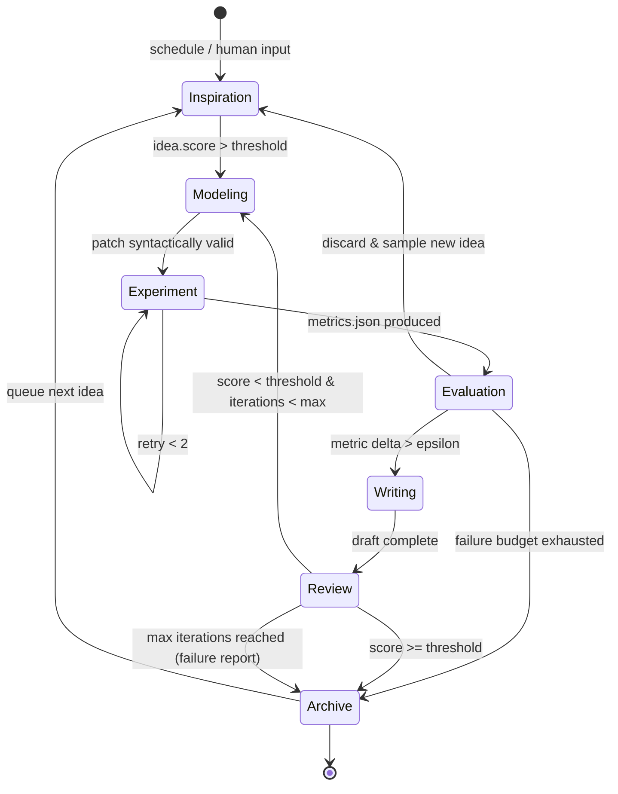
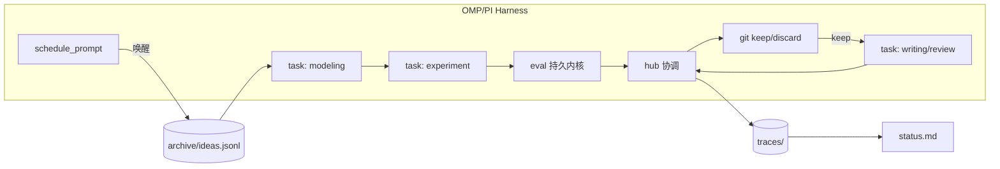

# OMP/PI 全自动科研飞轮工作区规格 v1.0

> 适用对象：Oh My Pi（OMP）与 PI coding harness 上的 agent 工作区。本规格定义一个可无人值守自转的科研闭环：人类提一句灵感或系统自动提灵感，agent 自动完成建模、实验、评估、写作、审稿、归档，产出论文草稿或结构化失败结论。

## 1. 设计目标

### 1.1 一句话目标
在 OMP/PI 中打开工作区，输入一句灵感或保持空输入，agent 在固定预算内全自动跑完建模到归档，夜间持续自转，次日人类通过看板复盘。

### 1.2 可度量目标
- 零启动成本：`bash orchestration/scaffold.sh --idea "xxx"` 或空参可在 5 分钟内产生首个可执行实验，`traces/<ts>/metrics.json` 落盘。
- 度量驱动决策：每轮实验产出 `metrics.json` 与 `trace.jsonl`，主度量提升超过 epsilon 才 keep，复刻 Karpathy autoresearch 的 modify-train-evaluate-keep 语义。
- 双终态归档：成功路径产出 `reports/report.md` 与 `archive/papers/` 的可复现快照；失败路径产出 `reports/failure.md` 与 `archive/failed.jsonl` 的否定性结论。
- 全链路可审计：git 分支、trace、cost、hub 消息均可回放。
- 并行探索：单机通过 `task` 并发多分支探索，通过 `hub` 协调分数与 keep 广播，通过 `eval` 持久内核复用数据加载。

### 1.3 非目标
不做通用 AutoML 平台，不直接对接物理仪器（SDL 形态保留扩展点），不追求单次产出顶会论文，追求可复现、可比较、可累积的飞轮。

## 2. 循环语义

### 2.1 七阶段状态机

```
inspiration → modeling → experiment → evaluation → writing → review → archive
      ^          |           |            |           |         |       |
      |          +-----<----+----<--------+           |         |       |
      |                                                +----<---+       |
      +---------------------------------------------------------------<--+
                         失败结论路径从任意 evaluation/review 直达 archive
```

| 阶段 | 输入 | 输出 | 准入与产出契约 |
|------|------|------|----------------|
| inspiration | 人提 `inspiration.md` 或自动生成 ideas 池 | `archive/ideas.jsonl` 新增条目，含假设、预期提升、风险 | 阈值过滤后入队，无灵感时自动触发 |
| modeling | idea + 文献证据 + 基线 `run.py` | 对 `run.py` 的 patch，写入 `traces/<ts>/git.patch` | 语法检查通过才进入 experiment |
| experiment | patch + 固定墙钟预算 | `traces/<ts>/metrics.json`, `run.log`, `figures/` | 超时或崩溃计为失败样本，进入重试或归因 |
| evaluation | metrics + `prepare.py:evaluate` | `traces/<ts>/metrics.json` 的 keep/discard 判定 | 主度量 delta 超 epsilon 才 keep |
| writing | keep 的 run 与证据 | `reports/report.md` 与图表 | 模板校验通过，引用来自 `navigator/evidence/` |
| review | draft + checklist | `reports/review.md` 与分数，Elo 排序 | 分数阈值以下回退到 modeling |
| archive | 任意终态 | `archive/` 固化与 `failed.jsonl` 或 `papers/` | 归档后触发下一轮 inspiration |

### 2.2 夜间无人值守语义
- `schedule_prompt` 每 30-60 分钟唤醒一轮，检查 `archive/ideas.jsonl` 队列与预算，自动选取最高分 idea 执行 `run_once`。
- 单轮实验预算固定（5-15 分钟墙钟），超时由 harness 强制终止并记为失败样本。
- 连续 3 轮无提升自动提升 idea 采样温度并扩宽候选池。
- 晨间人类通过 `status.md` 与 `traces/` 复盘，执行 keep/discard 人工复核或接受自动归档。



### 2.3 与已调研系统的对应
- Karpathy 三文件极简基座：`prepare.py` / `run.py` / `program.md` 为唯一可变执行单元与固定评估器的分离。
- Agent Laboratory 三阶段：literature / experimentation / writing 对应 `navigator/` / `traces/` / `reports/`。
- Sakana Tree Search + Google Elo：并行分支探索与锦标赛排序对应 `task` 并发与 `review` 的 Elo 机制。
- Bohrium 四层：Data / Model / Execution / Orchestration 对应 `prepare.py`+`bench/` / `run.py`+`models/` / `traces/` / `orchestration/`+`schedule_prompt`。
- Biomni 工具检索：capability registry 嵌入检索对应 `capabilities/registry.json`。
- ReviewRL / CycleReviewer：双智能体互训审稿对应 `review` 阶段的生成与批判分离。

## 3. 目录结构与文件契约

复刻三套成熟模式的交集：Karpathy 三文件 + Agent Lab 三阶段 + Bohrium 四层，落到本工作区的统一树。

```
research-flywheel/
  program.md              # 任务定义，冻结的研究目标、约束、预算、基线
  inspiration.md          # 人类入口灵感，一句或一段，空时触发自动灵感
  prepare.py              # 数据与评估固定，不可被 agent 编辑
  run.py                  # 唯一可变执行单元（模型/优化器/训练循环）
  capabilities/
    registry.json         # 工具清单：名称、输入 schema、成本、沙箱策略
    tools/*.py            # 可调用工具包装
  navigator/
    queries.jsonl         # 检索记录
    evidence/*.json       # 带溯源的证据片段
  traces/                 # 执行轨迹，每轮隔离
    2026-09-02T13-00-00/
      run.log
      metrics.json
      cost.json
      git.patch
  reports/
    report.md             # 本轮报告
    failure.md            # 失败结论（失败路径）
    review.md             # 审稿意见与分数
    figures/*.png
  archive/
    ideas.jsonl           # 灵感池全量
    papers/*.pdf          # 历史论文草稿
    failed.jsonl          # 失败归因库
  bench/
    tasks/*.json          # DeepResearch Bench 子集
    scores.jsonl
  orchestration/
    flywheel.py           # 主循环（常驻 eval 内核）
    scaffold.sh           # 一键建仓脚本
    schedule.json         # schedule_prompt 配置
    hooks/pre-run.sh      # 禁写区校验
    hooks/post-eval.sh    # keep/discard 与归档
  .omp/
    config.toml           # OMP 配置与 schedule 注册
  traces.jsonl            # 全局追加追踪（可选聚合）
  status.md               # 人类看板
  reproduce.sh            # 一键复现最新 keep
```

### 3.1 核心文件契约

| 文件 | 角色 | 谁写 | 谁读 | 变更规则 |
|------|------|------|------|----------|
| `program.md` | 任务定义，含度量、预算、基线 | 人类 / scaffold | 所有 agent | 冻结，变更需新分支 |
| `inspiration.md` | 单句人类灵感入口 | 人类 | orchestration | 为空时触发自动灵感 |
| `prepare.py` | 固定数据与评估器 | 人类 | evaluation | 禁止实验 agent 修改，签名 `load_data()`, `evaluate(pred,target)->metrics` 固定 |
| `run.py` | 唯一可变训练/仿真脚本 | modeling agent | experiment | 每次 patch 产生新 trace，不直接覆盖 main |
| `capabilities/registry.json` | 工具注册表 | 人类 | 所有 agent | 需显式申请变更 |
| `traces/<ts>/metrics.json` | 标准度量 | experiment | evaluation | 追加，含主度量、辅助度量、预算 |
| `reports/report.md` | 报告正文 | writing agent | review | 覆盖，引用来自 navigator |
| `reports/failure.md` | 失败结论 | review agent | archive | 失败路径必产 |
| `archive/ideas.jsonl` | 灵感池全量 | inspiration-engine | orchestration | 追加 |
| `traces.jsonl` | 全局追踪 | orchestration | 人类 | 追加，每行含 run_id、idea_id、metric |

主度量契约示例 `traces/<ts>/metrics.json`：

```json
{
  "run_id": "20260902-031502-a3f9",
  "idea_id": "idea-007",
  "parent_run": "20260902-021000-b1c2",
  "metric_main": {"name": "val_bpb", "value": 1.42, "higher_is_better": false},
  "metric_aux": {"acc": 0.81, "latency_ms": 340},
  "budget": {"seconds": 300, "gpu": "1xH100"},
  "keep": true,
  "reason": "val_bpb 1.45 -> 1.42, delta 0.03 > epsilon 0.01"
}
```

## 4. Harness 接线

### 4.1 组件映射

| 需求 | OMP/PI 能力 | 用法 |
|------|-------------|------|
| 并行探索 | `task` | 每个 idea 一个 task，独立 worktree，互不污染 |
| 持久实验内核 | `eval` | Python kernel 常驻，增量修改 run.py 后热重跑 |
| 协调与选举 | `hub` | 多 task 间共享 idea 池锁、keep 决策广播、review 投票 |
| 定时唤醒 | `schedule_prompt` | `0 */30 * * * *` 夜间轮询，空队列时触发 auto-inspiration |
| 版本控制 | `git keep/discard` | 每轮 trace 独立分支，keep 合并到 main，discard 保留 log 后丢弃 |
| 追踪 | `traces/` + `trace.jsonl` | 每条消息带 run_id、idea_id、metric，便于回放 |

### 4.2 接线伪代码

```python
# orchestration/flywheel.py — 在 eval 持久内核中常驻
import json, subprocess
from pathlib import Path
EPSILON = 0.01

def run_once(idea_text: str):
    run_id = new_run_id()
    branch = f"run/{run_id}"
    subprocess.run(["git", "checkout", "-b", branch], check=True)
    patch = call_task("modeling", idea=idea_text)
    apply_patch(patch, target="run.py")
    metrics = exec_in_eval("python run.py --budget 300")
    keep = metrics["val_bpb"] < load_baseline() - EPSILON
    write_json(f"traces/{run_id}/metrics.json", metrics | {"keep": keep})
    append_trace({"run_id": run_id, "idea": idea_text[:80], "keep": keep, "metrics": metrics})
    if keep:
        subprocess.run(["git", "add", "."], check=True)
        subprocess.run(["git", "commit", "-m", f"keep {run_id}"], check=True)
        subprocess.run(["git", "checkout", "main"], check=True)
        subprocess.run(["git", "merge", branch], check=True)
    else:
        subprocess.run(["git", "checkout", "main"], check=True)
        subprocess.run(["git", "branch", "-D", branch], check=True)
    if keep:
        call_task("writing", run_id=run_id)
        score = call_task("review", run_id=run_id)
        if score < 6.0:
            return "revise"
    return "next"
```

夜间调度 `orchestration/schedule.json`：

```json
{
  "schedules": [
    {"cron": "0 */30 * * * *", "prompt": "检查 archive/ideas.jsonl 队列与 traces/ 状态，选取最高分 idea 执行 run_once，若队列为空则触发 auto-inspiration。", "mode": "flywheel-night"},
    {"cron": "0 0 8 * * *", "prompt": "生成晨间复盘 status.md，汇总夜间 traces 与待人工复核的 keep/discard。", "mode": "morning-report"}
  ]
}
```



## 5. 失败结论路径

### 5.1 何时判定失败
满足任一即进入失败归档，不再重试该 idea：
- 同一 idea 连续 3 轮实验无提升且 delta 小于 epsilon。
- 实验连续 2 次崩溃或超时且自动修复未通过语法检查。
- 评估器判定违背约束（如泄漏、指标不可复现）。
- 审稿环节连续 2 轮分数低于阈值且 critique 指向假设层面缺陷。
- 预算耗尽（默认单 idea 上限 5 轮或 2 小时）。

### 5.2 失败报告契约
失败路径产出 `reports/failure.md` 并归档到 `archive/failed.jsonl`，结构固定：

```markdown
# Failure Report: <idea 标题>
- idea_id: idea-007
- runs: [run-1, run-2, run-3]
- hypothesis: 初始假设一句话
- evidence: 每轮 metrics 与关键 log 摘录
- root cause: 假设/实现/数据/评估 四选一 + 解释
- negative result: 可复用的否定性结论
- next hypotheses: 2-3 个可直接转 ideas.jsonl 的新假设
```

失败报告由 review agent 自动撰写，`traces.jsonl` 中标记 `outcome: failure`，`next hypotheses` 回注入 `archive/ideas.jsonl`，实现失败知识再利用。失败归档同样生成 `reproduce.sh`，保证否定性结论可复现。

### 5.3 人类复核点
- `status.md` 顶部展示最近 3 个失败报告的 root cause 与 next hypotheses，人类可一键 retain 某个新假设或关闭队列。
- 任何失败归档保留完整分支 log，`git branch -D` 前已将 `traces/<id>/` 固化到 `archive/`，不丢失证据。

---

> 验证标准：执行 `bash orchestration/scaffold.sh --idea "test"` 后，30 分钟内在 `traces/` 看到至少一轮 metrics，在 `archive/` 看到 keep 或 failure 归档，且 `traces.jsonl` 可回放全链路。
