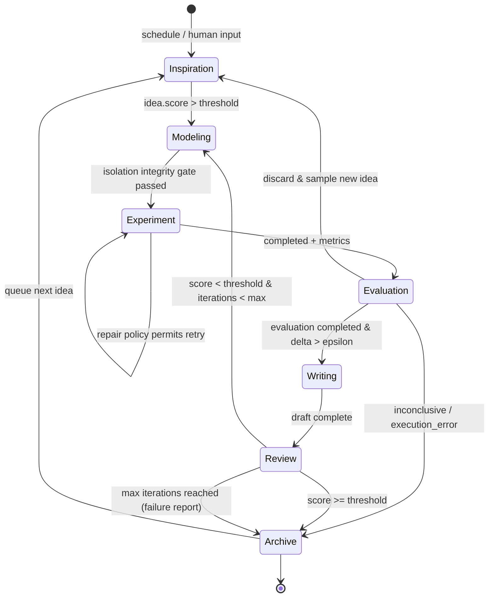
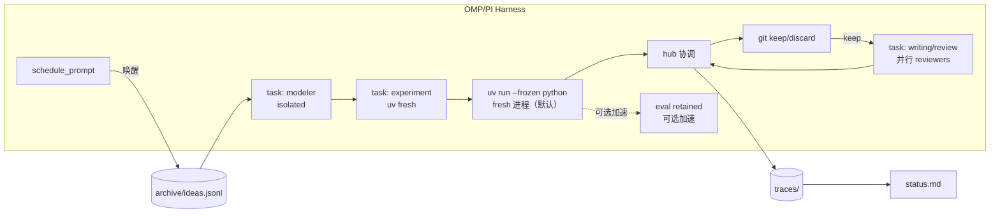

# OMP/PI 全自动科研飞轮工作区规格 v1.0

> 适用对象：Oh My Pi（OMP）与 PI coding harness 上的 agent 工作区。本规格定义一个可无人值守自转的科研闭环：人类提一句灵感或系统自动提灵感，agent 自动完成建模、实验、评估、写作、审稿、归档，产出论文草稿或结构化失败结论。

## 1. 设计目标

### 1.1 一句话目标
在 OMP/PI 中打开工作区，输入一句灵感或保持空输入，agent 按当前 experiment profile 全自动跑完建模到归档，runtime 管理执行生命周期，夜间持续自转，次日人类通过看板复盘。默认在普通 shell 中即可跑通（`uv` + `uv.lock`），无需配置 OMP 持久内核。

### 1.2 可度量目标
- 零启动成本：`uv sync --frozen` 后 `bash orchestration/scaffold.sh --idea "xxx"` 或空参可在 5 分钟内产生首个可执行实验，`traces/<ts>/metrics.json` 落盘。所有 Python 调用均为 `uv run --frozen python ...`（`uv`/`uv.lock` 缺失时 bootstrap 回退到 `python3`/`python`）。
- 度量驱动决策：每轮实验产出 `metrics.json`、`lifecycle.jsonl` 与 `traces.jsonl`，evaluation 完成且主度量提升超过 epsilon 才 keep，复刻 Karpathy autoresearch 的 modify-train-evaluate-keep 语义。
- 双终态归档：成功路径产出 `reports/report.md` 与 `archive/papers/` 的可复现快照；失败路径产出 `reports/failure.md` 与 `archive/failed.jsonl` 的否定性结论。
- 全链路可审计：不可变 baseline、隔离后端、候选分支、trace、requested/actual cost 与 hub 消息均可回放。
- 并行探索：单机通过 `task` 在独立 merged view 中并发多分支探索，通过 `hub` 协调分数与 keep 广播，默认以 `uv run --frozen python` fresh 子进程执行，OMP `eval` 仅作可选探索加速。

### 1.3 非目标
不做通用 AutoML 平台，不直接对接物理仪器（SDL 形态保留扩展点），不追求单次产出顶会论文，追求可复现、可比较、可累积的飞轮。

### 1.4 可移植 Python 契约
- `pyproject.toml`：`requires-python >=3.11`，`[tool.uv] package=false`，无依赖时亦保留可复现空环境。
- `.python-version`：`3.11`。
- `uv.lock`：已提交；`fingerprint.environment.package_lock_hash` 为 `sha256:<uv.lock 文件摘要>`（存在时），缺失时为 `"unlocked"`。
- 启动：`uv sync --frozen` 一次，后续一律 `uv run --frozen python ...`。Shell 入口（`reproduce.sh`、`orchestration/hooks/*.sh`）在 `uv` 与 `uv.lock` 存在时优先 uv，缺失时回退到 `python3`/`python` 以便 bootstrap。
- 正式门控（compile / smoke / keeper clean reproduction）一律 fresh uv 子进程，不要求持久内核。

## 2. 循环语义

### 2.1 七阶段状态机

```
inspiration → modeling → experiment → evaluation → writing → review → archive
      ^          |           |            |           |         |       |
      |          +-----<----+----<--------+           |         |       |
      |                                                +----<---+       |
      +---------------------------------------------------------------<--+
                         失败结论路径从任意 evaluation/review 直达 archive
```

| 阶段 | 输入 | 输出 | 准入与产出契约 |
|------|------|------|----------------|
| inspiration | 人提 `inspiration.md` 或自动生成 ideas 池 | `archive/ideas.jsonl` 新增条目，含假设、预期提升、风险 | 阈值过滤后入队，无灵感时自动触发 |
| modeling | idea + 文献证据 + baseline + experiment profile | 隔离候选分支与 `traces/<ts>/mutation.json` | 变更路径属于 `mutable_paths` 且完整性校验通过才进入 experiment |
| experiment | 候选 merged view + stage resource request | `metrics.json`, `lifecycle.jsonl`, `cost.json`, `run.log`，失败时附 `error.json` | runtime 记录生命周期；completed 进入评估，paused 保留 checkpoint，failed/cancelled 进入归因；默认以 fresh `uv run --frozen python` 执行 |
| evaluation | completed metrics + baseline evaluator | `metrics.json` 的 keep/discard 判定 | evaluation completed、指纹完整（含 `package_lock_hash`）且主度量 delta 超 epsilon才参与 keep |
| writing | keep 的 run 与证据 | `reports/report.md` 与图表 | 模板校验通过，引用来自 `navigator/evidence/` |
| review | draft + checklist | `reports/review.md` 与分数，Elo 排序 | 分数阈值以下回退到 modeling |
| archive | 任意终态 | `archive/` 固化与 `failed.jsonl` 或 `papers/` | keep、discard、inconclusive、execution_error 归档后触发下一轮 inspiration |

### 2.2 夜间无人值守语义
- `schedule_prompt` 每 30-60 分钟唤醒一轮，检查 `archive/ideas.jsonl` 队列与 runtime lifecycle，认领 queued idea，恢复 paused run，或启动新的 `run_once`（均以 `uv run --frozen python` fresh 进程执行）。
- experiment profile 为每个 stage 声明 requested resource/cost 与可选 deadline。runtime 记录 `started|heartbeat|checkpoint|paused|completed|failed|cancelled` 事件和 actual cost。通用模板省略固定墙钟截止值。
- 连续 3 轮 completed evaluation 无提升时提升 idea 采样温度并扩宽候选池。
- 晨间人类通过 `status.md` 与 `traces/` 复盘 keeper、inconclusive 与 execution_error，执行人工复核或接受自动归档。



### 2.3 与已调研系统的对应
- Karpathy 三文件极简基座：`prepare.py` / `run.py` / `program.md` 提供目标、可变实现与固定评估器分离；本模板以 `mutable_paths` 扩展跨文件候选，并以 task isolation 保持 baseline 不变。
- Agent Laboratory 三阶段：literature / experimentation / writing 对应 `navigator/` / `traces/` / `reports/`。
- Sakana Tree Search + Google Elo：并行分支探索与锦标赛排序对应 `task` 并发与 `review` 的 Elo 机制。
- Bohrium 四层：Data / Model / Execution / Orchestration 对应 `prepare.py`+`bench/` / `run.py`+`models/` / `traces/` / `orchestration/`+`schedule_prompt`。
- Biomni 工具检索：capability registry 嵌入检索对应 `capabilities/registry.json`。
- ReviewRL / CycleReviewer：双智能体互训审稿对应 `review` 阶段的生成与批判分离。

## 3. 目录结构与文件契约

复刻三套成熟模式的交集：Karpathy 三文件 + Agent Lab 三阶段 + Bohrium 四层，落到本工作区的统一树。

```
research-flywheel/
  pyproject.toml          # requires-python >=3.11，[tool.uv] package=false，可移植契约
  uv.lock                 # 已提交锁文件；package_lock_hash = sha256:<uv.lock digest>，缺失为 "unlocked"
  .python-version         # 3.11
  program.md              # 任务定义、冻结目标、experiment profile、baseline 引用
  inspiration.md          # 人类入口灵感，一句或一段，空时触发自动灵感
  prepare.py              # baseline 数据与评估器，候选运行内保持完整（已废弃路径，当前为 evaluation/prepare.py）
  evaluation/prepare.py   # 同上，当前权威路径
  experiment/run.py       # 默认可变入口；profile 可开放其他实现路径
  capabilities/
    registry.json         # 工具清单：名称、输入 schema、成本、沙箱策略
    tools/*.py            # 可调用工具包装
  navigator/
    queries.jsonl         # 检索记录
    evidence/*.json       # 带溯源的证据片段
  traces/                 # 执行轨迹，每轮隔离
    2026-09-02T13-00-00/
      baseline.json       # baseline SHA、完整性路径与 hash
      mutation.json       # resolved backend、变更路径、候选分支
      lifecycle.jsonl     # runtime 生命周期事件
      run.log
      metrics.json
      cost.json
      error.json          # 失败时生成的语言中立错误信封
      git.patch           # 可选审计或恢复产物
  reports/
    report.md             # 本轮报告
    failure.md            # 失败结论（失败路径）
    review.md             # 审稿意见与分数
    figures/*.png
  archive/
    ideas.jsonl           # 灵感池全量
    papers/*.pdf          # 历史论文草稿
    failed.jsonl          # 失败归因库
  bench/
    tasks/*.json          # DeepResearch Bench 子集
    scores.jsonl
  orchestration/
    flywheel.py           # 状态机、完整性门控与 runtime lifecycle 协调
    scaffold.sh           # 一键建仓脚本
    schedule.json         # schedule_prompt 配置
    hooks/pre-run.sh      # baseline hash 与 mutable_paths 校验
    hooks/post-eval.sh    # keep/discard 与归档
  .omp/
    config.yml            # task isolation 与 OMP 项目配置
  traces.jsonl            # 全局追加追踪（可选聚合）
  status.md               # 人类看板
  reproduce.sh            # 一键复现最新 keep（优先 uv，缺失回退 python3/python）
```

### 3.1 核心文件契约

| 文件 | 角色 | 谁写 | 谁读 | 变更规则 |
|------|------|------|------|----------|
| `pyproject.toml` | Python 版本与 uv 契约 | 人类/scaffold | 所有 agent | `requires-python >=3.11`，`[tool.uv] package=false`，冻结 |
| `uv.lock` | 锁文件摘要 → fingerprint | `uv sync` | evaluation/orchestration | 已提交；`package_lock_hash = sha256:<uv.lock digest>`，缺失为 `"unlocked"` |
| `.python-version` | Python 版本钉选 | 人类/scaffold | orchestration | `3.11` |
| `program.md` | 任务定义，含度量、experiment profile、baseline | 人类 / scaffold | 所有 agent | 每个 run 冻结；profile 声明 `mutable_paths`、stage resource request 与可选 deadline |
| `inspiration.md` | 单句人类灵感入口 | 人类 | orchestration | 为空时触发自动灵感 |
| `evaluation/prepare.py` | baseline 数据与评估器 | 人类 | evaluation | 候选运行保持 hash 不变，签名 `load_data()`, `evaluate(pred,target)->metrics` 固定 |
| `experiment/run.py` | 默认实验入口 | modeling agent (`task` + `agent: "modeler"`, `isolated: true`) | experiment | 在隔离 merged view 中编辑；profile 可把模型、配置等路径加入 `mutable_paths` |
| `capabilities/registry.json` | 工具注册表 | 人类 | 所有 agent | baseline 完整性路径，治理流程批准后形成新 baseline |
| `traces/<ts>/metrics.json` | 标准度量 | experiment | evaluation | 记录 completed evaluation、主辅度量、requested/actual cost 与指纹（含 `package_lock_hash`） |
| `traces/<ts>/lifecycle.jsonl` | runtime 生命周期 | orchestration/runtime | evaluation | 追加 `started|heartbeat|checkpoint|paused|completed|failed|cancelled` |
| `traces/<ts>/baseline.json` | 本轮不可变引用 | orchestration | integrity gate | 记录 baseline SHA 与完整性 hash |
| `traces/<ts>/mutation.json` | 候选变更清单 | orchestration | evaluation | 记录 resolved backend、branch、changed_paths 与 gate 结果 |
| `traces/<ts>/error.json` | 语言中立错误信封 | runtime | repair/review | 失败运行生成，字段契约见 `02-harness-wiring.md` §3.2 |
| `reports/report.md` | 报告正文 | writing agent (`task` + `agent: "paper-writer"`) | review | 覆盖，引用来自 navigator |
| `reports/failure.md` | 失败结论 | review agent | archive | 失败路径必产 |
| `archive/ideas.jsonl` | 灵感池全量 | inspiration-engine | orchestration | 追加 |
| `traces.jsonl` | 全局追踪 | orchestration | 人类 | 追加，每行含 run_id、idea_id、metric |

隔离执行要求工作区已有 Git baseline。项目配置采用：

```yaml
# .omp/config.yml
task:
  isolation:
    mode: auto
    apply: false
    merge: branch
```

`task` 以 `isolated: true` 启动候选。`runIsolatedSubprocess` 捕获 baseline，经 `isoResolve` 与 `isoStart` 生成 disposable merged view，成功候选保留为 `omp/task/<id>` 分支。`auto` 在 APFS 可用时使用 clonefile CoW，并按候选列表降级到其他后端；`rcopy` 提供最终复制路径。orchestration 对 changed paths、`mutable_paths` 与完整性 hash 做归并前门控。`isoDiff` 或 patch capture 提供可选审计产物。OMP approval mode 管理工具调用的 `read|write|exec` 审批和策略信号；文件级完整性由 isolation、baseline manifest 与归并门控执行。

主度量契约示例 `traces/<ts>/metrics.json`：

```json
{
  "run_id": "20260902-031502-a3f9",
  "idea_id": "idea-007",
  "parent_run": "20260902-021000-b1c2",
  "metric_main": {"name": "val_bpb", "value": 1.42, "higher_is_better": false},
  "metric_aux": {"acc": 0.81, "latency_ms": 340},
  "execution": {
    "stage": "coarse",
    "state": "completed",
    "requested": {"cost_type": "compute", "resource_class": "gpu", "count": 1},
    "actual": {"wall_clock_seconds": 342.8, "gpu_seconds": 342.8, "tokens": 0, "material_cost": 0}
  },
  "fingerprint": {
    "device": {"kind": "gpu", "model": "H100", "count": 1},
    "environment": {
      "image_digest": "sha256:9f86d081884c7d659a2feaa0c55ad015a3bf4f1b2b0b822cd15d6c15b0f00a08",
      "python_version": "3.11",
      "package_lock_hash": "sha256:d5579c46dfcc7e8c39d6f069c86005184d6e804a0560ec89323c817860aa4b14"
    }
  },
  "evaluation": {"state": "completed", "evaluator_hash": "sha256:6b86b273ff34fce19d6b804eff5a3f5747ada4eaa22f1d49c01e52ddb7875b4b"},
  "keeper_votes": {"numeric": "pass", "semantic": "pending", "conflict": false},
  "keep": true,
  "reason": "completed evaluation: val_bpb 1.45 -> 1.42, delta 0.03 > epsilon 0.01"
}
```

> `package_lock_hash` 口径：`uv.lock` 存在时为 `sha256:<uv.lock 文件字节的 SHA-256 十六进制>`，否则为 `"unlocked"`。`pyproject.toml` 与 `.python-version` 同为模板分发物。

## 4. Harness 接线

### 4.1 组件映射

| 需求 | OMP/PI 能力 | 用法 |
|------|-------------|------|
| 并行隔离探索 | `task` | 每个 idea 以 `isolated: true` 进入独立 merged view，parent checkout 保持 baseline |
| 正式执行与复现 | `uv run --frozen python` fresh 子进程 | compile/smoke、exploratory full run 与 keeper clean reproduction 均在 fresh 进程执行；`eval` 仅作可选探索加速 |
| 协调与选举 | `hub` | 多 task 间共享 idea 池锁、lifecycle 摘要、keep 决策广播、review 投票 |
| 定时唤醒 | `schedule_prompt` | 夜间轮询 queued/paused 状态，空队列时触发 auto-inspiration |
| 候选归并 | task isolation branch + git | orchestration 验证 candidate branch，keep 后归并，其他终态保留 trace 后删除候选 |
| 追踪 | `traces/` + `traces.jsonl` | 每条事件带 run_id、idea_id、lifecycle state、actual cost 与 fingerprint（含 `package_lock_hash`） |

### 4.2 接线伪代码

```python
# orchestration/flywheel.py — wrapper 伪代码；真实调用形态见 02-harness-wiring.md
# 正式执行一律 uv fresh 进程；eval 仅作可选加速，不参与门控
EPSILON = 0.01

def run_once(idea, profile):
    run_id = new_run_id()
    baseline = capture_baseline(run_id, integrity_paths=profile["integrity_paths"])
    candidate = call_task(
        agent="modeler",
        isolated=True,
        task=f"run_id={run_id} idea={idea['id']} 编辑 mutable_paths 并写 mutation.json",
    )
    integrity = verify_candidate(candidate, baseline, profile["mutable_paths"])
    write_mutation(run_id, candidate, integrity)
    if not integrity["passed"]:
        return archive_terminal(run_id, "execution_error", reason="integrity_gate")

    append_lifecycle(run_id, "started", requested=profile["stages"]["full"]["requested"])
    result = execute_candidate_fresh_uv(candidate, profile["stages"]["full"])
    append_lifecycle(run_id, result["state"], actual=result["actual"])
    if result["state"] != "completed":
        return archive_terminal(run_id, classify_unfinished(result), evidence=result)

    reproduction = clean_reproduce_fresh_uv(candidate)
    if reproduction["state"] != "completed":
        return archive_terminal(run_id, "inconclusive", evidence=reproduction)

    evaluation = evaluate_with_baseline(reproduction, baseline)
    keep = evaluation["state"] == "completed" and evaluation["delta"] > EPSILON
    write_metrics(run_id, result, reproduction, evaluation, keep)
    append_trace(run_id, evaluation, keep)
    if keep:
        merge_candidate(candidate["branch_name"])
        call_task(agent="paper-writer", task=f"run_id={run_id} 起草 reports/report.md")
        panel = parallel_tasks([
            dict(agent="reviewer-methodology", task=f"review run_id={run_id}"),
            dict(agent="reviewer-skeptic", task=f"review run_id={run_id}"),
            dict(agent="reviewer-reproducibility", task=f"review run_id={run_id}"),
        ])
    else:
        archive_terminal(run_id, "discard", evidence=evaluation)
    return "next"
```

夜间调度 `orchestration/schedule.json`：

```json
{
  "schedules": [
    {"cron": "0 */30 * * * *", "prompt": "检查 queued/paused run 与 lifecycle checkpoint，按 experiment profile 认领、恢复或启动一轮（uv fresh 进程），记录 requested/actual cost 与终态。", "mode": "flywheel-night"},
    {"cron": "0 0 8 * * *", "prompt": "生成晨间复盘 status.md，汇总 completed keep/discard、inconclusive、execution_error、actual cost 与待人工复核项。", "mode": "morning-report"}
  ]
}
```



## 5. 失败结论路径

### 5.1 何时判定失败
满足任一即进入对应终态归档，本轮 policy 决定后续重试资格：
- 同一 idea 连续 3 轮 completed evaluation 无提升且 delta 小于 epsilon。
- 执行连续 2 次进入 `failed|cancelled`，局部修复与 clean reproduction 均未通过。
- 评估器判定违背约束（如泄漏、指标不可复现）。
- 审稿环节连续 2 轮分数低于阈值且 critique 指向假设层面缺陷。
- experiment profile 声明的资源、材料或成本 envelope 耗尽。

### 5.2 失败报告契约
失败路径产出 `reports/failure.md` 并归档到 `archive/failed.jsonl`，结构固定：

```markdown
# Failure Report: <idea 标题>
- idea_id: idea-007
- runs: [run-1, run-2, run-3]
- hypothesis: 初始假设一句话
- evidence: 每轮 metrics 与关键 log 摘录
- root cause: 假设/实现/数据/评估 四选一 + 解释
- negative result: 可复用的否定性结论
- next hypotheses: 2-3 个可直接转 ideas.jsonl 的新假设
```

失败报告由 review agent 自动撰写，`traces.jsonl` 中标记 `outcome: failure`，`next hypotheses` 回注入 `archive/ideas.jsonl`，实现失败知识再利用。失败归档同样生成 `reproduce.sh`，保证否定性结论可复现（`uv run --frozen python` 优先）。

### 5.3 人类复核点
- `status.md` 顶部展示最近 3 个失败报告的 root cause 与 next hypotheses，人类可一键 retain 某个新假设或关闭队列。
- 任何失败归档保留完整分支 log，`git branch -D` 前已将 `traces/<id>/` 固化到 `archive/`，不丢失证据。

---

> 验证标准：`uv sync --frozen` 后执行 `bash orchestration/scaffold.sh --idea "test"`，在当前 experiment profile 的首轮执行窗口内，`traces/` 出现 completed metrics 或结构化未完成终态（含 `package_lock_hash` 指纹），`archive/` 出现 keep、discard、inconclusive 或 execution_error 归档，且 `traces.jsonl` 可回放全链路。全程无需配置 OMP 持久内核。
