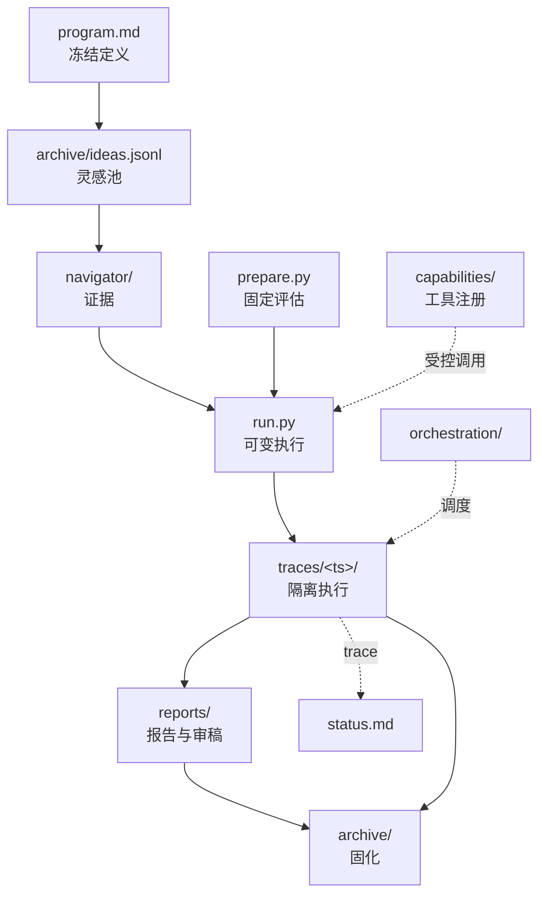

# 工作区目录布局与文件契约 01-workspace-layout

> 本文档把 00-spec 的抽象目录落到可一键 scaffold 的具体文件树，明确每个文件由谁创建、谁可读写、谁不可碰。所有路径相对于工作区根 `research-flywheel/`。

## 1. 设计原则

- 单一可变区：只有 `run.py` 与 `archive/ideas.jsonl` 可被实验 agent 频繁改写，其余目录有写入门禁。该约束复刻 Karpathy autoresearch 的三文件分离。
- 隔离执行：每轮实验产物落在 `traces/<ts>/`，不污染主分支，失败可原子回滚。
- 固定评估器：`prepare.py` 为只读，所有度量经由它产生，保证跨轮可比。
- 归档即证据：`archive/` 固化成功或失败的完整快照，含可复现脚本与 git patch。

## 2. 完整目录树

```
research-flywheel/
  program.md              # 任务定义，冻结的研究目标、约束、预算
  inspiration.md          # 人类入口灵感，一句或一段，空时触发自动灵感
  prepare.py              # 数据与评估固定，不可被 agent 编辑
  run.py                  # 唯一可变执行单元（模型/优化器/训练循环）
  capabilities/            # capability 注册表（Biomni 工具检索轻量版）
    registry.json         # 工具清单：名称、输入 schema、成本、沙箱策略
    tools/*.py            # 可调用工具包装
  navigator/              # 检索层（Science Navigator 轻量版）
    queries.jsonl         # 检索记录
    evidence/*.json       # 带溯源的证据片段
  traces/                 # 执行轨迹，每轮隔离
    2026-09-02T13-00-00/
      run.log
      metrics.json
      cost.json
      git.patch
  reports/
    report.md             # 本轮报告
    failure.md            # 失败结论（失败路径）
    review.md             # 审稿意见与分数
    figures/*.png
  archive/
    ideas.jsonl           # 灵感池全量
    papers/*.pdf          # 历史论文草稿
    failed.jsonl          # 失败归因库
  bench/
    tasks/*.json          # DeepResearch Bench 子集
    scores.jsonl
  orchestration/
    flywheel.py           # 主循环（常驻 eval 内核）
    scaffold.sh           # 一键建仓脚本
    schedule.json         # schedule_prompt 配置
    hooks/pre-run.sh      # 禁写区校验
    hooks/post-eval.sh    # keep/discard 与归档
  .omp/
    config.toml           # OMP 配置与 schedule 注册
  traces.jsonl            # 全局追加追踪（可选聚合）
  status.md               # 人类看板
  reproduce.sh            # 一键复现最新 keep
```



## 3. 文件职责与读写权限

| 路径 | 职责 | 创建者 | 可写者 | 只读者 | 备注 |
|------|------|--------|--------|--------|------|
| `program.md` | 任务、度量、预算、基线 | 人类/scaffold | 人类 | 全部 | 冻结，变更需开新分支，首段目标、末段约束、中间为 plan DAG |
| `inspiration.md` | 单句人类灵感入口 | 人类 | 人类 | orchestration | 为空时触发自动灵感 |
| `prepare.py` | 固定数据与评估器 | 人类 | 人类 | evaluation | 禁止实验 agent 修改，签名 `load_data()`, `evaluate(pred,target)->metrics` 固定 |
| `run.py` | 唯一可变资产 | scaffold | modeling agent | experiment | 每次 run 产生 patch，不直接覆盖 main，需导出 `main()` |
| `capabilities/registry.json` | 工具注册表 | 人类 | 人类 | 所有 agent | 需显式申请变更，含成本与沙箱策略 |
| `navigator/evidence/*.json` | 带溯源证据 | navigator agent | navigator agent | modeling/writing | 追加，含引用与可信度 |
| `traces/<ts>/` | 单轮产物 | orchestration | experiment | 全部 | 分支隔离，main 不可见直到 keep |
| `reports/report.md` | 报告正文 | writing agent | writing agent | review | 覆盖，引用来自 navigator |
| `reports/failure.md` | 失败结论 | review agent | review agent | archive | 失败路径必产，结构化归因 |
| `archive/ideas.jsonl` | 灵感池全量 | inspiration-engine | inspiration-engine | orchestration | 追加不改历史 |
| `archive/failed.jsonl` | 失败归因库 | orchestration | orchestration | 人类 | 追加，支撑下一轮灵感 |
| `traces.jsonl` | 全局追加日志 | orchestration | orchestration | 人类 | 每行含 run_id/idea_id/metric/timestamp |

### 3.1 program.md 契约

首段为目标陈述，中间为 plan DAG（可用 mermaid），末段为约束与预算。示例：

```markdown
# Program: Gated Attention Exploration
目标：在 5 分钟墙钟内将 val_bpb 从 1.45 降至 1.40。
约束：仅改 run.py，禁止改 prepare.py；单轮预算 300 秒。
Plan: inspiration → modeling → experiment → evaluation → writing → review → archive
```

### 3.2 run.py 契约

```python
# run.py 必须满足
def main(budget_seconds: int = 300) -> dict:
    """执行训练/仿真，返回 metrics 字典，超时前写 traces/<ts>/metrics.json"""
```

`prepare.py` 暴露 `load_data()` 与 `evaluate(pred, target) -> metrics`，签名固定，任何 agent 不可修改其文件。

### 3.3 metrics.json 契约

```json
{
  "run_id": "20260902-031502-a3f9",
  "idea_id": "idea-007",
  "metric_main": {"name": "val_bpb", "value": 1.42, "higher_is_better": false},
  "metric_aux": {"acc": 0.81},
  "budget": {"seconds": 300},
  "keep": true,
  "reason": "val_bpb 1.45 -> 1.42, delta 0.03 > epsilon 0.01"
}
```

## 4. Agent 可编辑边界

- **modeling agent**：仅可写 `run.py` 的 patch 与 `traces/<ts>/git.patch`，不可碰 `prepare.py`、`capabilities/registry.json`、`archive/`。通过系统提示与 `hooks/pre-run.sh` 双重约束。
- **experiment agent**：仅可写 `traces/<ts>/`，只读 `run.py` 的当前 patch 版本。
- **navigator agent**：仅可写 `navigator/`，只读 `archive/ideas.jsonl` 与 `program.md`。
- **writing/review agent**：仅可写 `reports/`，只读 `traces/` 与 `navigator/`。
- **orchestration**：唯一可写 `traces.jsonl`、`status.md`、`archive/` 的主体，负责 git 分支操作。

违规检测在 `orchestration/hooks/pre-run.sh` 中执行：

```bash
if git diff --name-only | grep -qE "^(prepare\.py|capabilities/registry\.json)"; then
  echo "forbidden write to frozen file" >&2; exit 1
fi
```

## 5. Git 分支与 keep/discard

- `main` 始终为可复现的最新 keep 状态。
- 每轮 `run/<id>` 分支从 `main` 拉出，实验结束后由 `hooks/post-eval.sh` 判定。
- `keep`：`git merge --no-ff run/<id>` 到 main，打 tag `keep-<id>`，固化 `traces/<id>/` 到 `archive/`。
- `discard`：保留 `traces/<id>/` 到 `archive/discard-<id>/` 后删除分支，不合并。
- 每次 experiment 前后各一次 `git commit`，失败自动 `git reset --hard` 回滚 `run.py`。
- `status.md` 展示最近 5 个 keep/discard 的 delta，便于人类快速判断。

## 6. 一键 scaffold

```bash
bash orchestration/scaffold.sh --idea "gated attention with learned temperature" --budget 300
```

`scaffold.sh` 行为：创建目录树、写入 `program.md` 模板、初始化 `prepare.py` 与 `run.py` 最小可跑版本、注册 `capabilities/registry.json`、创建 `navigator/` 与 `bench/` 骨架、注册 `schedule.json`、初始化 git 仓库并提交首版。
