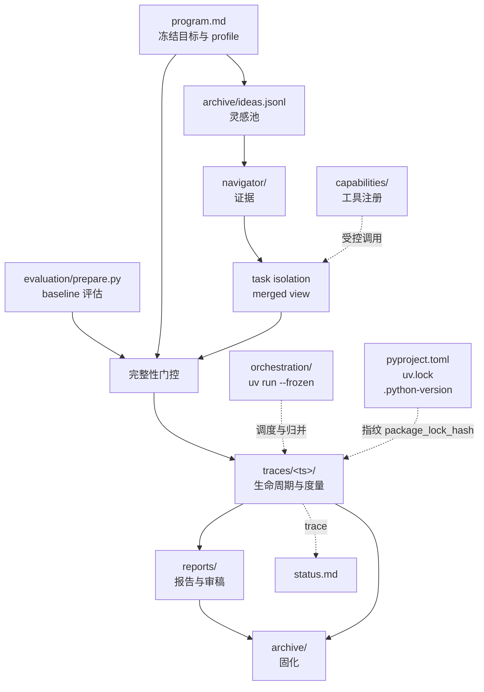

# 工作区目录布局与文件契约 01-workspace-layout

> 本文档把 00-spec 的抽象目录落到可一键 scaffold 的具体文件树，明确每个文件由谁创建、谁可读写、谁不可碰。所有路径相对于工作区根 `research-flywheel/`。

## 1. 设计原则

- 不可变 baseline：每轮固定 Git SHA、`program.md`、`evaluation/prepare.py` 与 capability registry 的 hash，候选运行引用同一组评估资产。
- 隔离可变面：experiment profile 以 `mutable_paths` 声明本轮可编辑路径，`task` 在 disposable merged view 中支持跨文件修改。
- 生命周期可恢复：runtime 记录 started、heartbeat、checkpoint、paused 与终态事件，执行产物落在 `traces/<ts>/`。
- 归档即证据：`archive/` 固化成功、丢弃与未完成终态的完整快照；候选 patch 作为可选审计产物。
- 可移植 Python：`pyproject.toml` / `uv.lock` / `.python-version` 随模板分发，默认以 `uv run --frozen python` fresh 子进程执行，无需持久内核。

## 2. 完整目录树

```
research-flywheel/
  pyproject.toml          # requires-python >=3.11，[tool.uv] package=false（已提交）
  uv.lock                 # 已提交锁文件；指纹 package_lock_hash = sha256:<uv.lock digest>，缺失为 "unlocked"
  .python-version         # 3.11
  program.md              # 冻结目标、experiment profile、baseline 引用
  inspiration.md          # 人类入口灵感，一句或一段，空时触发自动灵感
  evaluation/prepare.py   # baseline 数据与评估器，候选运行内保持完整
  experiment/run.py       # 默认可变入口；profile 可开放其他实现路径
  capabilities/            # capability 注册表（Biomni 工具检索轻量版）
    registry.json         # 工具清单：名称、输入 schema、成本、沙箱策略
    tools/*.py            # 可调用工具包装
  navigator/              # 检索层（Science Navigator 轻量版）
    queries.jsonl         # 检索记录
    evidence/*.json       # 带溯源的证据片段
  traces/                 # 执行轨迹，每轮隔离
    2026-09-02T13-00-00/
      baseline.json       # baseline SHA、integrity_paths 与 hash
      mutation.json       # isolation backend、候选分支、changed_paths
      lifecycle.jsonl     # runtime 生命周期事件
      run.log
      metrics.json
      cost.json
      error.json          # 失败时生成
      git.patch           # 可选审计或恢复产物
  reports/
    report.md             # 本轮报告
    failure.md            # 失败结论（失败路径）
    review.md             # 审稿意见与分数
    figures/*.png
  archive/
    ideas.jsonl           # 灵感池全量
    papers/*.pdf          # 历史论文草稿
    failed.jsonl          # 失败归因库
  bench/
    tasks/*.json          # DeepResearch Bench 子集
    scores.jsonl
  orchestration/
    flywheel.py           # 状态机、完整性门控与 lifecycle 协调
    scaffold.sh           # 一键建仓脚本
    schedule.json         # schedule_prompt 配置
    hooks/pre-run.sh      # baseline hash 与 mutable_paths 校验（优先 uv，回退 python3/python）
    hooks/post-eval.sh    # keep/discard 与归档
  .omp/
    config.yml           # task isolation 与 OMP 项目配置
  traces.jsonl            # 全局追加追踪（可选聚合）
  status.md               # 人类看板
  reproduce.sh            # 一键复现最新 keep（优先 uv run --frozen，回退 python3/python）
```



## 3. 文件职责与读写权限

| 路径 | 职责 | 创建者 | 可写者 | 只读者 | 备注 |
|------|------|--------|--------|--------|------|
| `pyproject.toml` | Python 版本与 uv 契约 | 人类/scaffold | 人类 | 全部 | `requires-python >=3.11`，`[tool.uv] package=false`，随模板提交 |
| `uv.lock` | 锁文件摘要 → fingerprint | `uv sync --frozen` | 全部（只读） | evaluation/orchestration | 已提交；`package_lock_hash = sha256:<uv.lock 字节摘要>`，缺失为 `"unlocked"` |
| `.python-version` | Python 版本钉选 | 人类/scaffold | 人类 | orchestration | `3.11`，与 `pyproject.toml` 一致 |
| `program.md` | 任务、度量、experiment profile、baseline | 人类/scaffold | 人类 | 全部 | 每个 run 冻结；frontmatter 声明 `mutable_paths`、`integrity_paths` 与 stage resources |
| `inspiration.md` | 单句人类灵感入口 | 人类 | 人类 | orchestration | 为空时触发自动灵感 |
| `evaluation/prepare.py` | baseline 数据与评估器 | 人类 | 人类 | evaluation | 候选运行保持 hash 不变，签名 `load_data()`, `evaluate(pred,target)->metrics` 固定 |
| `experiment/run.py` | 默认实验入口 | scaffold | modeling agent (`task` + `agent: "modeler"`, `isolated: true`) | experiment | 在隔离 merged view 中编辑，需导出 profile 指定入口 |
| `capabilities/registry.json` | 工具注册表 | 人类 | 人类 | 所有 agent | baseline 完整性路径；治理批准后形成新 baseline |
| `navigator/evidence/*.json` | 带溯源证据 | navigator agent (`task` + `agent: "literature-scout"`) | navigator agent | modeling/writing | 追加，含引用与可信度 |
| `traces/<ts>/` | 单轮证据包 | orchestration | experiment/runtime/orchestration | 全部 | parent checkout 外部收集，候选归并决策前持续可见 |
| `traces/<ts>/baseline.json` | baseline manifest | orchestration | orchestration | 全部 | SHA、integrity hash 与 profile snapshot |
| `traces/<ts>/mutation.json` | 候选变更清单 | orchestration | orchestration | evaluation | backend、branch、changed_paths 与 gate 结果 |
| `traces/<ts>/lifecycle.jsonl` | runtime 生命周期 | runtime | runtime | evaluation | 追加状态事件与 checkpoint 引用 |
| `traces/<ts>/error.json` | 语言中立错误信封 | runtime | runtime | repair/review | 失败运行生成 |
| `reports/report.md` | 报告正文 | writing agent (`task` + `agent: "paper-writer"`) | writing agent | review | 覆盖，引用来自 navigator |
| `reports/failure.md` | 失败结论 | review agent | review agent | archive | 失败路径必产，结构化归因 |
| `archive/ideas.jsonl` | 灵感池全量 | inspiration-engine | inspiration-engine | orchestration | 追加不改历史 |
| `archive/failed.jsonl` | 失败归因库 | orchestration | orchestration | 人类 | 追加，支撑下一轮灵感 |
| `traces.jsonl` | 全局追加日志 | orchestration | orchestration | 人类 | 每行含 run_id/idea_id/event/actual_cost/timestamp |
| `reproduce.sh` | 复现入口 | scaffold | 人类 | 全部 | 优先 `uv run --frozen python`，缺失时回退 `python3`/`python` |

### 3.1 program.md 契约

`program.md` 的 YAML frontmatter 固化机器可读 experiment profile，正文保存目标、假设与 plan DAG。示例：

```markdown
---
experiment_profile:
  baseline_ref: main
  mutable_paths: [experiment/run.py, "models/**", "configs/experiment/**"]
  integrity_paths: [program.md, evaluation/prepare.py, capabilities/registry.json]
  stages:
    coarse:
      requested: {cost_type: compute, resource_class: cpu, count: 1}
      deadline_seconds: null
---
# Program: Gated Attention Exploration
目标：在同一 baseline evaluator 与完整指纹下，将 val_bpb 从 1.45 降至 1.40。
Plan: inspiration → modeling → experiment → evaluation → writing → review → archive
```

### 3.2 实验入口契约

默认 Python profile 使用（以 fresh `uv run --frozen python` 子进程执行）：

```python
def main(run_context: dict) -> dict:
    """使用 runtime 租约执行候选，并返回原始 metrics。"""
```

`run_context` 提供 `run_id`、`trace_dir`、stage profile 与 resource lease。runtime 负责生命周期事件、checkpoint 和 actual cost。其他语言 profile 可声明等价入口。`evaluation/prepare.py` 暴露 `load_data()` 与 `evaluate(pred, target) -> metrics`；本轮 baseline manifest 固化其 hash。

启动示例（可移植默认）：

```bash
uv sync --frozen
uv run --frozen python orchestration/flywheel.py
bash reproduce.sh
```

`experiment/run.py` 与 `evaluation/prepare.py` 是由 runtime 导入的模块，不提供独立 CLI。需要直接检查 evaluator 时，使用 fresh 子进程调用其固定接口：

```bash
uv run --frozen python -c "from evaluation.prepare import evaluate, load_data; data=load_data(); targets=[target for _, target in data]; print(evaluate(targets, targets))"
```

Shell 入口在 `uv` 与 `uv.lock` 存在时优先 uv，缺失时回退到 `python3`/`python` 以便 bootstrap。正式门控永不要求持久内核。

### 3.3 metrics.json 契约

```json
{
  "run_id": "20260902-031502-a3f9",
  "idea_id": "idea-007",
  "metric_main": {"name": "val_bpb", "value": 1.42, "higher_is_better": false},
  "metric_aux": {"acc": 0.81},
  "execution": {
    "stage": "coarse",
    "state": "completed",
    "requested": {"cost_type": "compute", "resource_class": "cpu", "count": 1},
    "actual": {"wall_clock_seconds": 342.8, "gpu_seconds": 342.8, "tokens": 0, "material_cost": 0}
  },
  "fingerprint": {
    "device": {"kind": "gpu", "model": "H100", "count": 1},
    "environment": {
      "python_version": "3.11",
      "platform": "linux-x86_64",
      "package_lock_hash": "sha256:d5579c46dfcc7e8c39d6f069c86005184d6e804a0560ec89323c817860aa4b14"
    }
  },
  "evaluation": {"state": "completed", "evaluator_hash": "sha256:6b86b273ff34fce19d6b804eff5a3f5747ada4eaa22f1d49c01e52ddb7875b4b"},
  "keep": true,
  "reason": "completed evaluation: val_bpb 1.45 -> 1.42, delta 0.03 > epsilon 0.01"
}
```

`package_lock_hash` 口径：`uv.lock` 存在时为 `sha256:<uv.lock 文件字节的 SHA-256 十六进制摘要>`，否则为 `"unlocked"`。

## 4. Agent 可编辑边界

- **modeling agent**（`task` + `agent: "modeler"`, `isolated: true`）：在 merged view 中直接编辑 `experiment_profile.mutable_paths`。候选可包含 `experiment/run.py`、模型模块与实验配置等跨文件变更。compile/smoke 门控以 fresh `uv run --frozen python` 子进程执行（bash），不依赖 `eval`。
- **experiment agent**：执行已通过完整性门控的 candidate branch，写入 `traces/<ts>/` 证据包和 checkpoint（默认 `uv run --frozen python`）。
- **navigator agent**（`task` + `agent: "literature-scout"`）：写入 `navigator/`，读取 `archive/ideas.jsonl` 与冻结 `program.md`。
- **writing/review agent**（`task` + `agent: "paper-writer"` / `reviewer-*`, reviewers 并行一批）：写入 `reports/`，读取 completed metrics、clean reproduction 与 `navigator/`。
- **orchestration**：生成 baseline manifest，校验 changed paths 与 integrity hash，记录生命周期，决定候选归并和归档；正式执行与复现均以 `uv run --frozen python` fresh 进程为准。

`orchestration/hooks/pre-run.sh` 实现以下确定性门控（入口优先 uv）：

1. 从 `baseline.json` 读取 baseline SHA、profile snapshot 与 integrity hash。
2. 从 candidate branch 计算 changed paths 并写入 `mutation.json`。
3. 校验每个 changed path 均匹配 `mutable_paths`。
4. 重算 `program.md`、`evaluation/prepare.py`、`capabilities/registry.json` 的 hash 并与 manifest 对照。
5. 将 gate 结果写入 `mutation.json`；通过后进入 compile/smoke（`uv run --frozen python` fresh 进程）。

OMP approval mode 处理工具调用的 tier、用户策略与安全 prompt。headless subagent 的普通 tier 审批由 parent `task` 授权；显式 per-tool `deny` 保持生效。文件级边界由 isolation、manifest 与归并门控执行。`eval` 仅作可选的探索加速，不替代 fresh 进程门控。

## 5. 候选分支与 keep/discard

- `main` 保存可复现的最新 keep baseline。
- `.omp/config.yml` 设置 `task.isolation.mode: auto`、`task.isolation.apply: false`、`task.isolation.merge: branch`。
- 每轮 task 从 baseline 生成 disposable merged view；成功任务把候选提交到 `omp/task/<id>`，parent checkout 保持原 baseline。
- `keep`：clean reproduction（fresh `uv run --frozen python`）与 evaluation 均 completed、指纹含有效 `package_lock_hash`、actual cost 完整后，由 orchestration 将候选分支归并到 main，打 tag `keep-<id>`，固化证据包。
- `discard|inconclusive|execution_error`：先固化 `traces/<id>/`，再删除候选分支；parent checkout 无需 reset。
- `git.patch` 来自 `isoDiff` 或 patch capture，承担可选审计与恢复职责。
- `status.md` 展示最近候选的 state、delta、actual cost 与 fingerprint（含 `package_lock_hash`），便于人类复核。

## 6. 一键 scaffold

```bash
uv sync --frozen
bash orchestration/scaffold.sh --idea "gated attention with learned temperature"
```

`scaffold.sh` 行为：创建目录树、写入 `pyproject.toml` / `uv.lock` / `.python-version`（若不存在则 `uv sync --frozen` 生成）、写入含 experiment profile 的 `program.md`、初始化 `evaluation/prepare.py` 与 `experiment/run.py` 最小可跑版本、注册 `capabilities/registry.json`、创建 `navigator/` 与 `bench/` 骨架、写入 `.omp/config.yml` 的 task isolation 配置、初始化 Git 仓库并提交 baseline。后续所有 Python 调用均为 `uv run --frozen python ...`（缺失 uv 时 bootstrap 回退到 `python3`/`python`）。
