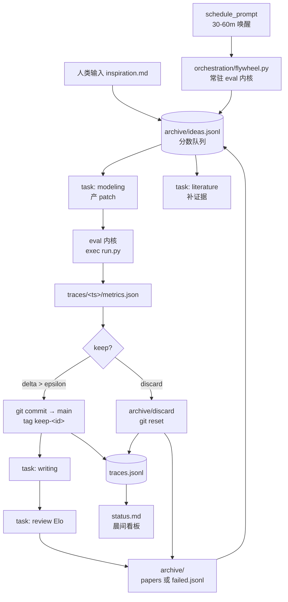
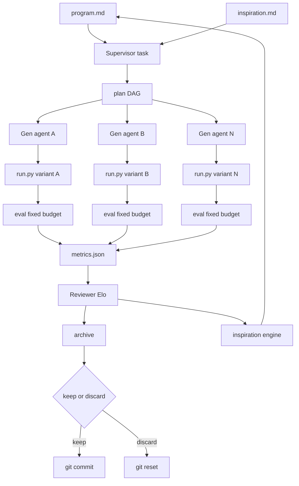
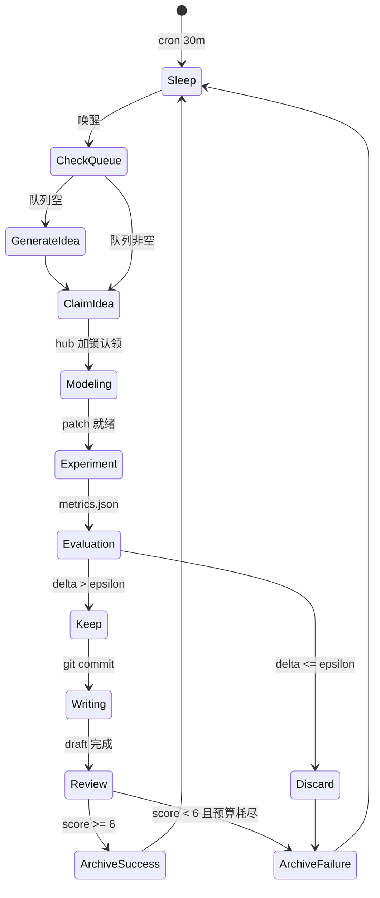

# Harness 接线图与运行时 02-harness-wiring

> 本文档把 00-spec 的 harness 抽象落到 OMP/PI 可执行的命令、代码与调度配置。目标是把无人值守的 modify-evaluate-keep 循环用 OMP 原生能力拼出来，不引入外部编排系统。

## 1. 接线总览

| 飞轮需求 | OMP/PI 原生能力 | 接线方式 | 备注 |
|----------|-----------------|----------|------|
| 并行探索多假设 | `task` | 每个 idea 一个 task，独立 git worktree | 互不污染，共享 trace |
| 常驻实验内核 | `eval` | Python 持久 kernel，热重载 run.py | 避免每轮冷启动，复用数据加载 |
| 多 task 协调 | `hub` | 队列锁、keep 广播、review 投票 | 轻量消息，不传大文件 |
| 定时无人值守 | `schedule_prompt` | cron 触发 orchestration/flywheel.py | 30-60 分钟一轮，8 点晨报 |
| 版本分歧管理 | `git` 分支 keep/discard | run/<id> 分支，keep 合并 main | 复刻 Karpathy git 语义 |
| 全链路审计 | `traces/` + `trace.jsonl` | 结构化追加，status.md 聚合 | 可回放可复盘 |



## 2. 角色映射

- Supervisor（PI 主 task）：读取 `program.md` 与 `inspiration.md`，产出 plan DAG，决定并发分支数与预算。
- Generation agents（并行 task）：基于 plan DAG 编辑 `run.py` 变体，每个变体对应一个 idea 的 method sketch。
- Experiment workers（并行 eval 内核）：在固定墙钟预算内执行 `run.py`，产出 `traces/<ts>/metrics.json` 与 `run.log`。
- Reviewer/Critic（审稿 task）：对 keep 候选做结构化审稿，产出分数与评语，Elo 排序决定最终 keep。
- Archivist（归档）：固化成功或失败快照，回注入灵感池。



## 3. 组件详解

### 3.1 task 并行探索

每个 idea 独立 task，通过隔离 worktree 避免文件污染。Supervisor 不直接改 `run.py`，而是让 modeling task 产 patch，由 orchestration 统一应用与验证。

```python
# orchestration/flywheel.py 片段：并发派发
from pathlib import Path
import json, subprocess

def dispatch(idea_paths, concurrency=3):
    # 用 OMP task 并行派发，实际由上层 prompt 触发 task 工具
    for idea in idea_paths[:concurrency]:
        call_omp_task(
            name=f"modeling-{idea.stem}",
            prompt=f"阅读 {idea} 与 program.md、navigator/evidence，"
                   f"产出对 run.py 的 patch，写入 traces/<id>/git.patch，"
                   f"禁止修改 prepare.py 与 capabilities/registry.json",
            worktree=f"traces/{new_run_id()}"
        )
```

约束：task 之间通过 `hub` 传递小消息（idea_id、score、keep 决策），大产物走文件系统 `traces/<id>/`。同一时刻最多 3 个 modeling task，避免资源争抢，execution 阶段串行或按可用内核并行。

### 3.2 eval 持久内核

`eval` 是 PI/OMP 的常驻 Python 内核，适合把 `run.py` 的修改热加载后立即执行。对比每次 `bash python run.py` 的冷启动，持久内核可复用已加载的数据与模型权重。

```python
# 在 eval 持久内核中常驻的代码 orchestration/kernel.py
import importlib.util, json, traceback
from pathlib import Path

def hot_run(run_id: str, patch_path: str):
    apply_patch(patch_path, target="run.py")
    spec = importlib.util.spec_from_file_location("run", "run.py")
    mod = importlib.util.module_from_spec(spec)
    try:
        spec.loader.exec_module(mod)
        metrics = mod.main(budget_seconds=300)
        Path(f"traces/{run_id}/metrics.json").write_text(json.dumps(metrics, indent=2))
        return metrics
    except Exception as e:
        Path(f"traces/{run_id}/run.log").write_text(traceback.format_exc())
        return {"error": str(e), "keep": False}
```

启动：

```bash
eval --kernel python --file orchestration/kernel.py --persist
# 后续每轮
eval --exec "hot_run('20260902-031502-a3f9', 'traces/xxx/git.patch')"
```

### 3.3 hub 协调

hub 负责三件事：队列加锁、keep 广播、review 投票。消息体保持精简，文件内容不经 hub。

```python
import hub, json
from pathlib import Path

def claim_idea(pool_path="archive/ideas.jsonl"):
    with hub.lock("idea-pool"):
        pool = [json.loads(l) for l in Path(pool_path).read_text().splitlines()]
        queued = [i for i in pool if i["status"] == "queued"]
        queued.sort(key=lambda x: x["score"], reverse=True)
        idea = queued[0]
        idea["status"] = "running"
        Path(pool_path).write_text("\n".join(json.dumps(i) for i in pool))
        hub.broadcast("idea-claimed", {"idea_id": idea["id"], "run_id": new_run_id()})
        return idea
```

常用频道：`idea-claimed`（避免重复认领）、`keep-decision`（writing/review 订阅）、`review-score`（orchestration 决定回退或归档）。

### 3.4 git keep/discard

复刻 Karpathy 语义，每轮一个分支，评估器判定后决定合并或丢弃。

```bash
# orchestration/hooks/post-eval.sh
RUN_ID=$1
KEEP=$(jq -r .keep traces/$RUN_ID/metrics.json)
BRANCH="run/$RUN_ID"

if [ "$KEEP" = "true" ]; then
  git add traces/$RUN_ID run.py
  git commit -m "keep $RUN_ID $(jq -r .idea_id traces/$RUN_ID/metrics.json)"
  git checkout main
  git merge --no-ff $BRANCH -m "merge $RUN_ID"
  git tag "keep-$RUN_ID"
  mkdir -p archive/papers
  cp -r traces/$RUN_ID archive/papers/$RUN_ID
else
  mkdir -p archive/discard-$RUN_ID
  cp -r traces/$RUN_ID archive/discard-$RUN_ID/
  git checkout main
  git reset --hard HEAD
fi
git branch -D $BRANCH 2>/dev/null || true
echo "{\"run_id\":\"$RUN_ID\",\"keep\":$KEEP,\"ts\":\"$(date -u +%FT%TZ)\"}" >> traces.jsonl
```

### 3.5 schedule_prompt 夜间循环

`orchestration/schedule.json` 注册两条 cron：夜间轮询与晨间复盘。

```json
{
  "schedules": [
    {
      "id": "night-flywheel",
      "cron": "0 */30 * * * *",
      "prompt": "你是夜间飞轮值班员。执行：1) 读取 archive/ideas.jsonl 选最高分 queued idea；若为空则调用 inspiration-engine 生成 3 个新 idea；2) 调用 orchestration/flywheel.py:run_once 执行一轮 modeling→experiment→evaluation；3) 按 keep/discard 归档并更新 traces.jsonl 与 status.md；4) 若连续 3 轮无提升，降低温度重采样 idea 池。",
      "mode": "flywheel-night",
      "timeout": 900
    },
    {
      "id": "morning-report",
      "cron": "0 0 8 * * *",
      "prompt": "生成晨间复盘：读取 traces.jsonl 与 archive/，更新 status.md，顶部展示最近 3 个 keep 的 delta 与最近 2 个 failure 的 root cause，列出待人工 retain 的新假设。",
      "mode": "morning-report"
    }
  ]
}
```

注册：

```bash
schedule_prompt add --file orchestration/schedule.json
schedule_prompt list
```

或 TOML 形式：

```toml
# .omp/schedule.toml
[[prompt]]
cron = "*/45 * * * *"
command = "omp run --task research-flywheel:next-cycle"
```

夜间状态机：



## 4. Trace 治理与伪代码

每轮写 `traces/<ts>/`，含 `run.log`、`git.patch`、`cost.json`，`hub` 广播关键事件，便于比较与回放。全局 `traces.jsonl` 每行一个 JSON：

```json
{"ts":"2026-09-02T03:15:02Z","run_id":"20260902-031502-a3f9","idea_id":"idea-007","phase":"evaluation","metric":"val_bpb","value":1.42,"delta":-0.03,"keep":true}
```

端到端伪代码：

```python
# orchestration/flywheel.py — 单轮入口
def run_once():
    idea = claim_idea()
    if not idea:
        idea = auto_inspiration()
    run_id = new_run_id()
    branch = f"run/{run_id}"
    git(f"checkout -b {branch}")
    patch = call_task("modeling", idea=idea["id"])
    if not patch.syntactically_valid:
        return archive_failure(run_id, idea, reason="patch invalid")
    metrics = hot_run(run_id, patch.path)
    keep = decide_keep(metrics)
    post_eval(run_id, keep)
    if keep:
        draft = call_task("writing", run_id=run_id)
        score = call_task("review", run_id=run_id)
        if score < 6.0 and not budget_exhausted(idea):
            return run_once_with_feedback(idea, critique=score.critique)
        archive_success(run_id, idea, draft, score)
    else:
        maybe_archive_failure(run_id, idea, metrics)
    return "next"

# Supervisor 并行分支简化版
plan = llm("parse", read("program.md"), read("inspiration.md"))
variants = parallel([llm("edit run.py", plan, branch=i) for i in range(N)])
results = parallel([eval(f"python run.py --budget 5m", worktree=v) for v in variants])
ranked = elo_rank(results, reviewer_llm)
best = ranked[0]
if best.metrics["val_bpb"] < baseline:
    git_commit(best.patch); write_report(best)
else:
    git_reset(); write_failure(best)
archive(best, ranked); schedule_next_inspiration()
```

失败与重试：实验崩溃记 discard，超时硬 kill，连续 3 轮无提升自动将 idea 温度从 0.7 升至 1.0 扩宽采样。

---

> 验证：`bash orchestration/scaffold.sh --idea "test" && schedule_prompt list` 应显示两条调度；`python orchestration/flywheel.py --once` 应在 `traces/` 产生首轮 metrics 且 `traces.jsonl` 新增一行。
