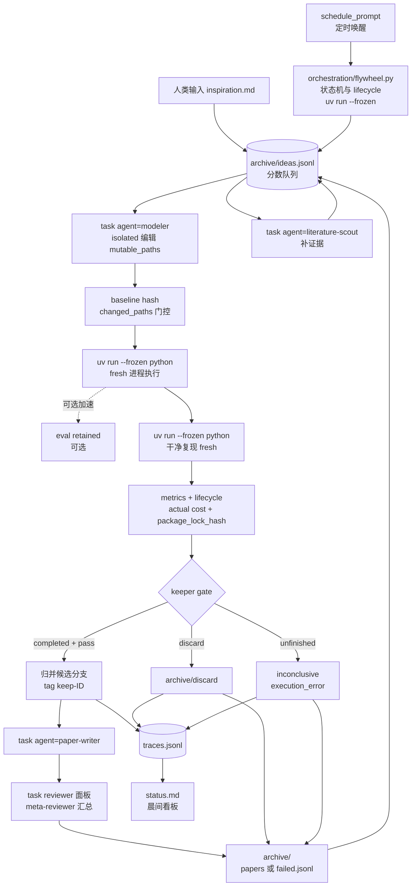
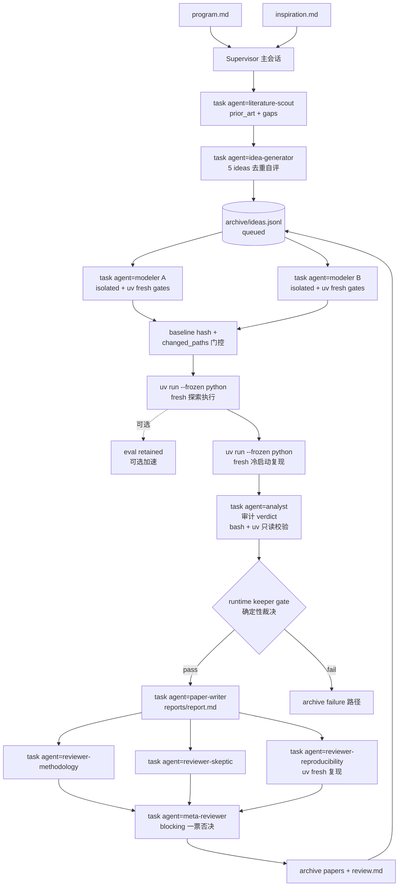
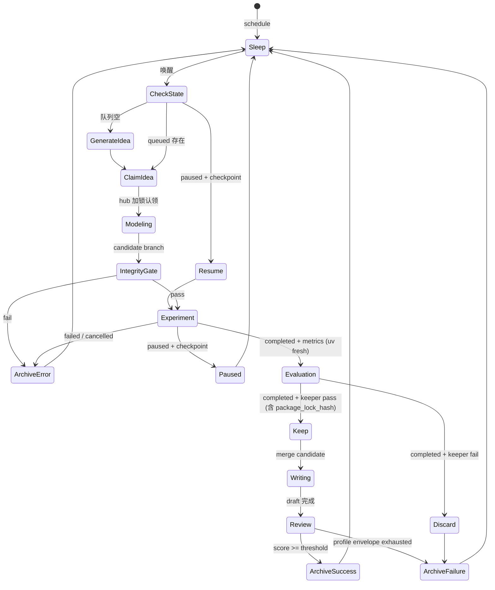

# Harness 接线图与运行时 02-harness-wiring

> 本文档把 00-spec 的 harness 抽象落到 Pi 可执行的命令、代码与调度配置。目标是把无人值守的 modify-evaluate-keep 循环用 Pi 原生能力拼出来，不引入外部编排系统。**默认在普通 shell 中以 `uv` fresh 进程跑通**（`uv sync --frozen` + `uv run --frozen python ...`）。

## 1. 接线总览

| 飞轮需求 | Pi 能力 | 接线方式 | 备注 |
|----------|-----------------|----------|------|
| 并行探索多假设 | `task` isolation (`agent: "<name>"`, `isolated: true`) | 每个 idea 以 `isolated: true` 进入独立 merged view | parent checkout 保持 baseline；reviewers 以一个 `tasks[]` 批次并行 |
| 正式执行与复现 | `uv run --frozen python` fresh 子进程（默认） | compile/smoke 与 keeper clean reproduction 均以 fresh uv 进程执行 | fresh 进程是唯一正式路径 |
| 多 task 协调 | `hub` | 队列锁、lifecycle 摘要、keep 广播、review 投票 | 轻量消息，大产物写 trace |
| 定时无人值守 | `schedule_prompt` | 定时检查 queued/paused run 与 checkpoint | runtime 管理实验生命周期；执行侧走 uv fresh 进程 |
| 候选分歧管理 | isolation branch + git | worktree 候选分支经门控后归并或归档 | patch 为可选审计产物 |
| 全链路审计 | `traces/` + `traces.jsonl` | baseline、mutation、lifecycle、cost、fingerprint（含 `package_lock_hash = sha256:<uv.lock digest>`）结构化追加 | 可回放可复盘 |



## 2. 角色映射（论文工厂分工）

角色以项目级 agent 定义 `.pi/agents/*.md` 承载（pi 项目级自动发现，`task` 的 `agent` 参数直接引用）。按现代论文工厂分工，keeper gate 保持 runtime 确定性裁决，review 面板只可否决、不可放行未过门控的候选。所有 phase 的 `task` 调度均显式传入 `agent: "<project-agent-name>"`，subagents 起始空白、仅凭 prompt 中的 run_id/idea/trace 路径工作。

| 论文工厂角色 | agent 名 | 阶段 | 权限要点 |
|--------------|----------|------|----------|
| Editor-in-Chief / PI | 主会话 Supervisor | 全程 | 读冻结 program.md 与 ideas 池，派发全部 `task`（带 `agent`）；`modeler` 必带 `isolated: true`，reviewers 一批并行 |
| Literature scout | `literature-scout` | inspiration 前置 | 只读；产出 prior_art/gaps/dead_ends |
| Hypothesis generator | `idea-generator` | inspiration | 写 ideas.jsonl 与 inspiration.md；受 PI 门禁约束 |
| Experiment designer | `modeler` | modeling | isolated task；仅编辑 mutable_paths；以 `bash` + `uv run --frozen python` 跑 compile/smoke；写 mutation.json |
| Analyst | `analyst` | evaluation | 只读；审计 delta/epsilon/fingerprint（含 `package_lock_hash`），必要时以 `bash` + `uv run --frozen python -c` 做只读算术校验；产 audit verdict |
| Paper writer | `paper-writer` | writing | 仅 keeper 路径；只写 reports/report.md |
| Review panel | `reviewer-methodology` / `reviewer-skeptic` / `reviewer-reproducibility` | review | 三视角并行（一个 `tasks[]` 批次）；`reproducibility` 以 fresh `uv run --frozen python` / `reproduce.sh` 亲自复现，失败=blocking |
| Meta-reviewer / AC | `meta-reviewer` | review 汇总 | 聚合三票写 review.md 与 review_vote |
| Archive | 无角色 | archive | flywheel.py runtime 确定性完成，不设第二套 |




## 3. 组件详解

### 3.1 task 并行隔离探索

隔离执行以 Git baseline 为前提。scaffold 先初始化仓库并提交 baseline，再写入项目配置：

```yaml
# .pi/agents/modeler.md（frontmatter）
task:
  isolation:
    mode: auto
    apply: false
    merge: branch
```

每个候选通过真实 `task` 工具参数请求隔离（显式 `agent`）：

```json
{
  "context": "使用 program.md 的冻结 experiment profile；完整性门控读取 traces/<run_id>/baseline.json。",
  "tasks": [
    {
      "name": "modeling-idea-007",
      "agent": "modeler",
      "isolated": true,
      "task": "run_id=20260902-031502-a3f9 idea=idea-007。读取 baseline.json 与 idea 记录，在 merged view 中编辑 mutable_paths，以 bash + uv run --frozen python 跑 compile/smoke 门控，写 mutation.json，返回候选分支、changed_paths、门控结果和 trace 路径。"
    }
  ]
}
```

subagent 隔离（`isolation: "worktree"`）在顶层调用开始时捕获 baseline 并为子 agent 生成 disposable worktree；父检出不持有子 agent 的可变权威，子 agent 返回 diff。成功候选保留为候选分支，归并决定留给 orchestration。diff 可作为审计或恢复产物，候选主路径保持 branch/commit。

experiment profile 的 `mutable_paths` 决定可接受的 changed paths。`program.md`、`evaluation/prepare.py`、`capabilities/registry.json` 的 hash 来自 `baseline.json`。orchestration 在 full run 前校验路径集合与完整性 hash，并将 resolved backend、fallback reason、branch name 和 gate 结果写入 `mutation.json`。

工具调用边界由 agent 模板声明（`tools` 白名单、`acceptanceRole`、`completionGuard`）与 parent 派遣参数共同执行。文件级完整性由 worktree isolation、baseline manifest 与归并门控执行。task 之间由 supervisor 传递 idea_id、score、lifecycle state 与 keeper 决策；大产物写入 `traces/<id>/`。

### 3.2 uv fresh 进程（默认）与 eval 可选加速

**可移植默认**：`uv sync --frozen` 一次，后续所有 Python 均以 fresh 子进程 `uv run --frozen python ...` 执行（`uv`/`uv.lock` 缺失时 shell 入口回退到 `python3`/`python` 以便 bootstrap）。

三类运行的默认形态（均为 fresh uv 子进程）：

1. **compile/smoke gate**：fresh `uv run --frozen python` 子进程，消除先前导入、全局变量与 cache 影响。`modeler` 通过 `bash` 执行。
2. **exploratory full run**：fresh `uv run --frozen python` 子进程执行 `experiment/run.py`（或 profile 指定入口）。同轮内如需多步迭代，可在同一 uv 调用内顺序执行或拆为多次 fresh 调用；`cost.json` 记录 `exploration_state_manifest`。
3. **keeper clean reproduction**：全新 fresh `uv run --frozen python` 子进程 cold-start 重跑候选分支、数据和依赖，结果独立记录为 `clean_reproduction_passed`。


默认（uv fresh 进程）的 compile gate：

```bash
# 优先 uv，缺失时回退到 python3/python（与 reproduce.sh 同款可移植逻辑）
if command -v uv >/dev/null 2>&1 && [ -f uv.lock ]; then
  uv run --frozen python -c "from pathlib import Path; source=Path('experiment/run.py').read_text(); compile(source, 'experiment/run.py', 'exec'); print({'gate':'compile','passed':True})"
else
  python3 -c "from pathlib import Path; source=Path('experiment/run.py').read_text(); compile(source, 'experiment/run.py', 'exec'); print({'gate':'compile','passed':True})"
fi
```

smoke check（uv fresh 进程）：

```bash
if command -v uv >/dev/null 2>&1 && [ -f uv.lock ]; then
  uv run --frozen python -c "import experiment.run as m; print(m.main({'run_id':'20260902-031502-a3f9','stage':'smoke','trace_dir':'traces/20260902-031502-a3f9'}))"
else
  python3 -c "import experiment.run as m; print(m.main({'run_id':'20260902-031502-a3f9','stage':'smoke','trace_dir':'traces/20260902-031502-a3f9'}))"
fi
```

keeper reproduction（fresh uv 子进程）：

```bash
uv run --frozen python experiment/run.py --run-id 20260902-031502-a3f9 --stage full --trace-dir traces/20260902-031502-a3f9
# 或等价的 orchestration 调度：
uv run --frozen python orchestration/flywheel.py --reproduce 20260902-031502-a3f9
```

`eval` 可选加速（仅探索，非门控）的形态（保留作参考，不作默认要求）：

```json
{"language":"py","title":"initialize exploration (optional eval)","reset":true,"timeout":0,"code":"from evaluation.prepare import load_data\ndata = load_data()\nprint({'cache': 'data', 'loaded': True})"}
```

失败统一写入 `traces/<id>/error.json`：

```json
{
  "error_class": "resource",
  "message": "CUDA out of memory during optimizer step",
  "frames": [
    {"file": "experiment/run.py", "line": 84, "symbol": "train_step"},
    {"file": "models/attention.py", "line": 129, "symbol": "forward"}
  ],
  "stderr_tail": "RuntimeError: CUDA out of memory",
  "stage": "full"
}
```

`error_class` 枚举为 `syntax|import|runtime|timeout|resource|assert`，`stage` 枚举为 `compile|smoke|full`。repair prompt 读取该信封与原始 `run.log`，优先修改命中 frame 的局部块。`cost.json` 分开记录 `compile_clean_passed`、`smoke_clean_passed`、`repair_scope`、`repair_passed`、`exploration_state_manifest` 与 `clean_reproduction_passed`（后者必来自 fresh uv 进程）。keeper gate 读取 clean reproduction 结果。

### 3.3 hub 协调

hub 负责三件事：队列加锁、keep 广播、review 投票。消息体保持精简，文件内容不经 hub。

```python
import hub, json
from pathlib import Path

def claim_idea(pool_path="archive/ideas.jsonl"):
    with hub.lock("idea-pool"):
        pool = [json.loads(l) for l in Path(pool_path).read_text().splitlines()]
        queued = [i for i in pool if i["status"] == "queued"]
        queued.sort(key=lambda x: x["score"], reverse=True)
        idea = queued[0]
        idea["status"] = "running"
        Path(pool_path).write_text("\n".join(json.dumps(i) for i in pool))
        hub.broadcast("idea-claimed", {"idea_id": idea["id"], "run_id": new_run_id()})
        return idea
```

常用频道：`idea-claimed`（避免重复认领）、`lifecycle-state`（广播 paused/completed/failed 与 checkpoint 引用）、`keep-decision`（writing/review 订阅）、`review-score`（orchestration 决定回退或归档）。

### 3.4 候选分支 keep/discard

worktree isolation 产出候选分支。orchestration 将候选元数据写入 `traces/<run_id>/mutation.json`：

```json
{
  "run_id": "20260902-031502-a3f9",
  "baseline_sha": "a1c5f7258fd7a6ab2dfb25c2a2d7f6af6f5d4b1e",
  "branch_name": "worktree/modeling-idea-007",
  "resolved_backend": "apfs",
  "fallback_reason": null,
  "changed_paths": ["experiment/run.py", "models/attention.py"],
  "integrity_gate": "pass"
}
```

归并规则：

1. `apply: false` 保持 parent checkout 与 baseline 一致。
2. `integrity_gate == pass` 后以 fresh `uv run --frozen python` 执行 compile、smoke、exploratory full run 与 clean reproduction（eval 仅作可选加速，不替代门控）。
3. keep 要求 execution、clean reproduction 与 evaluation 均为 `completed`，fingerprint（含 `package_lock_hash = sha256:<uv.lock digest>` 或 `"unlocked"`）与 actual cost 完整，keeper vote 通过。
4. keep 候选由 orchestration 归并到 main 并打 `keep-<id>` tag，证据包固化到 `archive/papers/<id>/`。
5. discard、inconclusive、execution_error 候选先固化证据包，再删除候选分支。parent checkout 无需回滚。
6. patch mode 或 `isoDiff` 产物承担审计与冲突恢复职责。branch/commit 保持正常候选路径。

`traces.jsonl` 同时记录 candidate branch、terminal state、keeper votes 与归并结果。

### 3.5 schedule_prompt 夜间循环

`orchestration/schedule.json` 保存以下两份 `schedule_prompt` 请求。agent 通过 `schedule_prompt` 工具/action（`action: add`，需同时提供 `schedule` 与 `prompt`）完成注册。

夜间轮询：

```json
{
  "action": "add",
  "name": "night-flywheel",
  "schedule": "0 */30 * * * *",
  "prompt": "检查 queued/paused run 与 lifecycle checkpoint。恢复可运行的 paused run；队列空时派发 task agent=idea-generator 补 3 个可证伪 idea；认领最高分 queued idea 并派发 task agent=modeler（isolated）按 experiment profile 启动候选（uv run --frozen python fresh 进程）。记录 baseline、mutation、requested/actual cost、lifecycle 与终态。连续 3 轮 completed evaluation 无提升时提高采样温度。",
  "type": "cron"
}
```

晨间复盘：

```json
{
  "action": "add",
  "name": "morning-report",
  "schedule": "0 0 8 * * *",
  "prompt": "读取 traces.jsonl 与 archive/，更新 status.md。展示最近 completed keep/discard、inconclusive、execution_error、actual cost、checkpoint 与待人工复核项。",
  "type": "cron"
}
```

查询注册结果时向同一设备写入 `{"action":"list"}`。schedule 负责唤醒与状态检查，runtime 负责实验 deadline、暂停、恢复和终止。night job 的 prompt 仅自动执行 `hardware_dependency_level == 0` 且未命中 `WATCHDOG.yml` human gate 的任务。

夜间状态机：



## 4. Trace 治理与伪代码

每轮写 `traces/<ts>/baseline.json`、`mutation.json`、`lifecycle.jsonl`、`run.log`、`metrics.json`、`cost.json`，失败时增加 `error.json`，审计策略启用时增加 `git.patch`。`hub` 广播关键状态摘要，大产物保留在文件系统。全局 `traces.jsonl` 追加事件：

```jsonl
{"ts":"2026-09-02T03:15:02Z","run_id":"20260902-031502-a3f9","idea_id":"idea-007","event":"started","stage":"full","requested":{"cost_type":"compute","resource_class":"gpu","count":1}}
{"ts":"2026-09-02T03:20:45Z","run_id":"20260902-031502-a3f9","idea_id":"idea-007","event":"completed","stage":"full","actual":{"wall_clock_seconds":342.8,"gpu_seconds":342.8}}
{"ts":"2026-09-02T03:21:12Z","run_id":"20260902-031502-a3f9","idea_id":"idea-007","event":"evaluation_completed","metric":"val_bpb","value":1.42,"delta":-0.03,"keep":true}
```

端到端 wrapper 伪代码（默认 uv fresh 进程；task 均显式 `agent`）：

```python
def run_once():
    idea = claim_idea() or auto_inspiration()
    run_id = new_run_id()
    profile = freeze_experiment_profile(run_id, read_program_frontmatter())
    baseline = capture_baseline(run_id, profile["integrity_paths"])

    evidence = call_task(
        agent="literature-scout",
        task=f"idea={idea['id']} 收集 prior_art/gaps/dead_ends",
    )

    candidate = call_task(
        agent="modeler",
        isolated=True,
        task=f"run_id={run_id} idea={idea['id']} 编辑 mutable_paths 并以 bash+uv 跑 compile/smoke 写 mutation.json",
    )
    gate = verify_candidate(candidate, baseline, profile["mutable_paths"])
    write_mutation(run_id, candidate, gate)
    if not gate["passed"]:
        return archive_terminal(run_id, "execution_error", error_class="assert")

    clean_gates = run_compile_and_smoke_fresh_uv(candidate)
    if not clean_gates["passed"]:
        repair = repair_from_error(candidate, clean_gates["error_json"], scope="local")
        return retry_or_archive(run_id, repair)

    append_lifecycle(run_id, "started", requested=profile["stages"]["full"]["requested"])
    exploratory = run_full_fresh_uv(candidate, profile["stages"]["full"])
    append_lifecycle(run_id, exploratory["state"], actual=exploratory["actual"])
    if exploratory["state"] == "paused":
        return record_checkpoint_and_wait(run_id, exploratory)
    if exploratory["state"] in {"failed", "cancelled"}:
        return archive_terminal(run_id, "execution_error", evidence=exploratory)

    reproduction = clean_reproduce_fresh_uv(candidate)
    if reproduction["state"] != "completed":
        return archive_terminal(run_id, "inconclusive", evidence=reproduction)

    evaluation = evaluate_with_baseline(reproduction, baseline)
    audit = call_task(
        agent="analyst",
        task=f"run_id={run_id} 审计 verification.json 的 delta/epsilon/fingerprint（含 package_lock_hash）",
    )
    keep = (
        evaluation["state"] == "completed"
        and decide_keeper(evaluation)
        and audit["verdict"] == "audit_pass"
    )
    write_metrics_and_cost(run_id, exploratory, reproduction, evaluation, keep)
    if not keep:
        return archive_terminal(run_id, "discard", evidence=evaluation)

    merge_candidate(candidate["branch_name"])
    call_task(agent="paper-writer", task=f"run_id={run_id} 起草 reports/report.md")
    panel = parallel_tasks([
        call_task(agent="reviewer-methodology", task=f"review run_id={run_id}"),
        call_task(agent="reviewer-skeptic", task=f"review run_id={run_id}"),
        call_task(agent="reviewer-reproducibility", task=f"review run_id={run_id} 需 uv fresh 复现"),
    ])
    review = call_task(
        agent="meta-reviewer",
        task=f"run_id={run_id} 聚合三票 panel={panel} 写 review.md 与 review_vote",
    )
    return archive_reviewed(run_id, review)
```

失败与重试：`syntax|import|runtime|timeout|resource|assert` 写入 error envelope。runtime deadline 产生 `timeout` lifecycle 证据。`paused` 保留 checkpoint 等待恢复。`failed|cancelled` 进入 execution_error 归因。clean reproduction（必为 fresh `uv run --frozen python`）未完成进入 inconclusive。任一未完成状态均不参与 keeper。污染的 `eval` cell 度量永不作为 keeper 依据。

---

> 验证：`uv sync --frozen` 后执行 `bash orchestration/scaffold.sh --idea "test"`，再通过 `schedule_prompt` 的 `action: list` 确认两条任务。在当前 experiment profile 的首轮执行窗口内，`traces/` 应出现 baseline、mutation、lifecycle 与 completed metrics（含 `package_lock_hash`）或结构化未完成终态；`traces.jsonl` 应新增对应事件。全程默认 `uv run --frozen python` fresh 进程，无需持久内核；`eval` 仅为可选加速。
