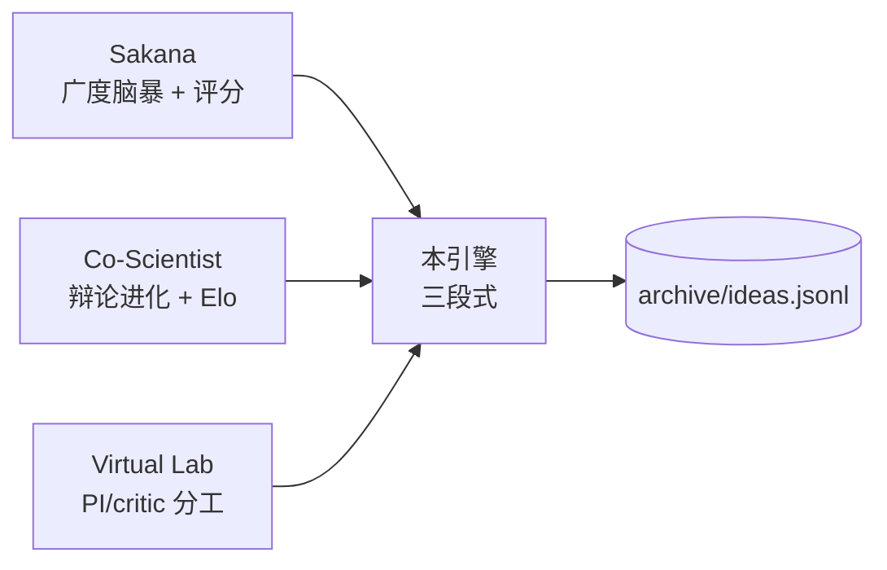
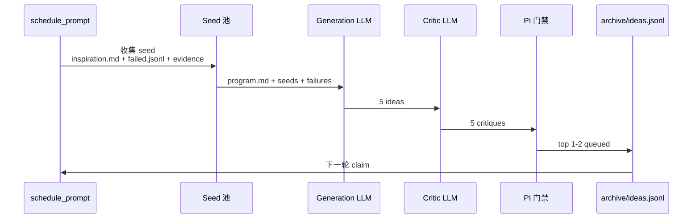
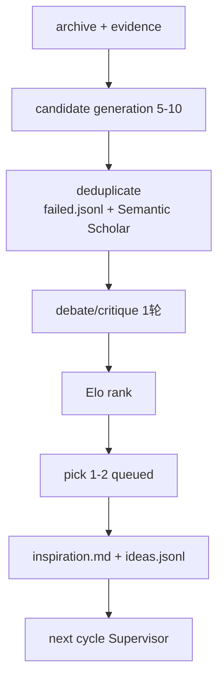

# 灵感自动产生引擎 03-inspiration-engine

> 本文档定义无人类输入时如何自动产生下一个可执行假设。对比 Sakana AI Scientist 的 idea generation、Google Co-Scientist 的 debate、Stanford Virtual Lab 的 PI/critic 机制，萃取可直接落到 OMP/PI 的实现。

## 1. 目标与约束

- **目标**：当 `inspiration.md` 为空或 `archive/ideas.jsonl` 中 queued 数量低于阈值（默认 2）时，自动产生 3-5 个新 idea，写入 `archive/ideas.jsonl` 并同步到 `inspiration.md`，保证飞轮无需人类输入即可自转。
- **约束**：每个 idea 必须可执行（对应 `run.py` 的具体 patch 方向）、可度量（关联 `prepare.py:evaluate` 的主度量）、可证伪（有明确失败判定与归因字段）。
- **预算**：单次引擎调用至多 2 次 LLM 调用，控制在 2k tokens 内，避免夜间烧掉配额。
- **记忆**：所有失败 idea 沉淀到 `archive/failed.jsonl`，后续生成时显式去重，避免语义重复。

## 2. 对比三套机制的可借鉴实现

### 2.1 Sakana AI Scientist — 模板出发的头脑风暴 + 查新

- **做法**：给定 broad direction 与模板代码，LLM 批量脑暴数十个 idea，按 novelty、feasibility、expected gain 打分，取 top-k 进入 agentic tree search 并行实验，Semantic Scholar 去重，最后对产物做 AI peer review。
- **输入**：当前 `run.py`、模板代码、`archive/failed.jsonl`。
- **适用**：ML 领域，idea 与代码变更强绑定。
- **可借鉴**：广度优先脑暴与评分机制，与后续 tree search 天然衔接。
- **潜在坑**：idea 质量方差大，低分 idea 浪费预算；评分依赖单模型自评，易高估新颖性。
- **OMP 落地**：`navigator/queries.jsonl` 记录检索，`archive/failed.jsonl` 去重，`capabilities/registry.json` 中注册检索工具。

### 2.2 Google Co-Scientist — 辩论 + Elo 锦标赛

- **做法**：Generation / Reflection / Ranking / Evolution / Proximity / Meta-review 六类 agent 异步协作，通过 generate-debate-evolve 循环对假设做锦标赛式排序，类似 AlphaGo 的 self-play，用 test-time compute 换假设质量，Elo 分数与外部指标（如 GPQA）校准。
- **适用**：需高质量假设的生物医学等高 stakes 领域。
- **可借鉴**：多轮批判与锦标赛排序提升假设质量。
- **潜在坑**：实现重，需要多角色编排与大量 test-time 计算，不适合单机夜间轻量场景。
- **OMP 落地**：`hub` 上的轻量 debate 会议，reviewer 产 Elo，排序后取 top-k 进入实验，每轮限制 1-2 轮辩论防止发散。

### 2.3 Stanford Virtual Lab — PI 分配 + Critic 检验

- **做法**：模拟真实实验室，PI 负责方向与资源分配，scientist 并行探索，critic 检验假设，通过 concurrent meeting 短时同步，PI 分解目标为子问题。
- **适用**：跨学科、需协作的复杂目标。
- **可借鉴**：PI 的全局视角与 critic 的风险意识互补，职责分离清晰。
- **潜在坑**：角色定义较重，轻量飞轮中引入全套实验室模拟会增加复杂度。
- **OMP 落地**：Supervisor task 扮演 PI，`task` 并行模拟 lab meeting，critic 仅做门禁校验。

### 2.4 本引擎的取舍

取 Sakana 的广度与评分作为基础，取 Co-Scientist 的轻量辩论作为质量过滤，取 Virtual Lab 的 PI/critic 作为门禁，不引入重型多 agent 常驻。



## 3. 三段式引擎设计

```
seed → generation → debate → gating → pool
```

完整统一流程：

```
archive + evidence ─► candidate generation (5-10) ─► deduplicate (failed.jsonl + Semantic Scholar)
        ─► debate/critique (1轮) ─► Elo rank ─► pick 1-2 for next cycle
```

### 3.1 Seed 来源

| 来源 | 触发条件 | 实现 |
|------|----------|------|
| 人类 `inspiration.md` | 文件非空 | 直接解析为 idea-000，最高优先级 |
| 失败报告的 next hypotheses | 每次 failure 归档 | 自动解析 `reports/failure.md` 的 next hypotheses 字段 |
| 检索证据的 gaps | `navigator/evidence/*.json` 更新 | 提取 open questions 与未覆盖的引用 |
| 随机扰动 | 队列为空且无上述来源 | 对 `program.md` 的关键词做组合扰动生成探索性 seed |

Seed 统一写入 `archive/ideas.jsonl` 的 seed 段或单独 `archive/_seed.jsonl`，每行一个 seed，便于追溯。

### 3.2 Generation — 一次性脑暴 5 个 idea

单次 LLM 调用，prompt 固定，避免夜间多次调用。

```
系统：你是科研灵感生成器。输入为 program.md、最近 3 个 idea、最近 1 篇 reports/failure.md、navigator 证据摘要。
任务：产生 5 个新 idea，每个含 hypothesis、method sketch、expected delta、risk、refs。
约束：每个 method 必须能在 run.py 上用 < 50 行 patch 实现；expected delta 需关联 prepare.py:evaluate 的主度量（如 val_bpb）；refs 来自 navigator/evidence。

输出：JSON 数组，元素含 title, hypothesis, method, expected_delta, risk, refs, score(0-1)。
```

后处理：

- 去重：与 `archive/failed.jsonl` 及 `archive/ideas.jsonl` 中已有 idea 做标题 embedding 余弦相似度，阈值 0.85 以上丢弃；同时通过 `navigator/queries.jsonl` 记录的 Semantic Scholar 检索去重。
- 补全：缺失 hypothesis、method、expected_delta 任一字段的 idea 直接丢弃，不做修复重试。

### 3.3 Debate — 轻量两轮批判

不引入常驻多 agent，用两次 LLM 调用模拟 Co-Scientist 的 Reflection + Ranking，每轮限制 1-2 轮防止发散：

- **Round 1 — Critic**：对 5 个 idea 逐条挑错，输出 weaknesses 与 feasibility 评分（1-5），关注是否绕开 `prepare.py`、是否可复现、是否存在泄漏。
- **Round 2 — Ranking**：综合 generation score 与 critic 分数，做轻量锦标赛排序，等价于 Elo 的简化版，取 top-3。

```python
# orchestration/inspiration.py 片段
def debate(ideas):
    critiques = call_llm("critic", ideas)  # 批量批判，1 次调用
    for idea, c in zip(ideas, critiques):
        idea["feasibility"] = c["feasibility"]
        idea["weaknesses"] = c["weaknesses"]
    # 加权排序：0.5 * generation_score + 0.3 * feasibility/5 + 0.2 * novelty
    ranked = sorted(ideas, key=lambda x: 0.5*x["score"] + 0.3*x["feasibility"]/5 + 0.2*x.get("novelty",0.5), reverse=True)
    return ranked[:3]
```

成本：generation 1 次 + critic 1 次 + ranking 本地计算，共 2 次 LLM 调用。

### 3.4 Gating — PI 门禁

复刻 Virtual Lab 的 PI 视角，做最终可行性门禁，避免把明显不可执行的 idea 送入实验。门禁为本地规则，无需 LLM：

- `expected_delta` 未关联主度量 → 拒。
- `method` 提及修改 `prepare.py` 或 `capabilities/registry.json` → 拒（与可编辑边界冲突）。
- `risk` 为空或 `weaknesses` 含 "leakage"、"unreproducible" → 拒。
- 与最近 3 个 discard idea 的 hypothesis 相似度大于 0.9 → 拒（避免重复踩坑）。
- 检索证据不支持且无失败报告背书的纯幻想 idea → 拒。

通过门禁的 idea 写入 `archive/ideas.jsonl` 并同步到 `inspiration.md`，状态标记为 `queued`。



## 4. 文件与命令

### 4.1 触发方式

```bash
# 手动触发一次
python orchestration/inspiration.py --once

# 被夜间调度自动触发（当 queued < 2 时）
# 见 02-harness-wiring 的 night-flywheel prompt
```

自动灵感产生在 `review → archive` 之后触发，写入 `inspiration.md` 并更新 `program.md` 的 plan 段，下一轮 Supervisor 读取即开始。

### 4.2 产物示例

`archive/ideas.jsonl` 新增行：

```json
{"id": "idea-008", "title": "Gated Temperature in Attention", "score": 0.74, "feasibility": 4, "hypothesis": "可学习 temperature 门控可降低 attention 熵，提升 val_bpb", "method": "在 run.py 的 attention 前插入 learnable scalar，sigmoid 门控", "expected_delta": "val_bpb -0.015", "risk": "训练初期不稳定，需 warmup", "weaknesses": "需调参，增量有限", "refs": ["ref-012", "ref-031"], "status": "queued", "created": "2026-09-02T03:00:00Z"}
```

同步写入的 `inspiration.md`：

```markdown
# Inspiration — auto 2026-09-02T03:00:00Z
Gated Temperature in Attention：可学习 temperature 门控降低 attention 熵，预期 val_bpb -0.015。
```

### 4.3 与飞轮的衔接

- 夜间轮询发现 `queued < 2` 即调用 `inspiration.py --once` 补齐 3 个。
- 连续 3 轮 discard 时，下一轮 generation 的 temperature 从 0.7 升至 1.0，强制扩宽。
- 每个 `reports/failure.md` 的 `next hypotheses` 自动转为 seed，优先级高于随机扰动，保证失败知识被再利用。
- 检索阶段显式比对 `archive/failed.jsonl`，避免语义重复；每轮 debate 限制 1-2 轮，防止发散。

## 5. 可借鉴点与坑位汇总

| 来源 | 可借鉴 | 潜在坑 | 本引擎对策 |
|------|--------|--------|------------|
| Sakana | 批量脑暴 + 评分，tree search 并行 | 评分自嗨，需外部校正 | 引入 critic 二次评分 |
| Co-Scientist | 辩论与锦标赛提升假设质量 | 重型多 agent 不适合夜间轻量 | 压缩为 2 轮轻量批判 + 本地 Elo |
| Virtual Lab | PI/critic 职责分离，门禁明确 | 角色过重 | 仅保留本地规则门禁 |
| Karpathy | 固定评估器保证可比性 | idea 若绕开评估器则度量失真 | 门禁拦截修改 prepare.py 的 method |
| Biomni | capability registry 嵌入检索 | 工具膨胀 | registry 显式申请变更 |

## 6. 最小可运行伪代码

```python
# orchestration/inspiration.py
def run_once():
    seeds = collect_seeds()  # inspiration.md + failed.jsonl next hypotheses + navigator gaps
    ideas = call_llm_generation(seeds, n=5)  # 单次调用，输出 JSON 数组
    ideas = dedup(ideas, failed="archive/failed.jsonl", pool="archive/ideas.jsonl")
    ranked = debate(ideas)  # 2 轮批判 + 加权排序
    gated = [i for i in ranked if pi_gate(i)]
    for idea in gated[:2]:  # 每轮最多 2 个，避免队列膨胀
        append_jsonl("archive/ideas.jsonl", idea | {"status": "queued"})
        Path("inspiration.md").write_text(f"# Inspiration — auto\n{idea['hypothesis']}\n")
    return gated
```



---

> 验证：`python orchestration/inspiration.py --once` 应在 `archive/ideas.jsonl` 新增 2 行且 `inspiration.md` 被更新；`grep -c queued archive/ideas.jsonl` 计数增加；无触及 `prepare.py` 的非法 method；`navigator/queries.jsonl` 新增检索记录。
